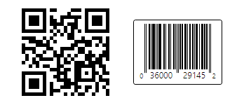

# Overview

Actipro Bar Code is a bar code generation product, which can be used in your organization to more efficiently input data.

*Two BarCode control instances, each with a different symbology*

This product is useful for adding bar codes to any WPF application or report.  Bar codes can be saved in XPS document content, saved to image files, rendered directly to a WPF `DrawingContext`, or added as a child control in any `FixedDocument`, `FlowDocument` or other WPF control.

Actipro Bar Code takes all the work out of the bar code generation process, by allowing you to simply say what value to encode.  It will automatically calculate any appropriate checksums and will generate the bar code for you.  The output is completely customizable with many options, everything from setting the bar height to display of the encoded value below the bar lines.

The most common symbologies are all supported, including [2D QR Code](symbologies/qr-code.md), [EAN-13](symbologies/ean13.md), [EAN-8](symbologies/ean8.md), [UPC-A](symbologies/upc-a.md), [UPC-E](symbologies/upc-e.md), [Code 39](symbologies/code39.md) (and [full ASCII](symbologies/code39-extended.md) variant), [Code 93](symbologies/code93.md) (and [full ASCII](symbologies/code93-extended.md) variant), [Code 128](symbologies/code128.md), [Codabar](symbologies/codabar.md), and [Interleaved 2 of 5](symbologies/interleaved2of5.md).

## What About Bar Code Fonts?

Up until now, the only way to generate bar codes in WPF was to use bar code fonts (a.k.a. fontware).  However, bar code fonts have a lot of limitations.  When you compare them to Actipro Bar Code, you'll find that Actipro Bar Code provides the best solution for bar code generation in WPF.

Please see our [Why Not Bar Code Fonts?](why-not-fonts.md) topic for more information.

## Features

### Symbology Implementations

[QR Code](symbologies/qr-code.md)

- With automatic detection of best version, encoding, and mask based on value

[Codabar](symbologies/codabar.md)

- Optional display of start/stop characters

[Code 128](symbologies/code128.md)

- Auto-generation and insertion of a checksum

[Code 39](symbologies/code39.md)

- Optional display of start/stop characters
- Optional auto-generation and insertion of a checksum
- Alter the width ratio of narrow to wide bars.

[Code 39 Extended](symbologies/code39-extended.md) (full ASCII)

- Optional display of start/stop characters
- Optional auto-generation and insertion of a checksum
- Alter the width ratio of narrow to wide bars.

[Code 93](symbologies/code93.md)

- Optional display of start/stop characters
- Auto-generation and insertion of a checksum
- Alter the width ratio of narrow to wide bars.

[Code 93 Extended](symbologies/code93-extended.md) (full ASCII)

- Optional display of start/stop characters
- Auto-generation and insertion of a checksum
- Alter the width ratio of narrow to wide bars.

[EAN-8](symbologies/ean8.md)

- Auto-generation and insertion of a checksum

[EAN-13](symbologies/ean13.md)

- Auto-generation and insertion of a checksum

[Interleaved 2 of 5](symbologies/interleaved2of5.md)

- Optional auto-generation and insertion of a checksum
- Alter the width ratio of narrow to wide bars.

[UPC-A](symbologies/upc-a.md)

- Auto-generation and insertion of a checksum

[UPC-E](symbologies/upc-e.md)

### BarCode Control Features

- Implemented as a WPF Control that can be used in any WPF context.
- Use in a `FixedDocument`, `FlowDocument`, or add to an XPS document.
- Add [borders around the bar code](barcode-basics.md) and adjust their corner radius.
- Add a [caption above the bar code](barcode-basics.md).
- Easily switch between symbologies.
- [Rotate to any angle and scale the bar code](barcode-basics.md) using WPF layout transforms.
- Provides a lot of features that you can't get using bar code fonts (a.k.a. fontware).

### Symbology Features

- Easily [render a bitmap](advanced-features/export-to-image.md) of the bar code and save to any image format (PNG, GIF, JPG, etc.) supported by WPF.
- Programmatically measure and [render bar codes to a DrawingContext](advanced-features/drawing-context.md).
- Set the fore and background colors of the bar code output.
- Set the bar height of linear bar codes.
- Set the cell size of 2D codes.
- Set the minimum bar height/width ratio so that long bar codes are tall enough to be read properly.
- Specify the thickness of the quiet zone surrounding the bar code.
- Use multiple value display styles for linear bar codes including:

  - `None` - The value is not displayed.
  - `Centered` - The value is centered horizontally.
  - `LeftAligned` - The value is left-aligned.
  - `RightAligned` - The value is right-aligned.
  - `CharactersAlignedWithBars` - The characters in the value are centered under the bars that represent each character.
  - `QuietZoneExtension` - The first and last characters are drawn in the lead/tail quiet zones and the remaining characters are centered under the encoded character runs. This is used for symbologies such as **UPC-A**.
  - `QuietZoneExtensionLeft` - The first character is drawn in the lead quiet zones and the remaining characters are centered under the encoded character runs.  This is used for symbologies such as **EIN-13**.
- Specify how far (if at all) the displayed value "intrudes" into the bar lines (used in bar codes like UPC-A).
- Inclusion of [ValidationRule classes for every symbology](advanced-features/validation-rules.md), that can be used to validate input.
- Validate bar code values programmatically.

*This product is written in 100% pure C#, and includes detailed documentation and samples.*

## Additional Symbology Implemetations

Do you require implementation of another symbology not listed?  Just write us, our bar code framework was designed from the ground up to be extensible so that nearly any symbology can be added without too much work.
