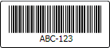

# Code 39

Code 39 is a linear symbology, and is one of the first alphanumeric bar codes.

Each character encoded is made up of 5 bars and 4 spaces for a total of 9 elements.  3 out of the 9 element are always wide.  Although it is not as dense of a symbology such as Code 128, it is one of the most widely supported symbologies by devices.



*A sample of this symbology*

An extended implementation of Code 39 is available in [Code 39 Extended](code39-extended.md).  That implementation allows for all lower 128 ASCII characters to be encoded based on the core Code 39 concepts.

## Symbology Characteristics

The following table gives an overview of the characteristics of the symbology.

| Item | Details |
|-----|-----|
| Implementation Class | [Code39Symbology](xref:@ActiproUIRoot.Controls.BarCode.Code39Symbology) |
| Base Class | [LinearBarCodeSymbology](xref:@ActiproUIRoot.Controls.BarCode.LinearBarCodeSymbology) |
| Related ValidationRule Class | [Code39ValidationRule](xref:@ActiproUIRoot.Controls.BarCode.ValidationRules.Code39ValidationRule) |
| Encodable Characters | Number, uppercase letter, and `-$% ./+` characters. |
| Supports Checksum | Yes.  While this symbology is self-checking, the implementation can optionally auto-calculate and insert a check character.  This is referred to as Code 39 mod 43. |
| Has Special Start/Stop Characters | Yes.  Must start and stop with `*` characters, but these are automatically appended for you. |
| Fixed Length Requirements | No.  The symbology value may be any number of characters. |

## Important Members

This symbology has these important members:

| Member | Description |
|-----|-----|
| [AreStartStopCharactersVisible](xref:@ActiproUIRoot.Controls.BarCode.Code39Symbology.AreStartStopCharactersVisible) Property | Gets or sets whether the start/stop characters (*) are visible in the displayed value. |
| [Background](xref:@ActiproUIRoot.Controls.BarCode.BarCodeSymbology.Background) Property | Gets or sets the `Brush` to use for rendering the background. |
| [BarHeight](xref:@ActiproUIRoot.Controls.BarCode.LinearBarCodeSymbology.BarHeight) Property | Gets or sets the desired height of the bars. |
| [BarWidthRatio](xref:@ActiproUIRoot.Controls.BarCode.LinearBarCodeSymbology.BarWidthRatio) Property | Gets or sets the width ratio of wide lines to narrow lines. |
| [DisplayName](xref:@ActiproUIRoot.Controls.BarCode.BarCodeSymbology.DisplayName) Property | Gets the display name of the symbology. |
| [DisplayValue](xref:@ActiproUIRoot.Controls.BarCode.LinearBarCodeSymbology.DisplayValue) Property | Gets or sets the value that is displayed if [ValueDisplayStyle](xref:@ActiproUIRoot.Controls.BarCode.LinearBarCodeSymbology.ValueDisplayStyle) is not `None`. |
| [Foreground](xref:@ActiproUIRoot.Controls.BarCode.BarCodeSymbology.Foreground) Property | Gets or sets the `Brush` to use for rendering the foreground. |
| [IsChecksumEnabled](xref:@ActiproUIRoot.Controls.BarCode.Code39Symbology.IsChecksumEnabled) Property | Gets or sets whether the optional checksum should be added. |
| [MeasureDesiredSize](xref:@ActiproUIRoot.Controls.BarCode.BarCodeSymbology.MeasureDesiredSize*) Method | Measures the desired size of the symbology, based on the specified available size. |
| [MinBarHeightWidthRatio](xref:@ActiproUIRoot.Controls.BarCode.LinearBarCodeSymbology.MinBarHeightWidthRatio) Property | Gets or sets the minimum ratio that the height of the bar code must be in relation to its width. |
| [QuietZoneThickness](xref:@ActiproUIRoot.Controls.BarCode.LinearBarCodeSymbology.QuietZoneThickness) Property | Gets or sets the `Thickness` of the quiet zone. |
| [Render](xref:@ActiproUIRoot.Controls.BarCode.BarCodeSymbology.Render*) Method | Renders the symbology to the specified `DrawingContext`. |
| [ToBitmap](xref:@ActiproUIRoot.Controls.BarCode.BarCodeSymbology.ToBitmap*) Method | Creates a `BitmapSource` based on the contents of the symbology. |
| [ValidateValue](xref:@ActiproUIRoot.Controls.BarCode.BarCodeSymbology.ValidateValue*) Method | Validates that the symbology can parse the specified value. |
| [Value](xref:@ActiproUIRoot.Controls.BarCode.BarCodeSymbology.Value) Property | Gets or sets the value to encode in the bar code. |
| [ValueDisplayStyle](xref:@ActiproUIRoot.Controls.BarCode.LinearBarCodeSymbology.ValueDisplayStyle) Property | Gets or sets a [LinearBarCodeValueDisplayStyle](xref:@ActiproUIRoot.Controls.BarCode.LinearBarCodeValueDisplayStyle) that indicates how the value should rendered. |
| [ValueIntrusionOffset](xref:@ActiproUIRoot.Controls.BarCode.LinearBarCodeSymbology.ValueIntrusionOffset) Property | Gets or sets the distance that the [Value](xref:@ActiproUIRoot.Controls.BarCode.BarCodeSymbology.Value) text intrudes into the bar code when [ValueDisplayStyle](xref:@ActiproUIRoot.Controls.BarCode.LinearBarCodeSymbology.ValueDisplayStyle) is not `None`. |

## Sample XAML

This sample XAML code shows how to create a [BarCode](xref:@ActiproUIRoot.Controls.BarCode.BarCode) using this symbology.

```xaml
<barCode:BarCode>
	<barCode:Code39Symbology Value="ABC-123" />
</barCode:BarCode>
```
