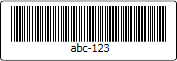

# Overview

Actipro Bar Code includes a number of built-in common symbology implementations.

<table>
<thead>

<tr>
<th>Name</th>
<th>Description</th>
</tr>

</thead>
<tbody>

<tr>
<td>

[QR Code](qr-code.md)

</td>
<td>

QR Code is a 2D symbology, originally used in automotive manufacturing, that is now used worldwide for a wide variety of purposes.

It is readable by most mobile devices with cameras and can be used to display text to a user, add a vCard contact to the user's device, open a URL, or compose a text message or e-mail.

</td>
</tr>

<tr>
<td>

[EAN-13](ean13.md)

</td>
<td>

EAN-13 is a linear symbology, based on the original 12-digit Universal Product Code (UPC) system developed in North America.

</td>
</tr>

<tr>
<td>

[EAN-8](ean8.md)

</td>
<td>

EAN-8 is a linear symbology, used on smaller retail packages where EAN-13 bar codes don't fit.

</td>
</tr>

<tr>
<td>

[UPC-A](upc-a.md)

</td>
<td>

UPC-A is a linear symbology, widely used in the United States and Canada for tracking trade items in stores.

</td>
</tr>

<tr>
<td>

[UPC-E](upc-e.md)

</td>
<td>

UPC-E is a linear symbology, used on smaller retail packages where UPC-A bar codes don't fit.

</td>
</tr>

<tr>
<td>

[Code 39](code39.md)

</td>
<td>

Code 39 is a linear symbology, and is one of the first alphanumeric bar codes.

</td>
</tr>

<tr>
<td>

[Code 39 Extended](code39-extended.md)

</td>
<td>

Code 39 Extended is a linear symbology, and supports the encoding of many more characters than standard Code 39.

</td>
</tr>

<tr>
<td>

[Code 93](code93.md)

</td>
<td>

Code 93 is a linear symbology, designed in 1982 by Intermec to provide a higher density and data security enhancement to Code 39.

</td>
</tr>

<tr>
<td>

[Code 93 Extended](code93-extended.md)

</td>
<td>

Code 93 Extended is a linear symbology, and supports the encoding of many more characters than standard Code 93.

</td>
</tr>

<tr>
<td>

[Code 128](code128.md)

</td>
<td>

Code 128 is a high-density barcode symbology, used extensively worldwide in shipping and packaging industries.

</td>
</tr>

<tr>
<td>

[Codabar](codabar.md)

</td>
<td>

Codabar is a linear symbology, developed in 1972 by Pitney Bowes, Inc.

</td>
</tr>

<tr>
<td>

[Interleaved 2 of 5](interleaved2of5.md)

</td>
<td>

Interleaved 2 of 5 is a linear symbology, that provides higher density than the Industrial 2 of 5 symbology that it is based on.

</td>
</tr>

</tbody>
</table>
