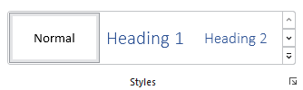

# Gallery

Galleries are graphically-rich list controls whose items are displayed in a scrollable list that can be optionally categorized and filtered.  They can support selection of an item and/or can take an action when an item is clicked.  They also offer live preview capabilities where hovering over a gallery item can preview its intended outcome.

Common usage scenarios for galleries include:
- Selection of colors, text styles, underline styles, bullet kinds, numbering kinds, etc.
- Insertion of shapes, symbols, tables, equations, etc.

> [!NOTE]
> This topic extends the [Control Basics](control-basics.md) topic with additional information specific to the control types described below.  Please refer to the base topic for more generalized concepts that apply to all controls, including this one.

## Control Implementations

There are separate gallery concept control implementations based on the usage context.

### Expanded In-Ribbon Contexts

Use the [RibbonGallery](xref:@ActiproUIRoot.Controls.Bars.RibbonGallery) control to implement a gallery within a ribbon context that is expanded when space is available.

> [!TIP]
> See the information on toolbar contexts below if you wish to have a [Popup Button](popup-button.md) or [Split Button](split-button.md) in the ribbon that only shows the gallery when the button's popup menu is displayed.



*An in-ribbon gallery*

| Specification | Details |
|-----|-----|
| Base class | [BarGalleryBase](xref:@ActiproUIRoot.Controls.Bars.Primitives.BarGalleryBase), which inherits native `Selector`. |
| Has key | Yes, via the [Key](xref:@ActiproUIRoot.Controls.Bars.Primitives.BarGalleryBase.Key) property. |
| Has label | Yes, via the [Label](xref:@ActiproUIRoot.Controls.Bars.Primitives.BarGalleryBase.Label) property.  Auto-generated from the `Key` value if not specified.  |
| Has image | Yes, via the [SmallImageSource](xref:@ActiproUIRoot.Controls.Bars.Primitives.BarGalleryBase.SmallImageSource), [MediumImageSource](xref:@ActiproUIRoot.Controls.Bars.Primitives.BarGalleryBase.MediumImageSource), and [LargeImageSource](xref:@ActiproUIRoot.Controls.Bars.Primitives.BarGalleryBase.LargeImageSource) properties. |
| Has popup | Yes, which generally shows a [BarMenuGallery](xref:@ActiproUIRoot.Controls.Bars.BarMenuGallery) with the same items. |
| Is checkable | No. |
| Variant sizes | `Small` (collapsed gallery popup button), `Medium` (several columns), `Large` (many columns). |
| Command support | Yes, via the [Command](xref:@ActiproUIRoot.Controls.Bars.Primitives.BarGalleryBase.Command) property.  The gallery item that is selected/previewed is passed as the command parameter. |
| Key tip support | Yes, via the [KeyTipText](xref:@ActiproUIRoot.Controls.Bars.RibbonGallery.KeyTipText) property, for the `More` button when expanded and the collapsed gallery popup button.  Auto-generated from the `Label` value if not specified. |
| [Ribbon QAT](../ribbon-features/quick-access-toolbar.md) support | Yes, via the [CanCloneToRibbonQuickAccessToolBar](xref:@ActiproUIRoot.Controls.Bars.Primitives.BarGalleryBase.CanCloneToRibbonQuickAccessToolBar) property. |
| UI density support | Yes, via the [UserInterfaceDensity](xref:@ActiproUIRoot.Controls.Bars.Primitives.BarGalleryBase.UserInterfaceDensity) property. |
| [MVVM Library](../mvvm-support.md) VM | [BarGalleryViewModel](xref:@ActiproUIRoot.Controls.Bars.Mvvm.BarGalleryViewModel) class. |

```xaml
xmlns:bars="http://schemas.actiprosoftware.com/winfx/xaml/bars"
xmlns:themes="http://schemas.actiprosoftware.com/winfx/xaml/themes"
...
<Application.Resources>
	<DataTemplate x:Key="ColorGalleryItemTemplate">
		<Border
			BorderBrush="{DynamicResource {x:Static themes:AssetResourceKeys.ContainerBorderMidLowBrushKey}}"
			BorderThickness="1" Width="32" Height="16">
			<Border.Background>
				<SolidColorBrush Color="{Binding Color}" />
			</Border.Background>
		</Border>
	</DataTemplate>
</Application.Resources>
...
<bars:Ribbon>
	<!-- Label is auto-generated from Key -->
	<bars:RibbonTabItem Key="Home">
		<bars:RibbonGroup Key="Colors">
			<bars:RibbonGallery
				Key="ColorPicker"
				LargeImageSource="/Images/ColorPicker32.png"
				SmallImageSource="/Images/ColorPicker16.png"
				Command="{Binding SetColorCommand}"
				ItemsSource="{Binding ColorItems}"
				ItemTemplate="{StaticResource ColorGalleryItemTemplate}"
				UseAccentedItemBorder="True"
				/>
		</bars:RibbonGroup>
	</bars:RibbonTabItem>
	...
</bars:Ribbon>
```

### Ribbon and Toolbar Contexts

Galleries can be used in other ways within a ribbon, and in toolbar contexts as well.  This is supported by placing a [Popup Button](popup-button.md) or [Split Button](split-button.md) in the toolbar and then using a [BarMenuGallery](xref:@ActiproUIRoot.Controls.Bars.BarMenuGallery) control (described below) in the popup menu.

```xaml
xmlns:bars="http://schemas.actiprosoftware.com/winfx/xaml/bars"
...
<bars:StandaloneToolBar>
	<!-- Label is auto-generated from Key -->
	<bars:BarPopupButton Key="SetColor">
		<bars:BarMenuGallery
			Key="ColorPicker"
			Command="{Binding SetColorCommand}"
			ItemsSource="{Binding ColorItems}"
			ItemTemplate="{StaticResource ColorGalleryItemTemplate}"
			UseAccentedItemBorder="True"
			/>
		...
	</bars:BarContextMenu>
</bars:StandaloneToolBar>
```

### Menu Contexts

Use the [BarMenuGallery](xref:@ActiproUIRoot.Controls.Bars.BarMenuGallery) control to implement a gallery concept within a menu context.


*A list numbering gallery*

| Specification | Details |
|-----|-----|
| Base class | [BarGalleryBase](xref:@ActiproUIRoot.Controls.Bars.Primitives.BarGalleryBase), which inherits native `Selector`. |
| Has key | Yes, via the [Key](xref:@ActiproUIRoot.Controls.Bars.Primitives.BarGalleryBase.Key) property. |
| Has label | Yes, via the [Label](xref:@ActiproUIRoot.Controls.Bars.Primitives.BarGalleryBase.Label) property.  Auto-generated from the `Key` value if not specified.  |
| Has image | No. |
| Has popup | No. |
| Is checkable | No. |
| Variant sizes | None. |
| Command support | Yes, via the [Command](xref:@ActiproUIRoot.Controls.Bars.Primitives.BarGalleryBase.Command) property.  The gallery item that is selected/previewed is passed as the command parameter. |
| Key tip support | None. |
| [Ribbon QAT](../ribbon-features/quick-access-toolbar.md) support | Not directly.  Ribbon logic will look for a containing [Popup Button](popup-button.md) or [Split Button](split-button.md) to clone to the Quick Access Toolbar instead. |
| UI density support | None. |
| [MVVM Library](../mvvm-support.md) VM | [BarGalleryViewModel](xref:@ActiproUIRoot.Controls.Bars.Mvvm.BarGalleryViewModel) class. |

```xaml
xmlns:bars="http://schemas.actiprosoftware.com/winfx/xaml/bars"
...
<bars:BarContextMenu>
	<!-- Label is auto-generated from Key -->
	<bars:BarMenuGallery
		Key="ColorPicker"
		Command="{Binding SetColorCommand}"
		ItemsSource="{Binding ColorItems}"
		ItemTemplate="{StaticResource ColorGalleryItemTemplate}"
		UseAccentedItemBorder="True"
		/>
	...
</bars:BarContextMenu>
```

## Appearance

There are several appearance-related properties that determine how the controls render.

### Label

The controls have a string `Label` that can be set, which is sometimes visible in UI.

The `Label` can be auto-generated based on the control's `Key` property.  For instance, a control with `Key` of `TextStyles` will automatically assign `Text Styles` as the `Label` value.  The auto-generated default can be overridden by setting the `Label` property.

The [RibbonGallery](xref:@ActiproUIRoot.Controls.Bars.RibbonGallery).[Label](xref:@ActiproUIRoot.Controls.Bars.Primitives.BarGalleryBase.Label) is only rendered when the gallery is in a `Small` variant size, and it's displayed as a collapsed gallery [Popup Button](popup-button.md).

The [BarMenuGallery](xref:@ActiproUIRoot.Controls.Bars.BarMenuGallery).[Label](xref:@ActiproUIRoot.Controls.Bars.Primitives.BarGalleryBase.Label) property isn't really used, other than in customization UI.

### Images

[RibbonGallery](xref:@ActiproUIRoot.Controls.Bars.RibbonGallery) uses images, but only when the gallery is in a `Small` variant that renders a collapsed gallery popup button (see the [Popup Button](popup-button.md) topic for image usage details), or if the gallery is in the [Ribbon Quick Access Toolbar](../ribbon-features/quick-access-toolbar.md).

### Title

An optional string [RibbonGallery](xref:@ActiproUIRoot.Controls.Bars.RibbonGallery).[Title](xref:@ActiproUIRoot.Controls.Bars.Primitives.BarGalleryBase.Title) and [BarMenuGallery](xref:@ActiproUIRoot.Controls.Bars.BarMenuGallery).[Title](xref:@ActiproUIRoot.Controls.Bars.Primitives.BarGalleryBase.Title) can be specified, which are intended to override the control's `Label` when displayed in screen tips and customization UI.

### Variant Sizes (`RibbonGallery` only)

[RibbonGallery](xref:@ActiproUIRoot.Controls.Bars.RibbonGallery) supports multiple variant sizes via its [VariantSize](xref:@ActiproUIRoot.Controls.Bars.RibbonGallery.VariantSize) property, which enables it to be resized through three distinct stages when used in a ribbon with `Classic` layout mode.  The parent [RibbonGroup](xref:@ActiproUIRoot.Controls.Bars.RibbonGroup) updates the gallery's variant size to match its variant size.


*In-ribbon gallery in a Small variant size*

The first stage occurs when the parent group has a `Small` variant size, the [RibbonGallery](xref:@ActiproUIRoot.Controls.Bars.RibbonGallery) will render as a collapsed gallery [Popup Button](popup-button.md).  Click the collapsed gallery popup button to see a popup menu containing the gallery items.  This is the same popup menu that displays when the [RibbonGallery](xref:@ActiproUIRoot.Controls.Bars.RibbonGallery) is in a larger variant size, and its `More` button is clicked.


*In-ribbon gallery in a Medium variant size*

The second stage occurs when the parent group has a `Medium` variant size.  When in this stage, the gallery will display a variable number of item columns within the ribbon.  The range of item columns displayed is inclusively between the [MinMediumColumnCount](xref:@ActiproUIRoot.Controls.Bars.RibbonGallery.MinMediumColumnCount) and [MinLargeColumnCount](xref:@ActiproUIRoot.Controls.Bars.RibbonGallery.MinLargeColumnCount) property values and depends on available space.  Set those two properties to the same value to prevent the gallery from resizing within a `Medium` variant.


*In-ribbon gallery in a Large variant size*

The final stage occurs when the parent group has a `Large` variant size.  When in this stage, the gallery will again display a variable number of item columns within the ribbon.  The range of item columns displayed is inclusively between the [MinLargeColumnCount](xref:@ActiproUIRoot.Controls.Bars.RibbonGallery.MinLargeColumnCount) and [MaxColumnCount](xref:@ActiproUIRoot.Controls.Bars.RibbonGallery.MaxColumnCount) property values and depends on available space.

> [!TIP]
> See the [Resizing and Variants](../ribbon-features/resizing.md) topic for more information on ribbon's variant sizing features.

When a ribbon is in `Simplified` layout mode, the [RibbonGallery](xref:@ActiproUIRoot.Controls.Bars.RibbonGallery) control will render in a `Small` variant size by default, which shows as a collapsed gallery popup button.  The [MaxSimplifiedVariantSize](xref:@ActiproUIRoot.Controls.Bars.RibbonGallery.MaxSimplifiedVariantSize) property can be set to `Medium` to show gallery items inline, or set to `Collapsed` to always have the gallery in the overflow menu.

While [BarMenuGallery](xref:@ActiproUIRoot.Controls.Bars.BarMenuGallery) doesn't support variant sizes, it can be used in a menu that has resizing capabilities as described below.

### Item Rows (`RibbonGallery` only)

[RibbonGallery](xref:@ActiproUIRoot.Controls.Bars.RibbonGallery) automatically determines the number of rows displayed based on the gallery's height and the height of the items.  There can be anywhere from one to three rows, each of which supports smooth row-by-row scrolling.


*In-ribbon gallery row comparison*

### Columns Displayed on Menu

A minimum and maximum number of columns to display in a menu may be set for the menu gallery.  When the menu is initially displayed, it will show at least the minimum number of columns specified, which defaults to `1`.  If the menu gallery is opened for a [RibbonGallery](xref:@ActiproUIRoot.Controls.Bars.RibbonGallery) `More` button, the popup menu will be stretched to cover the width of the in-ribbon gallery at a minimum.  As the popup menu is sized larger, the number of columns displayed will range between the minimum and maximum specified.  The default maximum number of columns to display in a menu is `Int32.MaxValue` but can be reduced if some other maximum should be used.

The [RibbonGallery](xref:@ActiproUIRoot.Controls.Bars.RibbonGallery).[MinMenuColumnCount](xref:@ActiproUIRoot.Controls.Bars.RibbonGallery.MinMenuColumnCount) and [MaxMenuColumnCount](xref:@ActiproUIRoot.Controls.Bars.RibbonGallery.MaxMenuColumnCount) properties set the menu column count range for the menu gallery displayed when the `More` button is clicked.

Whereas the [BarMenuGallery](xref:@ActiproUIRoot.Controls.Bars.BarMenuGallery).[MinColumnCount](xref:@ActiproUIRoot.Controls.Bars.BarMenuGallery.MinColumnCount) and [MaxColumnCount](xref:@ActiproUIRoot.Controls.Bars.BarMenuGallery.MaxColumnCount) properties are used for menu galleries that are declared outside of a ribbon gallery.

### Menu Resizing

A menu that contains a menu gallery can optionally be resized.  This feature can be enabled by assigning a [ControlResizeMode](xref:@ActiproUIRoot.Controls.ControlResizeMode) value.  The values of that enumeration are `None`, `Horizontal`, `Vertical`, or `Both`.

Menu galleries that show items in a single column, such as an underline gallery, should use a `Vertical` resize mode.

Menu galleries that contain many items displayed in multiple columns generally use a `Both` resize mode.

The [RibbonGallery](xref:@ActiproUIRoot.Controls.Bars.RibbonGallery).[MenuResizeMode](xref:@ActiproUIRoot.Controls.Bars.RibbonGallery.MenuResizeMode) and [BarMenuGallery](xref:@ActiproUIRoot.Controls.Bars.BarMenuGallery).[ResizeMode](xref:@ActiproUIRoot.Controls.Bars.BarMenuGallery.ResizeMode) properties set the resize mode for the containing menu to use.

### Surrounding Separators on Menu

Menu galleries will automatically render a separator between them and surrounding menu items.  In some scenarios, this may be undesired.

The automatic insertion of separators around a menu gallery can be disabled by setting the [RibbonGallery](xref:@ActiproUIRoot.Controls.Bars.RibbonGallery).[AreSurroundingSeparatorsAllowedOnMenu](xref:@ActiproUIRoot.Controls.Bars.RibbonGallery.AreSurroundingSeparatorsAllowedOnMenu) or [BarMenuGallery](xref:@ActiproUIRoot.Controls.Bars.BarMenuGallery).[AreSurroundingSeparatorsAllowed](xref:@ActiproUIRoot.Controls.Bars.BarMenuGallery.AreSurroundingSeparatorsAllowed) property to `false`.

If a separator is only needed either above or below the menu gallery, disable automatic surrounding separators and then manually add a [Separator](separator.md) either before or after the menu gallery as appropriate.

### Item Spacing

The [ItemSpacing](xref:@ActiproUIRoot.Controls.Bars.Primitives.BarGalleryBase.ItemSpacing) property sets the amount of spacing between items.  By default, it is set to `0`, meaning no space in between items.  Some galleries such as color picker galleries may wish to increase the item spacing to a larger value, like `4`.

### Accented Item Borders

The [UseAccentedItemBorder](xref:@ActiproUIRoot.Controls.Bars.Primitives.BarGalleryBase.UseAccentedItemBorder) property can be set to `true` to use an accented border for selected items.  This is useful for gallery items that have vibrant content, such as color swatches.

### Menu Item Indent

A menu gallery generally fills the width of the menu, aligning the gallery items to the menu's edges.  Sometimes a gallery may wish to indent its items such that they appear within the icon column on the left and spacer column on the right.

This can be achieved by setting the [RibbonGallery](xref:@ActiproUIRoot.Controls.Bars.RibbonGallery).[UseMenuItemIndent](xref:@ActiproUIRoot.Controls.Bars.RibbonGallery.UseMenuItemIndent) or [BarMenuGallery](xref:@ActiproUIRoot.Controls.Bars.BarMenuGallery).[UseMenuItemIndent](xref:@ActiproUIRoot.Controls.Bars.BarMenuGallery.UseMenuItemIndent) properties to `true`.

### Menu Item Appearance (`BarMenuGallery` only)

When a gallery is solely presented within the menu of a containing [Popup Button](popup-button.md), [Split Button](split-button.md), or [Combobox](combobox.md), and the gallery has a single column of items with longer-width content, the gallery may wish to present these items with a menu item-like appearance.  This feature will cause the [BarGalleryItem](xref:@ActiproUIRoot.Controls.Bars.BarGalleryItem) container to use the same theme resource brushes that `MenuItem` uses.

This feature can be enabled by setting the [BarMenuGallery](xref:@ActiproUIRoot.Controls.Bars.BarMenuGallery).[UseMenuItemAppearance](xref:@ActiproUIRoot.Controls.Bars.BarMenuGallery.UseMenuItemAppearance) property to `true`.

### User Interface Density (`RibbonGallery` only)

The [UserInterfaceDensity](xref:@ActiproUIRoot.Controls.Bars.Primitives.BarGalleryBase.UserInterfaceDensity) property can alter the appearance of the gallery, such as its size and padding used.  This property is not generally set on the gallery instance itself, and is instead meant to be set on the root bar control to inherit down, such as with the [Ribbon.UserInterfaceDensity](xref:@ActiproUIRoot.Controls.Bars.Ribbon.UserInterfaceDensity) property.

## Key Tips

The [RibbonGallery](xref:@ActiproUIRoot.Controls.Bars.RibbonGallery) control support key tips.  When its key tip is accessed, a click is simulated that will show its popup menu.

The `KeyTipText` can be auto-generated based on the control's `Label` property.  For instance, a control with `Label` of `Styles` will automatically assign `S` as the `KeyTipText` value.  The auto-generated default can be overridden by setting the `KeyTipText` property.

The [RibbonGallery](xref:@ActiproUIRoot.Controls.Bars.RibbonGallery).[KeyTipText](xref:@ActiproUIRoot.Controls.Bars.RibbonGallery.KeyTipText) property designates the key tip text to use for the control.

The [BarMenuGallery](xref:@ActiproUIRoot.Controls.Bars.BarMenuGallery) control does not use key tips.

> [!TIP]
> See the [Key Tips](../ribbon-features/key-tips.md) topic for more information on key tips.

## Commands and Events

The `ICommand` in the [RibbonGallery](xref:@ActiproUIRoot.Controls.Bars.RibbonGallery).[Command](xref:@ActiproUIRoot.Controls.Bars.Primitives.BarGalleryBase.Command) and [BarMenuGallery](xref:@ActiproUIRoot.Controls.Bars.BarMenuGallery).[Command](xref:@ActiproUIRoot.Controls.Bars.Primitives.BarGalleryBase.Command) properties is executed when a gallery item is clicked.

An [IPreviewableCommand](xref:@ActiproUIRoot.Input.IPreviewableCommand) interface is defined in the Shared Library that allows special `ICommand` implementations to support live preview features.  A section below describes how to implement live preview.

A [RibbonGallery](xref:@ActiproUIRoot.Controls.Bars.RibbonGallery).`SelectionChanged` and [BarMenuGallery](xref:@ActiproUIRoot.Controls.Bars.BarMenuGallery).`SelectionChanged` event is raised when the gallery's selection changes.

> [!TIP]
> See the [Using Commands](using-commands.md) topic for more information on commands.

## MVVM Support

The optional companion [MVVM Library](../mvvm-support.md) defines a [BarGalleryViewModel](xref:@ActiproUIRoot.Controls.Bars.Mvvm.BarGalleryViewModel) class that is intended to be used as a view model for galleries.

This view model class maps over to the appropriate view controls described above based on usage context, and configures all necessary bindings between the view model and the view control.

A [BarGalleryItemViewModelBase](xref:@ActiproUIRoot.Controls.Bars.Mvvm.BarGalleryItemViewModelBase) class is intended to be a base class for any gallery item view model.  Each kind of gallery should define a separate view model class for its items.  For instance, a gallery related to selection of a color defines a [ColorBarGalleryItemViewModel](xref:@ActiproUIRoot.Controls.Bars.Mvvm.ColorBarGalleryItemViewModel) class for its items, which inherits [BarGalleryItemViewModelBase](xref:@ActiproUIRoot.Controls.Bars.Mvvm.BarGalleryItemViewModelBase).

It is recommended to build a custom `DataTemplateSelector` that can be assigned to the gallery's `ItemTemplateSelector` property to apply a `DataTemplate` for the related gallery item view model type.

> [!TIP]
> See the [MVVM Support](../mvvm-support.md) topic for more information on how to use the library's view models and view templates to create and manage your application's bars controls with MVVM techniques.

## Gallery Items

Gallery items are often very visual in nature.  Some galleries maintain a selection, while others do not, and take an action instead when an item is clicked.

### Item Selection

The gallery control classes indirectly inherit `Selector` and therefore support all the selection features from that base class.  A gallery item will be selected when it is clicked, or the `Enter` key is pressed while the gallery item has focus.  This updates the gallery's `SelectedItem` property and raises the `SelectionChanged` event.  As described above, at this point the gallery's `Command` will be executed with the gallery item being passed as the parameter.

The gallery's `SelectedItem` property may be set at any time to alter the selected gallery item.

The [IsSelectionSupported](xref:@ActiproUIRoot.Controls.Bars.Primitives.BarGalleryBase.IsSelectionSupported) property, which defaults to `true`, can be set to `false` to prevent a selection from being retained when an item is clicked.  It does this by automatically clearing the `SelectedItem` after a selection is made.  This feature is handy for galleries that should take an action when an item is clicked, such as a gallery that inserts a symbol into a document based on the item that was clicked.

### Item Templates

Gallery controls generate a [BarGalleryItem](xref:@ActiproUIRoot.Controls.Bars.BarGalleryItem) container for each gallery item in the gallery's `ItemsSource`.  It is recommended to always use custom view model types for gallery items, and to bind an enumerable of view model instances to the gallery's `ItemsSource` property, or `CategorizedItemsSource` property if supporting categorization per a latter section.

A `DataTemplate` for the view model type can be supplied via the [BarGalleryBase](xref:@ActiproUIRoot.Controls.Bars.Primitives.BarGalleryBase).`ItemTemplate` property, or alternatively, a `DataTemplateSelector`-based class instance can be set to the gallery's `ItemTemplateSelector` property.  These concepts are all fundamental to how any data-bound `ItemsControl` works.

Any UI elements can be placed in a `DataTemplate`, allowing you to make your gallery items' appearance as simple or complex as you wish.

Here's an example of a template for a font size view model that has a `FontSize` property and uses a basic `TextBlock` for display.

```xaml
<DataTemplate x:Key="FontSizeGalleryItemTemplate" DataType="local:FontSizeBarGalleryItemViewModel">
	<TextBlock Margin="12,4" Text="{Binding FontSize}" />
</DataTemplate>
```

Note that no borders are usually necessary in a gallery item template since the containing [BarGalleryItem](xref:@ActiproUIRoot.Controls.Bars.BarGalleryItem) will render the chrome of the item.

In the following example for an insert symbol gallery, we use a custom `SymbolPresenter` element.  This element could be a custom templated `Control` itself.  Or it could be a more basic element that overrides its `OnRender` method to render the content in code-behind via a `DrawingContext`.

```xaml
<DataTemplate x:Key="SymbolGalleryItemTemplate" DataType="local:SymbolBarGalleryItemViewModel">
	<local:SymbolPresenter Width="30" Height="30" />
</DataTemplate>
```

While the template examples above only contain a single element, any complex element hierarchy can be placed within the template to achieve the look you desire.

### Item Size Consistency

The item templates used for galleries can be any width/height, however the one rule to which you must adhere is that all items within the same gallery must be the same size.  The layout routines rely on this assumption.  Not only that, but it also makes for a better presentation to the end user.  The best way to ensure this is to explicitly set a `Width` and `Height` on the root element of your item template and the gallery will take care of measuring the additional gallery item container border size and padding for you.

### Item Live Preview

Galleries support live preview features where hovering the mouse over a gallery item after a delay can trigger a preview of the outcome of clicking the gallery item.

If the `ICommand` set to the gallery's `Command` property implements [IPreviewableCommand](xref:@ActiproUIRoot.Input.IPreviewableCommand), the gallery will notify the command when live preview is started or canceled.  The [PreviewableDelegateCommand\<T\>](xref:@ActiproUIRoot.Input.PreviewableDelegateCommand`1) class inherits [DelegateCommand\<T\>](xref:@ActiproUIRoot.Input.DelegateCommand`1) and implements [IPreviewableCommand](xref:@ActiproUIRoot.Input.IPreviewableCommand).  That class will execute designated actions, one when preview starts and one when preview is canceled.  This allows you to apply preview within your application temporarily while the end user hovers their mouse over a gallery item.

As an example, here's how a command could be set up to show live preview of a font size gallery:

```csharp
public ICommand SetFontSizeCommand {
	get {
		if (setFontSizeCommand is null) {
			setFontSizeCommand = new PreviewableDelegateCommand<FontSizeBarGalleryItemViewModel>(
				executeAction: p => {
					OnRequestSaveAndExitPreviewMode();
					UpdateSelectionTextStyle(x => x.FontSize = p?.Size ?? FontSettings.DefaultFontSize);
				},
				canExecuteFunc: p => true,
				previewAction: p => {
					OnRequestActivatePreviewMode();
					UpdateSelectionTextStyle(x => x.FontSize = p?.Size ?? FontSettings.DefaultFontSize);
				},
				cancelPreviewAction: p => {
					OnRequestCancelPreviewMode();
				}
			);
		}
		return setFontSizeCommand;
	}
}
```

The gallery's [InitialPreviewDelay](xref:@ActiproUIRoot.Controls.Bars.Primitives.BarGalleryBase.InitialPreviewDelay) property, which defaults to `300`, sets the delay in milliseconds for preview mode to begin after an item is first highlighted.  The [BetweenPreviewDelay](xref:@ActiproUIRoot.Controls.Bars.Primitives.BarGalleryBase.BetweenPreviewDelay) property, which defaults to `0`, sets the delay in milliseconds between previewed item updates as a new item is highlighted.

### Item Tool Tips

Set the [BarGalleryItem](xref:@ActiproUIRoot.Controls.Bars.BarGalleryItem).`ToolTip` property to support a tool tip on for an item.  The value set can be a string or any `ToolTip`-derived class, including our [ScreenTip](xref:@ActiproUIRoot.Controls.Bars.ScreenTip) class.

### Item Categorization

Gallery items can be placed in categories.  These categories will not show up in a [RibbonGallery](xref:@ActiproUIRoot.Controls.Bars.RibbonGallery) itself, but they can optionally be displayed in a [BarMenuGallery](xref:@ActiproUIRoot.Controls.Bars.BarMenuGallery) using the properties described below.


*A color picker gallery with categorized colors*

Menu gallery categorization requires several configuration steps.  First, the gallery item view model collection should be bound to the [BarMenuGallery](xref:@ActiproUIRoot.Controls.Bars.BarMenuGallery).[CategorizedItemsSource](xref:@ActiproUIRoot.Controls.Bars.BarMenuGallery.CategorizedItemsSource) property instead of `ItemsSource`.  What happens behind the scenes is that the enumerable set to that property will be placed into a `CollectionViewSource` for categorization and possible filtering support, and the resulting `CollectionViewSource.View` will then be set as the gallery's `ItemsSource`.  Therefore, it is important not to set the `ItemsSource` property yourself when categorization is desired.  When a menu gallery is displayed for a ribbon gallery's `More` button, it will automatically bind the [RibbonGallery](xref:@ActiproUIRoot.Controls.Bars.RibbonGallery).`ItemsSource` property to the related [BarMenuGallery](xref:@ActiproUIRoot.Controls.Bars.BarMenuGallery).[CategorizedItemsSource](xref:@ActiproUIRoot.Controls.Bars.BarMenuGallery.CategorizedItemsSource) property.

Second, the [RibbonGallery](xref:@ActiproUIRoot.Controls.Bars.RibbonGallery).[CategoryPropertyName](xref:@ActiproUIRoot.Controls.Bars.RibbonGallery.CategoryPropertyName) or [BarMenuGallery](xref:@ActiproUIRoot.Controls.Bars.BarMenuGallery).[CategoryPropertyName](xref:@ActiproUIRoot.Controls.Bars.BarMenuGallery.CategoryPropertyName) property should be set to the name of the property on your gallery item view models that contains the string category name.  For instance, when using our [MVVM Library](../mvvm-support.md), the [BarGalleryItemViewModelBase](xref:@ActiproUIRoot.Controls.Bars.Mvvm.BarGalleryItemViewModelBase).[Category](xref:@ActiproUIRoot.Controls.Bars.Mvvm.BarGalleryItemViewModelBase.Category) property is where the category name is stored.  Therefore, set the [CategoryPropertyName](xref:@ActiproUIRoot.Controls.Bars.BarMenuGallery.CategoryPropertyName) property to `Category` for that use case.

Finally, the [RibbonGallery](xref:@ActiproUIRoot.Controls.Bars.RibbonGallery).[CanCategorizeOnMenu](xref:@ActiproUIRoot.Controls.Bars.RibbonGallery.CanCategorizeOnMenu) or [BarMenuGallery](xref:@ActiproUIRoot.Controls.Bars.BarMenuGallery).[CanCategorize](xref:@ActiproUIRoot.Controls.Bars.BarMenuGallery.CanCategorize) property must be set to `true` to support categorization.  When categorization is active, a category header that displays the category name will appear above all items in the category.  One exception is that if the category is `null`, no category header will be displayed.


*A menu gallery that has category headers hidden, while still displaying menu separators*

In a scenario where you wish for a gallery to break items into multiple categories with a separator in between, but not display a category header for any categories, set the [RibbonGallery](xref:@ActiproUIRoot.Controls.Bars.RibbonGallery).[HasCategoryHeadersOnMenu](xref:@ActiproUIRoot.Controls.Bars.RibbonGallery.HasCategoryHeadersOnMenu) or [BarMenuGallery](xref:@ActiproUIRoot.Controls.Bars.BarMenuGallery).[HasCategoryHeaders](xref:@ActiproUIRoot.Controls.Bars.BarMenuGallery.HasCategoryHeaders) property to `false`.

### Categorized Item Filtering (`BarMenuGallery` only)

If you have categorization enabled in your [BarMenuGallery](xref:@ActiproUIRoot.Controls.Bars.BarMenuGallery) as described above, you can optionally add filtering capabilities.  The filter is a button at the top of the gallery that, when clicked, shows a menu of available filters for selection.


*A menu gallery with filtering enabled*

There is always an `All` option and the rest of the options relate to the various category names.  The `All` filter is used by default and does not perform any filtering.  When a specific category is chosen as a filter, only the items in that category are displayed.

Set the [RibbonGallery](xref:@ActiproUIRoot.Controls.Bars.RibbonGallery).[CanFilterOnMenu](xref:@ActiproUIRoot.Controls.Bars.RibbonGallery.CanFilterOnMenu) or [BarMenuGallery](xref:@ActiproUIRoot.Controls.Bars.BarMenuGallery).[CanFilter](xref:@ActiproUIRoot.Controls.Bars.BarMenuGallery.CanFilter) property to `true` to enable filtering features for the end user.  The current category that is being filtered is available via the [BarMenuGallery](xref:@ActiproUIRoot.Controls.Bars.BarMenuGallery).[SelectedFilterCategory](xref:@ActiproUIRoot.Controls.Bars.BarMenuGallery.SelectedFilterCategory) property.

## Additional Menu Items (`RibbonGallery` only)

[RibbonGallery](xref:@ActiproUIRoot.Controls.Bars.RibbonGallery) has the ability to display additional menu items underneath the menu gallery on its `More` popup menu.  This can be achieved by adding menu items into its [MenuItems](xref:@ActiproUIRoot.Controls.Bars.RibbonGallery.MenuItems) collection.

```xaml
xmlns:bars="http://schemas.actiprosoftware.com/winfx/xaml/bars"
...
<bars:RibbonGallery Key="TextStyles" ... >
	<bars:RibbonGallery.MenuItems>
		<x:Array Type="{x:Type bars:BarMenuItem}">
			<bars:BarMenuItem Key="MoreTextStyles" Command="{Binding MoreTextStylesCommand}" />
		</x:Array>
	</bars:RibbonGallery.MenuItems>
</bars:RibbonGallery>
```

## Size Selection Menu Gallery

The [BarSizeSelectionMenuGallery](xref:@ActiproUIRoot.Controls.Bars.BarSizeSelectionMenuGallery) control is a specialized implementation of a [BarMenuGallery](xref:@ActiproUIRoot.Controls.Bars.BarMenuGallery) that displays a grid of squares and hot tracks which one the mouse is over.  This is ideal for galleries that require a size to quickly be selected, such as an `Insert Table` gallery.  All other features of menu galleries apply to [BarSizeSelectionMenuGallery](xref:@ActiproUIRoot.Controls.Bars.BarSizeSelectionMenuGallery).


*A size selection menu gallery*

Its [ColumnCount](xref:@ActiproUIRoot.Controls.Bars.BarSizeSelectionMenuGallery.ColumnCount) and [RowCount](xref:@ActiproUIRoot.Controls.Bars.BarSizeSelectionMenuGallery.RowCount) properties indicate the size of the grid to display.  They default to `10` and `8` respectively.

The items in the gallery are auto-generated based on the row/column counts.  The protected virtual [CreateItem](xref:@ActiproUIRoot.Controls.Bars.BarSizeSelectionMenuGallery.CreateItem*) method is called to create each item and is passed the zero-based row and column index for the item being created.  The default implementation of that method will create a `Size` value with one-based versions of the row/column indices.

The gallery will show a default heading above the grid, such as `Insert Table`.  The heading text is set via the [DefaultHeadingText](xref:@ActiproUIRoot.Controls.Bars.BarSizeSelectionMenuGallery.DefaultHeadingText) property.  As the mouse moves over the grid of gallery items, the heading text will be updated per the [SizeHeadingTextFormat](xref:@ActiproUIRoot.Controls.Bars.BarSizeSelectionMenuGallery.SizeHeadingTextFormat) format string, such as `{0}x{1} Table`.  The parameters passed to the format string are the width and height based on the gallery item the mouse is currently over.

When a gallery item is clicked on, the command associated with the gallery will be executed and the related item (by default a one-based `Size` value) will be passed as the command parameter.

There is a [BarSizeSelectionMenuGalleryViewModel](xref:@ActiproUIRoot.Controls.Bars.Mvvm.BarSizeSelectionMenuGalleryViewModel) class defined in the optional companion [MVVM Library](../mvvm-support.md) that can be used to work with this control.
