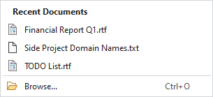

# Separator

Separators are simplistic controls that render a line between surrounding controls.

> [!NOTE]
> This topic extends the [Control Basics](control-basics.md) topic with additional information specific to the control types described below.  Please refer to the base topic for more generalized concepts that apply to all controls, including this one.

## Control Implementations

There are separate separator concept control implementations based on the usage context.

### Ribbon Contexts

Separator controls are not generally specifically used in ribbon contexts, since other controls like [RibbonGroup](xref:@ActiproUIRoot.Controls.Bars.RibbonGroup) and [RibbonControlGroup](xref:@ActiproUIRoot.Controls.Bars.RibbonControlGroup) have built-in separators.

#### Ribbon Control Group Separators

The [RibbonControlGroup](xref:@ActiproUIRoot.Controls.Bars.RibbonControlGroup).[SeparatorMode](xref:@ActiproUIRoot.Controls.Bars.RibbonControlGroup.SeparatorMode) property uses a [RibbonControlGroupSeparatorMode](xref:@ActiproUIRoot.Controls.Bars.RibbonControlGroupSeparatorMode) enumeration value to help the control group determine its behavior in rendering separators around itself.  Its default behavior is to never render surrounding separators when the parent [RibbonGroup](xref:@ActiproUIRoot.Controls.Bars.RibbonGroup) is using a stacking layout, but to show surrounding separators when the parent [RibbonGroup](xref:@ActiproUIRoot.Controls.Bars.RibbonGroup) is using a multi-row layout and neighboring controls allow separators.

> [!TIP]
> When the parent [RibbonGroup](xref:@ActiproUIRoot.Controls.Bars.RibbonGroup) is in a multi-row layout and the control group contains edit controls such as a font family and font size [Combobox](combobox.md), it is ideal to set the separator mode to `Never`.  Edit controls already have well-defined borders and don't require an extra separator to properly surround them from other neighboring controls.

See the [RibbonControlGroupSeparatorMode](xref:@ActiproUIRoot.Controls.Bars.RibbonControlGroupSeparatorMode) enumeration documentation for details on numerous other mode options that can be used to achieve special behavior.

### Toolbar Contexts

Use the [BarSeparator](xref:@ActiproUIRoot.Controls.Bars.BarSeparator) control to implement a separator within a toolbar context.


*A separator in a toolbar*

| Specification | Details |
|-----|-----|
| Base class | Native `Separator`. |
| Has key | No. |
| Has label | No. |
| Has image | No. |
| Has popup | No. |
| Is checkable | No. |
| Variant sizes | None. |
| Command support | None. |
| Key tip support | None. |
| [Ribbon QAT](../ribbon-features/quick-access-toolbar.md) support | None. |
| UI density support | None. |
| [MVVM Library](../mvvm-support.md) VM | [BarSeparatorViewModel](xref:@ActiproUIRoot.Controls.Bars.Mvvm.BarSeparatorViewModel) class. |

```xaml
xmlns:bars="http://schemas.actiprosoftware.com/winfx/xaml/bars"
...
<bars:StandaloneToolBar>
	<bars:BarButton Key="Undo" />
	<bars:BarButton Key="Redo" />
	<bars:BarSeparator />
	<bars:BarButton Key="Cut" />
	<bars:BarButton Key="Copy" />
	<bars:BarButton Key="Paste" />
	...
</bars:StandaloneToolBar>
```

### Menu Contexts

Use the [BarMenuSeparator](xref:@ActiproUIRoot.Controls.Bars.BarMenuSeparator) control to implement a separator within a menu context.



*A separator in a menu*

| Specification | Details |
|-----|-----|
| Base class | Native `Separator`. |
| Has key | No. |
| Has label | No. |
| Has image | No. |
| Has popup | No. |
| Is checkable | No. |
| Variant sizes | None. |
| Command support | None. |
| Key tip support | None. |
| [Ribbon QAT](../ribbon-features/quick-access-toolbar.md) support | None. |
| UI density support | None. |
| [MVVM Library](../mvvm-support.md) VM | [BarSeparatorViewModel](xref:@ActiproUIRoot.Controls.Bars.Mvvm.BarSeparatorViewModel) class. |

```xaml
xmlns:bars="http://schemas.actiprosoftware.com/winfx/xaml/bars"
...
<bars:BarContextMenu>
	<bars:BarMenuItem Key="Undo" />
	<bars:BarMenuItem Key="Redo" />
	<bars:BarSeparator />
	<bars:BarMenuItem Key="Cut" />
	<bars:BarMenuItem Key="Copy" />
	<bars:BarMenuItem Key="Paste" />
	...
</bars:BarContextMenu>
```

#### Separators Surrounding Menu Galleries

By default, separators will automatically be rendered around menu galleries when there are neighboring menu items.  This feature can be disabled by setting the [RibbonGallery](xref:@ActiproUIRoot.Controls.Bars.RibbonGallery)/[BarComboBox](xref:@ActiproUIRoot.Controls.Bars.BarComboBox).[AreSurroundingSeparatorsAllowedOnMenu](xref:@ActiproUIRoot.Controls.Bars.Primitives.BarMenuGalleryHostBase.AreSurroundingSeparatorsAllowedOnMenu) or [BarMenuGallery](xref:@ActiproUIRoot.Controls.Bars.BarMenuGallery).[AreSurroundingSeparatorsAllowed](xref:@ActiproUIRoot.Controls.Bars.BarMenuGallery.AreSurroundingSeparatorsAllowed) property to `false`.

## MVVM Support

The optional companion [MVVM Library](../mvvm-support.md) defines a [BarSeparatorViewModel](xref:@ActiproUIRoot.Controls.Bars.Mvvm.BarSeparatorViewModel) class that is intended to be used as a view model for separators.

This view model class maps over to the appropriate view controls described above based on usage context and configure all necessary bindings between the view models and the view controls.

> [!TIP]
> See the [MVVM Support](../mvvm-support.md) topic for more information on how to use the library's view models and view templates to create and manage your application's bars controls with MVVM techniques.
