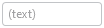
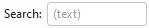

# Textbox

Textbox controls can have text entered into them.  A command executes when Enter is pressed, or the text is changed when focus is lost.

> [!NOTE]
> This topic extends the [Control Basics](control-basics.md) topic with additional information specific to the control types described below.  Please refer to the base topic for more generalized concepts that apply to all controls, including this one.

## Control Implementations

There are separate textbox concept control implementations based on the usage context.

### Ribbon and Toolbar Contexts

Use the [BarTextBox](xref:@ActiproUIRoot.Controls.Bars.BarTextBox) control to implement a textbox within a ribbon or toolbar context.



*A BarTextBox example*

| Specification | Details |
|-----|-----|
| Base class | Native `TextBox`. |
| Has key | Yes, via the [Key](xref:@ActiproUIRoot.Controls.Bars.BarTextBox.Key) property. |
| Has label | Yes, via the [Label](xref:@ActiproUIRoot.Controls.Bars.BarTextBox.Label) property.  Auto-generated from the `Key` value if not specified. |
| Has image | Yes, via the [SmallImageSource](xref:@ActiproUIRoot.Controls.Bars.BarTextBox.SmallImageSource) property. |
| Has popup | No. |
| Is checkable | No. |
| Variant sizes | None. |
| Command support | Yes, via the [Command](xref:@ActiproUIRoot.Controls.Bars.BarTextBox.Command) property. |
| Key tip support | Yes, via the [KeyTipText](xref:@ActiproUIRoot.Controls.Bars.BarTextBox.KeyTipText) property.  Auto-generated from the `Label` value if not specified. |
| [Ribbon QAT](../ribbon-features/quick-access-toolbar.md) support | Yes, via the [CanCloneToRibbonQuickAccessToolBar](xref:@ActiproUIRoot.Controls.Bars.BarTextBox.CanCloneToRibbonQuickAccessToolBar) property. |
| UI density support | None. |
| [MVVM Library](../mvvm-support.md) VM | [BarTextBoxViewModel](xref:@ActiproUIRoot.Controls.Bars.Mvvm.BarTextBoxViewModel) class. |

```xaml
xmlns:bars="http://schemas.actiprosoftware.com/winfx/xaml/bars"
...
<bars:StandaloneToolBar>
	<!-- Label is auto-generated from Key -->
	<bars:TextBox
		Key="Search"
		RequestedWidth="120"
		Command="{Binding SearchCommand}"
		/>
	...
</bars:StandaloneToolBar>
```

### Menu Contexts

Use the [BarTextBox](xref:@ActiproUIRoot.Controls.Bars.BarTextBox) control described above, but wrapped in a [BarMenuControlWrapper](xref:@ActiproUIRoot.Controls.Bars.BarMenuControlWrapper) to implement a textbox concept within a menu context.

[BarMenuControlWrapper](xref:@ActiproUIRoot.Controls.Bars.BarMenuControlWrapper) is a special control that is intended wrap other interactive controls like a [BarTextBox](xref:@ActiproUIRoot.Controls.Bars.BarTextBox) that are not normally intended for use in a menu.  It can display the wrapped control's label externally from the wrapped control itself and aligns everything within the menu properly.


*A BarTextBox when in a menu, wrapped by BarMenuControlWrapper*

```xaml
xmlns:bars="http://schemas.actiprosoftware.com/winfx/xaml/bars"
...
<bars:BarContextMenu>
	<bars:BarMenuControlWrapper>
		<bars:BarMenuControlWrapper.Header>
			<!-- Label is auto-generated from Key -->
			<bars:BarTextBox
				Key="Search"
				Command="{Binding SearchCommand}"
				/>
		<bars:BarMenuControlWrapper.Header>
	</bars:BarMenuControlWrapper>
	...
</bars:BarContextMenu>
```

> [!TIP]
> See the [Using Custom Controls](using-custom-controls.md) topic for more information on [BarMenuControlWrapper](xref:@ActiproUIRoot.Controls.Bars.BarMenuControlWrapper).

## Appearance

There are several appearance-related properties that determine how the controls render.

### Text

The `Text` property gets or sets the text that is displayed within the textbox.

### Label

The control has a string [Label](xref:@ActiproUIRoot.Controls.Bars.BarTextBox.Label) that can be set, which is visible in UI.  The label is not rendered by the control itself, but can show externally (such as when in a [RibbonControlGroup](xref:@ActiproUIRoot.Controls.Bars.RibbonControlGroup), or when [BarMenuControlWrapper](xref:@ActiproUIRoot.Controls.Bars.BarMenuControlWrapper) wraps [BarTextBox](xref:@ActiproUIRoot.Controls.Bars.BarTextBox) in a menu), in screen tips, or in customization UI.



*A BarTextBox with an external label*

The `Label` can be auto-generated based on the control's `Key` property.  For instance, a control with `Key` of `FormatPainter` will automatically assign `Format Painter` as the `Label` value.  The auto-generated default can be overridden by setting the `Label` property.

### Images

The control can display an image via [SmallImageSource](xref:@ActiproUIRoot.Controls.Bars.BarTextBox.SmallImageSource) that helps identify its function.  The image is not rendered by the control itself, but can show externally (such as when in a [RibbonControlGroup](xref:@ActiproUIRoot.Controls.Bars.RibbonControlGroup), or when [BarMenuControlWrapper](xref:@ActiproUIRoot.Controls.Bars.BarMenuControlWrapper) wraps [BarTextBox](xref:@ActiproUIRoot.Controls.Bars.BarTextBox) in a menu), or in customization UI.

### Title

An optional string [Title](xref:@ActiproUIRoot.Controls.Bars.BarTextBox.Title) can be specified, which is intended to override the control's `Label` when displayed in screen tips and customization UI.

### Requested Width and Star Sizing

It is recommended that textbox controls within ribbon and toolbar contexts specify a width.  While the `Width` property can be set directly, it's better to set the [RequestedWidth](xref:@ActiproUIRoot.Controls.Bars.BarTextBox.RequestedWidth) property.  [RequestedWidth](xref:@ActiproUIRoot.Controls.Bars.BarTextBox.RequestedWidth) will ideally measure to the requested width, thereby acting the same as setting `Width`, but can allow other widths such as in situations like star-sizing.  Setting the `Width` property directly will not allow other possible widths, since it is explicitly forcing a width.

Star-sizing is a handy feature when the control is within a [RibbonGroup](xref:@ActiproUIRoot.Controls.Bars.RibbonGroup) that is using multi-row layout via the [CanUseMultiRowLayout](xref:@ActiproUIRoot.Controls.Bars.RibbonGroup.CanUseMultiRowLayout) property.  If the [BarTextBox](xref:@ActiproUIRoot.Controls.Bars.BarTextBox).[IsStarSizingAllowed](xref:@ActiproUIRoot.Controls.Bars.BarTextBox.IsStarSizingAllowed) property is set to `true` and the row the [BarTextBox](xref:@ActiproUIRoot.Controls.Bars.BarTextBox) is on has some extra width available compared to the other rows, it will expand [BarTextBox](xref:@ActiproUIRoot.Controls.Bars.BarTextBox) to fill that width.  This makes the overall row widths equal for a more professional appearance.  Only one control per row should enable star-sizing.

## Key Tips

The controls support key tips.  When a control's key tip is accessed, the control is focused.

The `KeyTipText` can be auto-generated based on the control's `Label` property.  For instance, a control with `Label` of `Search` will automatically assign `S` as the `KeyTipText` value.  The auto-generated default can be overridden by setting the `KeyTipText` property.

The [KeyTipText](xref:@ActiproUIRoot.Controls.Bars.BarTextBox.KeyTipText) properties designate the key tip text to use for the control.

> [!TIP]
> See the [Key Tips](../ribbon-features/key-tips.md) topic for more information on key tips.

## Commands and Events

The `ICommand` in the [Command](xref:@ActiproUIRoot.Controls.Bars.BarTextBox.Command) property is executed when `Enter` is pressed while the control is focused, or the control's text changes and then focus is lost.  This allows the command handler to process a committed text change.

A `TextChanged` event is raised whenever the control's text changes.

> [!TIP]
> See the [Using Commands](using-commands.md) topic for more information on commands.

## Screen Tips

The controls support screen tips, which are formatted tool tips.

The control's `Title` is used as the default screen tip header, falling back to `Label` if no `Title` is available.  The [ScreenTipHeader](xref:@ActiproUIRoot.Controls.Bars.BarTextBox.ScreenTipHeader) property can override the default screen tip header value if desired.

If the control's `ToolTip` property is set to a value that doesn't derive from a native `ToolTip` control, such as a string, the value will be used in the screen tip's content area, with the screen tip header becoming bold.  The screen tip's content area is where extended descriptions are displayed.

If the optional [ScreenTipFooter](xref:@ActiproUIRoot.Controls.Bars.BarTextBox.ScreenTipFooter) property is specified, it will appear in a footer area of the screen tip.

> [!TIP]
> See the [Screen Tips](../ribbon-features/screen-tips.md) topic for more information on screen tips.

## MVVM Support

The optional companion [MVVM Library](../mvvm-support.md) defines a [BarTextBoxViewModel](xref:@ActiproUIRoot.Controls.Bars.Mvvm.BarTextBoxViewModel) class that is intended to be used as a view models for textboxes.

This view model class maps over to the appropriate view controls described above based on usage context and configure all necessary bindings between the view models and the view controls.

> [!TIP]
> See the [MVVM Support](../mvvm-support.md) topic for more information on how to use the library's view models and view templates to create and manage your application's bars controls with MVVM techniques.
