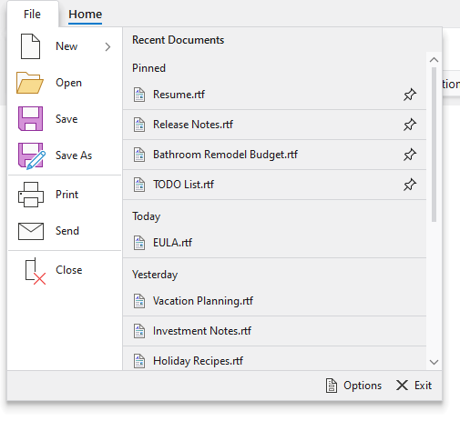

# Application Menu

The application menu is a medium-sized popup that can be displayed when clicking the [application button](application-button.md) and is generally populated by application-wide menu items such as file operations or printing.



*A traditional application menu with optional footer and additional content*

A section at the bottom of the application menu is optional and can be used for footer buttons.  Generally, buttons for application options and application exiting are displayed there.

Any content can optionally be placed on the far side of the application menu as well.  A list of [recent documents](recent-documents.md) is commonly displayed there.

> [!TIP]
> See the [Backstage](backstage.md) topic for details on how to define a more modern alternative to the traditional application menu.

## Defining an Application Menu

An application menu is defined by assigning menu items to a [RibbonApplicationButton](xref:@ActiproUIRoot.Controls.Bars.RibbonApplicationButton)'s `Items` collection and optionally setting other content-based properties.

> [!TIP]
> See the [Application Button](application-button.md) topic for more details on configuring a ribbon with an application button.

This code sample shows how to define an application menu for a ribbon.  Combine it with the code in the following sections to define your application menu and its items.

```xaml
xmlns:bars="http://schemas.actiprosoftware.com/winfx/xaml/bars"
...
<bars:RibbonContainerPanel>
	<bars:Ribbon>
		<bars:Ribbon.ApplicationButtonContent>
			<bars:RibbonApplicationButton>

				<bars:RibbonApplicationButton.MenuAdditionalContent>
					<!-- Additional content goes here -->
				<bars:RibbonApplicationButton.MenuAdditionalContent>

				<bars:RibbonApplicationButton.MenuFooter>
					<!-- Footer content goes here -->
				<bars:RibbonApplicationButton.MenuFooter>

				<!-- Menu items go here -->

			</bars:RibbonApplicationButton>
		</bars:Ribbon.ApplicationButtonContent>
	</bars:Ribbon>
</bars:RibbonContainerPanel>
```

> [!WARNING]
> If [Ribbon](xref:@ActiproUIRoot.Controls.Bars.Ribbon).[BackstageContent](xref:@ActiproUIRoot.Controls.Bars.Ribbon.BackstageContent) is assigned, backstage will be used instead of any defined application menu.

## Defining Menu Items

Menu items that appear on the near side of the application menu are defined via the [RibbonApplicationButton](xref:@ActiproUIRoot.Controls.Bars.RibbonApplicationButton)'s `Items` collection.

Common control types that would be used here include: [BarMenuItem](xref:@ActiproUIRoot.Controls.Bars.BarMenuItem), [BarSplitMenuItem](xref:@ActiproUIRoot.Controls.Bars.BarSplitMenuItem), [BarMenuSeparator](xref:@ActiproUIRoot.Controls.Bars.BarMenuSeparator), and [BarMenuHeading](xref:@ActiproUIRoot.Controls.Bars.BarMenuHeading).

This code defines the root items for a typical application menu.

```xaml
xmlns:bars="http://schemas.actiprosoftware.com/winfx/xaml/bars"
...
<bars:RibbonApplicationButton>

	<!-- Menu items -->
	<bars:BarMenuItem Key="New" LargeImageSource="/Images/New32.png" SmallImageSource="/Images/New16.png" UseLargeSize="True">
		<bars:BarMenuItem Key="PlainText" Command="ApplicationCommands.New" CommandParameter="PlainText" LargeImageSource="/Images/BlankPage32.png" SmallImageSource="/Images/BlankPage16.png" UseLargeSize="True" Description="A plain text document" />
		<bars:BarMenuItem Key="RichText" Command="ApplicationCommands.Open" CommandParameter="RichText" LargeImageSource="/Images/RichTextDocument32.png" SmallImageSource="/Images/RichTextDocument16.png" UseLargeSize="True" Description="A text document with rich formatting" />
	</bars:BarMenuItem>
	<bars:BarMenuItem Key="Open" Command="ApplicationCommands.Open" LargeImageSource="/Images/Open32.png" SmallImageSource="/Images/Open16.png" UseLargeSize="True" />
	<bars:BarMenuItem Key="Save" Command="ApplicationCommands.Save" LargeImageSource="/Images/Save32.png" SmallImageSource="/Images/Save16.png" UseLargeSize="True" />
	<bars:BarMenuItem Key="SaveAs" Label="Save As" KeyTipText="A" Command="ApplicationCommands.SaveAs" LargeImageSource="/Images/SaveAs32.png" SmallImageSource="/Images/SaveAs16.png" UseLargeSize="True" />
	<bars:BarMenuSeparator />
	<bars:BarMenuItem Key="Print" Command="ApplicationCommands.Print" LargeImageSource="/Images/Print32.png" SmallImageSource="/Images/Print16.png" UseLargeSize="True" />
	<bars:BarMenuItem Key="Send" KeyTipText="D" Command="ApplicationCommands.NotACommand" LargeImageSource="/Images/Mail32.png" SmallImageSource="/Images/Mail16.png" UseLargeSize="True" />
	<bars:BarMenuSeparator />
	<bars:BarMenuItem Key="Close" Command="ApplicationCommands.Close" LargeImageSource="/Images/Close32.png" SmallImageSource="/Images/Close16.png" UseLargeSize="True" />

</bars:RibbonApplicationButton>
```

## Defining Footer Content

The [RibbonApplicationButton](xref:@ActiproUIRoot.Controls.Bars.RibbonApplicationButton).[MenuFooter](xref:@ActiproUIRoot.Controls.Bars.RibbonApplicationButton.MenuFooter) property can be set to any `Object` which is supported by `ContentPresenter`.

Since the footer is commonly used to display [buttons](../controls/button.md) for configuring options or exiting the application, the following sample demonstrates using a `StackPanel` as the footer content. Instances of `BarButton` are used for the buttons so [Key Tips](key-tips.md) are properly supported.

```xaml
xmlns:bars="http://schemas.actiprosoftware.com/winfx/xaml/bars"
...
<bars:RibbonApplicationButton>

	<bars:RibbonApplicationButton.MenuFooter>
		<StackPanel Margin="0,4" Orientation="Horizontal" HorizontalAlignment="Right">
			<bars:BarButton Key="Options" KeyTipText="I" Command="ApplicationCommands.NotACommand" SmallImageSource="/Images/Options16.png" VariantSize="Medium" />
			<bars:BarButton Key="Exit" KeyTipText="X" Margin="7,0" Command="ApplicationCommands.NotACommand" SmallImageSource="/Images/Exit16.png" VariantSize="Medium" />
		</StackPanel>
	<bars:RibbonApplicationButton.MenuFooter>

</bars:RibbonApplicationButton>
```

## Defining Additional Content (Far Side)

The [RibbonApplicationButton](xref:@ActiproUIRoot.Controls.Bars.RibbonApplicationButton).[MenuAdditionalContent](xref:@ActiproUIRoot.Controls.Bars.RibbonApplicationButton.MenuAdditionalContent) property can be set to any `Object` which is supported by `ContentPresenter`.

This code defines a simple `TextBlock` as content for the far side of the application menu, but you can create your own complex custom control to fill this space.

```xaml
xmlns:bars="http://schemas.actiprosoftware.com/winfx/xaml/bars"
...
<bars:RibbonApplicationButton>

	<bars:RibbonApplicationButton.MenuAdditionalContent>
		<TextBlock>My content here...</TextBlock>
	<bars:RibbonApplicationButton.MenuAdditionalContent>

</bars:RibbonApplicationButton>
```

Many applications will want to place our [Recent Documents](recent-documents.md) control into the application menu's additional content.  This control displays a list of recently opened documents that can be maintained in code-behind and supports pinning of the documents so that they don't fall off the list when newer documents are opened.

This code defines a [Recent Documents](recent-documents.md) list as the application menu's additional content.

```xaml
xmlns:bars="http://schemas.actiprosoftware.com/winfx/xaml/bars"
...
<bars:RibbonApplicationButton>

	<bars:RibbonApplicationButton.MenuAdditionalContent>
		<DockPanel>
			<TextBlock DockPanel.Dock="Top" Margin="10,6" Text="Recent Documents" FontWeight="SemiBold" />
			<bars:RecentDocumentControl Width="350" Height="350" UseLargeSize="False" />
		</DockPanel>
	<bars:RibbonApplicationButton.MenuAdditionalContent>

</bars:RibbonApplicationButton>
```

> [!TIP]
> See the "Application Menu" Bars Ribbon QuickStart of the Sample Browser application for a full demonstration of setting the button content.

> [!TIP]
> See the "Recent Documents" Bars Ribbon QuickStart of the Sample Browser application for a full demonstration of showing recent files in the application menu.

