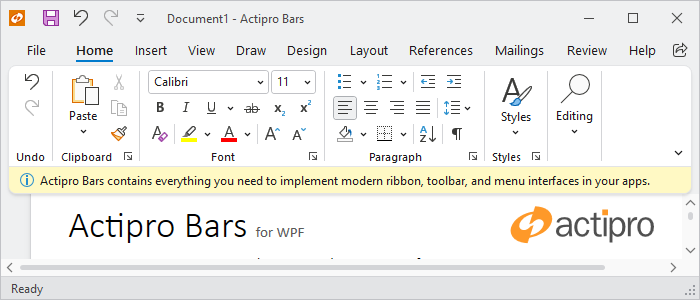

# Footer

Ribbon includes a built-in footer for displaying additional content below the ribbon.  The footer can be set to any content and is a great place to display tips or notifications.



*A ribbon with a footer*

## Defining a Footer

The footer can be defined in XAML or code-behind by assigning a [RibbonFooterControl](xref:@ActiproUIRoot.Controls.Bars.RibbonFooterControl) control instance to the [Ribbon](xref:@ActiproUIRoot.Controls.Bars.Ribbon).[FooterContent](xref:@ActiproUIRoot.Controls.Bars.Ribbon.FooterContent) property.

> [!NOTE]
> See the "MVVM Support" section below for details on alternatively using this property to define the footer via MVVM techniques.

The following example demonstrates defining a footer message with an icon.

```xaml
xmlns:bars="http://schemas.actiprosoftware.com/winfx/xaml/bars"
xmlns:shared="http://schemas.actiprosoftware.com/winfx/xaml/shared"
...
<bars:RibbonContainerPanel>
	<bars:Ribbon>
		<bars:Ribbon.FooterContent>
			<bars:RibbonFooterControl>
				<DockPanel>
					<shared:DynamicImage
						DockPanel.Dock="Left" Width="16" Height="16" Margin="0,0,5,0"
						Stretch="Uniform" StretchDirection="DownOnly" Source="/Images/Info16.png"
						HorizontalAlignment="Center" VerticalAlignment="Center"
						SnapsToDevicePixels="True" UseLayoutRounding="True" />
					<TextBlock VerticalAlignment="Center" TextWrapping="Wrap" Text="Footer message here."/>
				</DockPanel>
			</bars:RibbonFooterControl>
		</bars:Ribbon.FooterContent>
	</bars:Ribbon>
</bars:RibbonContainerPanel>
```

## MVVM Support

The footer may also be defined by setting the [Ribbon](xref:@ActiproUIRoot.Controls.Bars.Ribbon).[FooterContent](xref:@ActiproUIRoot.Controls.Bars.Ribbon.FooterContent) property to a view model that generates a [RibbonFooterControl](xref:@ActiproUIRoot.Controls.Bars.RibbonFooterControl) control via the ribbon's [ItemContainerTemplateSelector](xref:@ActiproUIRoot.Controls.Bars.Ribbon.ItemContainerTemplateSelector).

The optional companion [MVVM Library](../mvvm-support.md) defines a [RibbonFooterViewModel](xref:@ActiproUIRoot.Controls.Bars.Mvvm.RibbonFooterViewModel) class that is intended to be used as a view model for a [RibbonFooterControl](xref:@ActiproUIRoot.Controls.Bars.RibbonFooterControl) control, and the [BarControlTemplateSelector](xref:@ActiproUIRoot.Controls.Bars.Mvvm.BarControlTemplateSelector) class in the library generates a [RibbonFooterControl](xref:@ActiproUIRoot.Controls.Bars.RibbonFooterControl) for that view model.

A [RibbonFooterSimpleContentViewModel](xref:@ActiproUIRoot.Controls.Bars.Mvvm.RibbonFooterSimpleContentViewModel) instance may be assigned to the [RibbonFooterViewModel](xref:@ActiproUIRoot.Controls.Bars.Mvvm.RibbonFooterViewModel).[Content](xref:@ActiproUIRoot.Controls.Bars.Mvvm.RibbonFooterViewModel.Content) property.  This simple content view model supports easy definition of an image and text message for the footer.

> [!TIP]
> See the [MVVM Support](../mvvm-support.md) topic for more information on how to use the library's view models and view templates to create and manage your application's bars controls with MVVM techniques.

## Showing / Hiding the Footer

The ribbon will display the footer as long as the [Ribbon](xref:@ActiproUIRoot.Controls.Bars.Ribbon).[FooterContent](xref:@ActiproUIRoot.Controls.Bars.Ribbon.FooterContent) property is defined. To show the footer, set the [FooterContent](xref:@ActiproUIRoot.Controls.Bars.Ribbon.FooterContent) property to the desired content. To hide the footer, set the [FooterContent](xref:@ActiproUIRoot.Controls.Bars.Ribbon.FooterContent) property to `null`.

> [!IMPORTANT]
> The ribbon has an altered appearance based on the presence of the footer, so changing the `Visibility` property of a footer control is not sufficient to properly hide the footer.

## Changing the Background Color

By default, the footer background will use a color that is consistent with the ribbon theme, but any brush can be assigned to the [RibbonFooterControl](xref:@ActiproUIRoot.Controls.Bars.RibbonFooterControl).`Background` property to customize the appearance.  For example, a different color might be used to indicate the severity of a message or to simply draw attention to the footer area.


Instead of setting the `Background` property directly, the [RibbonFooterControl](xref:@ActiproUIRoot.Controls.Bars.RibbonFooterControl).[Kind](xref:@ActiproUIRoot.Controls.Bars.RibbonFooterControl.Kind) property can be set one of the [RibbonFooterKind](xref:@ActiproUIRoot.Controls.Bars.RibbonFooterKind) values to trigger a pre-defined background brush. This is the recommended approach for customizing the background since the resulting brush asset will be consistent with the current theme.

> [!TIP]
> See the [Reusable Assets](../../themes/reusable-assets.md) topic for details on customizing the pre-defined brush assets used by a footer kind.

> [!TIP]
> See the "Footer" Bars Ribbon QuickStart of the Sample Browser application for a full demonstration of working with the ribbon footer.