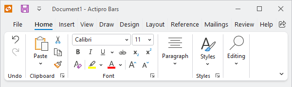
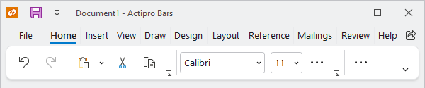

# Layout Modes and Density

Ribbon supports multiple layout modes and user interface densities to easily achieve the desired look and feel for your application.

## Layout Modes

Ribbon supports two different layout modes: [Classic](xref:@ActiproUIRoot.Controls.Bars.RibbonLayoutMode.Classic) and [Simplified](xref:@ActiproUIRoot.Controls.Bars.RibbonLayoutMode.Simplified).  Use the [Ribbon](xref:@ActiproUIRoot.Controls.Bars.Ribbon).[LayoutMode](xref:@ActiproUIRoot.Controls.Bars.Ribbon.LayoutMode) property to set the desired [RibbonLayoutMode](xref:@ActiproUIRoot.Controls.Bars.RibbonLayoutMode).

The ribbon can switch between layout modes at run-time without any change in configuration.  When allowed, users can use the [ribbon options button](options-button.md) to change layout modes.  Set the  [Ribbon](xref:@ActiproUIRoot.Controls.Bars.Ribbon).[CanChangeLayoutMode](xref:@ActiproUIRoot.Controls.Bars.Ribbon.CanChangeLayoutMode) property to `false` to prevent the user from changing layout modes.

### Classic

*Ribbon displayed in classic layout mode*

The [Classic](xref:@ActiproUIRoot.Controls.Bars.RibbonLayoutMode.Classic) layout mode, first introduced with Office 2007, uses a taller ribbon with a combination of large buttons and multi-row groups of controls that dynamically adjust to fill as much or as little space as is available.

### Simplified

*Ribbon displayed in simplified layout mode*

The [Simplified](xref:@ActiproUIRoot.Controls.Bars.RibbonLayoutMode.Simplified) layout mode is a modern refinement of the ribbon that appears more like a traditional toolbar with a single row of controls but can still dynamically adjust to fill the available space. When necessary, controls that do not have room to appear on the primary ribbon are moved to an overflow menu.

> [!TIP]
> See the "Layout Modes" Bars Ribbon QuickStart of the Sample Browser application for a demonstration of layout modes and user options.

## User Interface Density

Actipro Ribbon supports multiple levels of density that adjust the padding of user interface elements.  Set the [Ribbon](xref:@ActiproUIRoot.Controls.Bars.Ribbon).[UserInterfaceDensity](xref:@ActiproUIRoot.Controls.Bars.Ribbon.UserInterfaceDensity) property to one of the following [UserInterfaceDensity](xref:@ActiproUIRoot.Themes.UserInterfaceDensity) values.
- [UserInterfaceDensity](xref:@ActiproUIRoot.Themes.UserInterfaceDensity).[Compact](xref:@ActiproUIRoot.Themes.UserInterfaceDensity.Compact) is best for traditional mouse interactions and is the default for [RibbonLayoutMode](xref:@ActiproUIRoot.Controls.Bars.RibbonLayoutMode).[Classic](xref:@ActiproUIRoot.Controls.Bars.RibbonLayoutMode.Classic).
- [UserInterfaceDensity](xref:@ActiproUIRoot.Themes.UserInterfaceDensity).[Spacious](xref:@ActiproUIRoot.Themes.UserInterfaceDensity.Spacious) is great for touch interactions and is the default for [RibbonLayoutMode](xref:@ActiproUIRoot.Controls.Bars.RibbonLayoutMode).[Simplified](xref:@ActiproUIRoot.Controls.Bars.RibbonLayoutMode.Simplified).
- [UserInterfaceDensity](xref:@ActiproUIRoot.Themes.UserInterfaceDensity).[Normal](xref:@ActiproUIRoot.Themes.UserInterfaceDensity.Normal) is a little in-between [Compact](xref:@ActiproUIRoot.Themes.UserInterfaceDensity.Compact) and [Spacious](xref:@ActiproUIRoot.Themes.UserInterfaceDensity.Spacious) for a more balanced approach.

> [!TIP]
> See the "User Interface Density" Bars Ribbon QuickStart of the Sample Browser application for a demonstration of different density values applied to classic and simplified ribbons.
