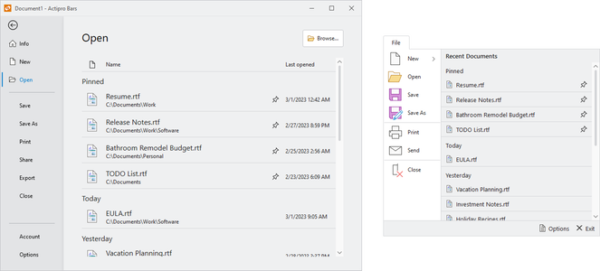

# Recent Documents

A [RecentDocumentControl](xref:@ActiproUIRoot.Controls.Bars.RecentDocumentControl) is a control that is intended to be used within a [backstage](backstage.md) or as the [RibbonApplicationButton](xref:@ActiproUIRoot.Controls.Bars.RibbonApplicationButton).[MenuAdditionalContent](xref:@ActiproUIRoot.Controls.Bars.RibbonApplicationButton.MenuAdditionalContent) of an [application menu](application-menu.md).

*A RecentDocumentControl shown in a backstage and application menu*

Recently opened documents are listed in a sorted order and can be clicked to open them.  Hovering the mouse over a document provides its full path.

Clicking on a document's pin button will toggle the pinned state of the document.  When pinned, the document will not fall off the list if there are other unpinned documents that have been opened more recently.

## Adding to a Backstage

The `RecentDocumentControl` can be added to a [Backstage](application-menu.md) as content for a [RibbonBackstageTabItem](xref:@ActiproUIRoot.Controls.Bars.RibbonBackstageTabItem).

When a `RecentDocumentControl` is included in a [RibbonBackstageTabItem](xref:@ActiproUIRoot.Controls.Bars.RibbonBackstageTabItem), it is recommended to leave the [RecentDocumentControl](xref:@ActiproUIRoot.Controls.Bars.RecentDocumentControl).[UseLargeSize](xref:@ActiproUIRoot.Controls.Bars.RecentDocumentControl.UseLargeSize) property at the default value of `true`.  This will enable the control to take advantage of the additional space afforded on a backstage and render similar to Office with large icons and descriptions.

## Adding to an Application Menu

The `RecentDocumentControl` can be added to the [RibbonApplicationButton](xref:@ActiproUIRoot.Controls.Bars.RibbonApplicationButton).[MenuAdditionalContent](xref:@ActiproUIRoot.Controls.Bars.RibbonApplicationButton.MenuAdditionalContent) property for use on an application menu.

> [!IMPORTANT]
> When used on an application menu, set the [RecentDocumentControl](xref:@ActiproUIRoot.Controls.Bars.RecentDocumentControl).[UseLargeSize](xref:@ActiproUIRoot.Controls.Bars.RecentDocumentControl.UseLargeSize) property to `false` so the control can render properly in a smaller size.

See the [Application Menu](application-menu.md) topic for more details on defining `MenuAdditionalContent` including sample code for using a `RecentDocumentControl`.

## Managing the Recent Document List

The recent document list is managed by the [RecentDocumentManager](xref:@ActiproUIRoot.DocumentManagement.RecentDocumentManager) that is assigned to the [RecentDocumentControl](xref:@ActiproUIRoot.Controls.Bars.RecentDocumentControl).[Manager](xref:@ActiproUIRoot.Controls.Bars.RecentDocumentControl.Manager) property.  This object maintains a list of [IDocumentReference](xref:@ActiproUIRoot.DocumentManagement.IDocumentReference) objects.

See the [Document Management](../../shared/windows-document-management.md) topic for details on how to manage the list using the [RecentDocumentManager](xref:@ActiproUIRoot.DocumentManagement.RecentDocumentManager), including the ability to limit the number of documents shown, associate icons with files, and set descriptions.

Changes to the [RecentDocumentManager](xref:@ActiproUIRoot.DocumentManagement.RecentDocumentManager) should automatically update the `RecentDocumentControl`.  However, certain changes such as updating a document reference's last-opened date/time may not be picked up by the manager as a change.  In these cases you must call [RecentDocumentManager](xref:@ActiproUIRoot.DocumentManagement.RecentDocumentManager).[RebindFilteredDocuments](xref:@ActiproUIRoot.DocumentManagement.RecentDocumentManager.RebindFilteredDocuments*) explicitly and the `RecentDocumentControl` will update in response.

## Processing Document Clicks

When the end user clicks on a document listed in the `RecentDocumentControl`, the [RecentDocumentControl](xref:@ActiproUIRoot.Controls.Bars.RecentDocumentControl).[OpenCommand](xref:@ActiproUIRoot.Controls.Bars.RecentDocumentControl.OpenCommand) will be executed with the corresponding [IDocumentReference](xref:@ActiproUIRoot.DocumentManagement.IDocumentReference) passed as the command parameter.  Since this action indicates the document should be opened, the `OpenCommand` property defaults to the standard WPF `ApplicationCommands.Open` routed command, but any command can be assigned to replace the default.

In the code that handles the execution of the command, use the command parameter (which is an [IDocumentReference](xref:@ActiproUIRoot.DocumentManagement.IDocumentReference)) to determine which document to open.  Since `ApplicationCommands.Open` might be raised in scenarios unrelated to opening a recent document, it is generally safe to assume that if no command parameter is passed, the command was not raised by the `RecentDocumentControl` and the default action for the command (e.g., browse for a file with an **Open File** dialog) should be invoked.

> [!TIP]
> See the "Recent Documents" Bars Ribbon QuickStart of the Sample Browser application for a full demonstration of configuring a backstage or application menu with a `RecentDocumentControl` and working with a `RecentDocumentManager`.

## Grouping

The `RecentDocumentControl` supports grouping documents based on [IDocumentReference](xref:@ActiproUIRoot.DocumentManagement.IDocumentReference).[LastOpenedDateTime](xref:@ActiproUIRoot.DocumentManagement.IDocumentReference.LastOpenedDateTime).  Set the [AllowGrouping](xref:@ActiproUIRoot.Controls.Bars.RecentDocumentControl.AllowGrouping) property to `false` to disable this functionality (defaults to `true`).

When grouping is allowed, all pinned documents will appear at the top. Unpinned documents will be grouped based on how recently they were last accessed.  Each group label is defined by a localizable `String` resource value. The following groups are available:

| Group | Resource key | Description |
|-----|-----|-----|
| Pinned | `UIRecentDocumentGroupPinnedText` | Pinned documents. |
| Today | `UIRecentDocumentGroupTodayText` | Documents last accessed on the current day. |
| Yesterday | `UIRecentDocumentGroupYesterdayText` | Documents last accessed on the previous day. |
| Older | `UIRecentDocumentGroupOlderText` | Documents last accessed two or more days ago. |
| Future | `UIRecentDocumentGroupFutureText` | Documents last accessed at a date chronologically after the current date. |

See the [Customizing String Resources](../../customizing-string-resources.md) topic for additional details on working with string resources.

## Customizing Column Text

When the [RecentDocumentControl](xref:@ActiproUIRoot.Controls.Bars.RecentDocumentControl).[UseLargeSize](xref:@ActiproUIRoot.Controls.Bars.RecentDocumentControl.UseLargeSize) property is set to `true`, document data is displayed in columns. The text displayed for these columns can be customized by setting the [DateTimeColumnText](xref:@ActiproUIRoot.Controls.Bars.RecentDocumentControl.DateTimeColumnText) and/or [NameColumnText](xref:@ActiproUIRoot.Controls.Bars.RecentDocumentControl.NameColumnText) properties to the desired value.

Each of these properties are initialized to a localizable `String` resource value. The following resources are configured:

| Resource key | Description |
|-----|-----|
| `UIRecentDocumentControlDateTimeColumnText` | The text displayed for [DateTimeColumnText](xref:@ActiproUIRoot.Controls.Bars.RecentDocumentControl.DateTimeColumnText). The default value is `"Last opened"`. |
| `UIRecentDocumentControlNameColumnText` | The text displayed for [NameColumnText](xref:@ActiproUIRoot.Controls.Bars.RecentDocumentControl.NameColumnText). The default value is `"Name"`. |

See the [Customizing String Resources](../../customizing-string-resources.md) topic for additional details on working with string resources.