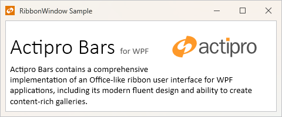

# Ribbon Window

Bars includes a [RibbonWindow](xref:@ActiproUIRoot.Controls.Bars.RibbonWindow) class, which is an implementation of the `Window` class and provides a custom window user interface much like that found in Office.



*A simple RibbonWindow hosting a `RichTextBox` but without any `Ribbon`*

It is *always* recommended that a [Ribbon](xref:@ActiproUIRoot.Controls.Bars.Ribbon) control implementation be hosted within a [RibbonWindow](xref:@ActiproUIRoot.Controls.Bars.RibbonWindow).

While a [RibbonWindow](xref:@ActiproUIRoot.Controls.Bars.RibbonWindow) can be used without a [Ribbon](xref:@ActiproUIRoot.Controls.Bars.Ribbon) control at all, any `Window` object can achieve the same look-and-feel by applying [WindowChrome](../../themes/windowchrome.md) directly on normal `Window` objects instead of using [RibbonWindow](xref:@ActiproUIRoot.Controls.Bars.RibbonWindow). This is the recommended approach if the `Window` will not contain a
[Ribbon](xref:@ActiproUIRoot.Controls.Bars.Ribbon) control.

> [!TIP]
> See the [WindowChrome](../../themes/windowchrome.md) topic for details.

## WindowChrome Usage

Each [RibbonWindow](xref:@ActiproUIRoot.Controls.Bars.RibbonWindow) already has a default [WindowChrome](../../themes/windowchrome.md) assigned that is configured to support the [quick access toolbar](quick-access-toolbar.md) and other ribbon features.  The `WindowChrome` is what allows any `Window` to have a customized user interface compared to a normal window.

### Customizing Ribbon Window Chrome

[RibbonWindow](xref:@ActiproUIRoot.Controls.Bars.RibbonWindow) is automatically configured with a [RibbonWindowChrome](xref:@ActiproUIRoot.Themes.RibbonWindowChrome) instance that sets default properties, like [BackdropKind](xref:@ActiproUIRoot.Themes.WindowChrome.BackdropKind), that are appropriate for a `RibbonWindow`.  The [RibbonWindowChrome](xref:@ActiproUIRoot.Themes.RibbonWindowChrome) class inherits the [WindowChrome](xref:@ActiproUIRoot.Themes.WindowChrome) class.

> [!NOTE]
> When defining [WindowChrome](../../themes/windowchrome.md) on a [RibbonWindow](xref:@ActiproUIRoot.Controls.Bars.RibbonWindow), it is recommended to use the [RibbonWindowChrome](xref:@ActiproUIRoot.Themes.RibbonWindowChrome) class since it is pre-configured with default values appropriate for a `RibbonWindow` and future changes to default values will also be implemented through this class.

The following example shows how to modify the [WindowChrome](../../themes/windowchrome.md) for a [RibbonWindow](xref:@ActiproUIRoot.Controls.Bars.RibbonWindow) to turn off the transparency effect and adjust the alignment of the title bar header:

```xaml
<bars:RibbonWindow ...
	xmlns:bars="http://schemas.actiprosoftware.com/winfx/xaml/bars"
	xmlns:themes="http://schemas.actiprosoftware.com/winfx/xaml/themes">

	<themes:WindowChrome.Chrome>
		<themes:RibbonWindowChrome BackdropKind="None"
		                           TitleBarHeaderAlignment="Center" />
	</themes:WindowChrome.Chrome>

</bars:RibbonWindow>
```

> [!TIP]
> See the [WindowChrome](../../themes/windowchrome.md) topic more details on more advanced customization options like injecting additional content into the title bar.