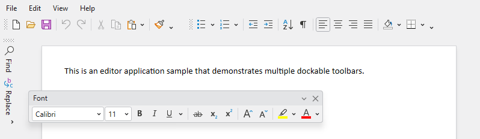
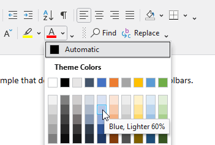
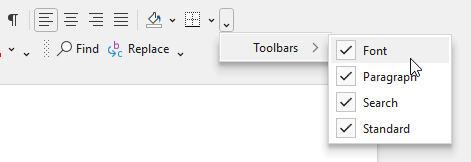

# Overview

A [DockableToolBar](xref:@ActiproUIRoot.Controls.Bars.DockableToolBar) control within a [DockableToolBarHost](xref:@ActiproUIRoot.Controls.Bars.DockableToolBarHost) is a toolbar that can be dragged to any side of the host, or even floated outside of the host.  Any toolbar controls, including popup buttons with galleries, can be used on a dockable toolbar.  The entire host and its toolbars can be configured via MVVM.

## Usage Scenarios

### Main Set of Toolbars

Dockable toolbars are very common in IDE applications and can be used in complex line of business applications as well, in scenarios where a ribbon may not be appropriate.



*Multiple dockable toolbars in various placements around their host*

Each dockable toolbar arranges its child controls on a single line.  More than one dockable toolbar can appear within a line.  In a scenario where not all toolbar child controls fit within a line, the child controls will be collapsed to an overflow popup as needed.  Transitions between variant sizes from medium (showing label) to small (no label) to collapsed (moved to overflow popup) are all supported for each control within the toolbar and can be configured.

## Dockable Toolbar Host

The [DockableToolBarHost](xref:@ActiproUIRoot.Controls.Bars.DockableToolBarHost) control is an `ItemsControl` and a root bar control.  It manages one or more dockable toolbars and arranges any docked toolbars in lines along its sides (left, top, right, or bottom).  Floating toolbars appear above the `Window` in which the host is contained.

### Host Child

The [DockableToolBarHost](xref:@ActiproUIRoot.Controls.Bars.DockableToolBarHost).[Child](xref:@ActiproUIRoot.Controls.Bars.DockableToolBarHost.Child) property sets the child control that fills the space within all docked toolbar lines.  The child control is stretched to fill that inner space.

@if (wpf) {
```xaml
xmlns:bars="http://schemas.actiprosoftware.com/winfx/xaml/bars"
...
<bars:DockableToolBarHost>

	<!-- Child control arranged within toolbar lines here -->
	<Border ...>
		...
	</Border>

</bars:DockableToolBarHost>
```
}

> [!IMPORTANT]
> Since the [Child](xref:@ActiproUIRoot.Controls.Bars.DockableToolBarHost.Child) property is always used, it is set as the default XAML content property for the [DockableToolBarHost](xref:@ActiproUIRoot.Controls.Bars.DockableToolBarHost) control instead of the `Items` property.

### Host Items

The item containers for a [DockableToolBarHost](xref:@ActiproUIRoot.Controls.Bars.DockableToolBarHost) control are [DockableToolBar](xref:@ActiproUIRoot.Controls.Bars.DockableToolBar) instances.  The instances can be set directly in XAML as in the following code, or via MVVM as described further below in this topic.  When using MVVM, a [DockableToolBar](xref:@ActiproUIRoot.Controls.Bars.DockableToolBar) control is generated to wrap each object item specified in the host's `ItemsSource`.

@if (wpf) {
```xaml
xmlns:bars="http://schemas.actiprosoftware.com/winfx/xaml/bars"
...
<bars:DockableToolBarHost>
	<bars:DockableToolBarHost.Items>
		<bars:DockableToolBar x:Name="standardToolBar" Title="Standard" LineIndex="0">
			<!-- Labels are auto-generated from Key -->
			<bars:BarButton Key="New" SmallImageSource="/Images/New16.png" Command="{Binding NewCommand}" />
			<bars:BarButton Key="Open" SmallImageSource="/Images/Open16.png" Command="{Binding OpenCommand}" />
			<bars:BarButton Key="Save" SmallImageSource="/Images/Save16.png" Command="{Binding SaveCommand}" />
			...
		</bars:DockableToolBar>
		<bars:DockableToolBar x:Name="editingToolBar" Title="Editing" LineIndex="1">
			<!-- Labels are auto-generated from Key -->
			<bars:BarButton Key="Undo" SmallImageSource="/Images/Undo16.png" Command="{Binding UndoCommand}" />
			<bars:BarButton Key="Redo" SmallImageSource="/Images/Redo16.png" Command="{Binding RedoCommand}" />
			<bars:BarSeparator />
			<bars:BarButton Key="Cut" SmallImageSource="/Images/Cut16.png" Command="{Binding CutCommand}" />
			<bars:BarButton Key="Copy" SmallImageSource="/Images/Copy16.png" Command="{Binding CopyCommand}" />
			<bars:BarButton Key="Paste" SmallImageSource="/Images/Paste16.png" Command="{Binding PasteCommand}" />
			...
		</bars:DockableToolBar>
	</bars:DockableToolBarHost.Items>

	<!-- Child control arranged within toolbar lines here -->
	<Border ...>
		...
	</Border>

</bars:DockableToolBarHost>
```
}

> [!IMPORTANT]
> Per above, the `Items` property is not the default XAML content property for the [DockableToolBarHost](xref:@ActiproUIRoot.Controls.Bars.DockableToolBarHost) control.  The `Items` property must therefore be explicitly declared when toolbars are specified directly in XAML.

## Toolbar Title

The [DockableToolBar](xref:@ActiproUIRoot.Controls.Bars.DockableToolBar).[Title](xref:@ActiproUIRoot.Controls.Bars.DockableToolBar.Title) property designates a string title for the toolbar that can appear in several UI locations, including:

- The toolbar's title bar when floating.
- A menu item in the **Options** menu to toggle the toolbar's visibility.

## Toolbar Overflow Behavior

The [DockableToolBar](xref:@ActiproUIRoot.Controls.Bars.DockableToolBar) control can alter the variant size of child controls as available size changes.  If a child control is unable to fit in the available space, it will be overflowed to a popup **Options** menu from where a related menu context variation of the control can be fully accessed.

The [IsOverflowed](xref:@ActiproUIRoot.Controls.Bars.DockableToolBar.IsOverflowed) property returns whether the toolbar is currently in an overflowed state.

## Toolbar Child Controls

The toolbars can host all [Bars controls](../controls/index.md) that are meant for a toolbar context.  A powerful feature is the ability to use a [popup button](../controls/popup-button.md) or [split button](../controls/split-button.md) to show a graphically rich [menu gallery](../controls/gallery.md) in its popup menu.



*A dockable toolbar with a gallery open*

### Variants

Several controls support multiple variant sizes, where each variant alters the appearance of the control.  As the variant size moves from larger to smaller, the change in appearance generally involves a reduction in the amount of information displayed in the control's content to save on overall space usage.

The following [VariantSize](xref:@ActiproUIRoot.Controls.Bars.VariantSize) values are supported by the dockable toolbar's children in order from largest to smallest:

| Variant Size | Description |
| --- | --- |
| `Medium` | Most controls display as an icon with a label. |
| `Small` (Default) | Most controls display only as an icon. |
| `Collapsed` | Controls are moved to the **Options** menu. |

A dockable toolbar will always try to display a control at the largest variant size for the available space.

The [VariantSize](xref:@ActiproUIRoot.Controls.Bars.VariantSize).[Large](xref:@ActiproUIRoot.Controls.Bars.VariantSize.Large) value has no effect on controls in a dockable toolbar.

### Variant Behaviors

Most controls define a `ToolBarItemVariantBehavior` property (e.g., [BarButton](xref:@ActiproUIRoot.Controls.Bars.BarButton).[ToolBarItemVariantBehavior](xref:@ActiproUIRoot.Controls.Bars.BarButton.ToolBarItemVariantBehavior)) that determines the allowed variant sizes of a control when it is displayed in a ribbon with the `Simplified` layout mode or a toolbar.

Since the default variant behavior is `AlwaysSmall`, most controls will appear without a label.  By setting `ToolBarItemVariantBehavior` = `All`, most controls will use a medium variant to display with a label when space is available and will shrink to a small variant without a label, as needed.  Use the `AlwaysMedium` value to require a label and prevent small variant sizes.  Note that large variant sizes are unsupported in toolbars.

The following example shows buttons using the `ToolBarItemVariantBehavior` property in a dockable toolbar:

@if (wpf) {
```xaml
xmlns:bars="http://schemas.actiprosoftware.com/winfx/xaml/bars"
...

<!-- Will show a label when space is available -->
<bars:BarSplitButton Key="New" ... ToolBarItemVariantBehavior="All" />

<!-- Will always show a label -->
<bars:BarButton Key="Open" ... ToolBarItemVariantBehavior="AlwaysMedium" />

<!-- The default, will only show an icon and never a label -->
<bars:BarToggleButton Key="Bold" ... ToolBarItemVariantBehavior="AlwaysSmall" />
```
}

> [!NOTE]
> The `ToolBarItemCollapseBehavior` property defined by some child controls is not used by dockable toolbars.

### Control Variants

The [DockableToolBarHost](xref:@ActiproUIRoot.Controls.Bars.DockableToolBarHost).[ControlVariants](xref:@ActiproUIRoot.Controls.Bars.DockableToolBarHost.ControlVariants) property can be assigned values to dynamically alter toolbar child control variant sizes as necessary.  Control variants are set at the host level since they apply to all toolbars that are managed by the host. The variants are applied in order of their declaration within the collection.

> [!TIP]
> See the **Explicit Variant Sizing** section within the [Resizing and Variants](../ribbon-features/resizing.md) topic for detailed information on how control variants are assigned and used.  The information in that topic related to a ribbon in `Simplified` layout mode applies to dockable toolbars as well.

#### Default Logic

If no control variants are defined, the default logic when space is required is for the last toolbar child control in a line to have its variant size shifted down until it is collapsed and overflowed to the **Options** menu.  This process repeats until enough space is reclaimed.

It is often better to prioritize the variant size changes so that less important controls are affected first.  That's why specifying control variants is an important step in the later stages of app development.

## Docked Toolbar Layout

The layout of toolbars docked within a host is controlled by multiple [DockableToolBar](xref:@ActiproUIRoot.Controls.Bars.DockableToolBar) properties.

### Placement

The [Placement](xref:@ActiproUIRoot.Controls.Bars.DockableToolBar.Placement) property specifies a `Dock` enumeration value with these high-level options:

- `Left` - Docked along the left side of the host.
- `Top` - Docked along the top side of the host.
- `Right` - Docked along the right side of the host.
- `Bottom` - Docked along the bottom side of the host.

### Line Index

Each placement side can have zero to many lines that contain docked toolbars.  The outermost line in a placement side, meaning the line furthest from the host's [Child](xref:@ActiproUIRoot.Controls.Bars.DockableToolBarHost.Child) control, is line index `0`.  The next line inward has line index `1` and so on.

As an example, assuming **Standard** and **Editing** toolbars are both docked on the `Top` placement side.  Set the **Standard** toolbar's [LineIndex](xref:@ActiproUIRoot.Controls.Bars.DockableToolBar.LineIndex) to `0` and the **Editing** toolbar's [LineIndex](xref:@ActiproUIRoot.Controls.Bars.DockableToolBar.LineIndex) to `1` to have the **Standard** toolbar appear above the **Editing** toolbar.

### Sort Order

When there is more than one toolbar docked in the same line, the [SortOrder](xref:@ActiproUIRoot.Controls.Bars.DockableToolBar.SortOrder) property determines the order in which they appear from left-to-right for horizontal toolbars, or top-to-bottom for vertical toolbars.  Lower numbers are sorted before higher numbers for sort orders.

### Offset

The [Offset](xref:@ActiproUIRoot.Controls.Bars.DockableToolBar.Offset) property determines the ideal starting offset within a line at which the left or top of the toolbar appears, based on its orientation, and assuming that space is available.  If a toolbar docked on top and alone in a line is `500` units wide and the host is `800` units wide, an [Offset](xref:@ActiproUIRoot.Controls.Bars.DockableToolBar.Offset) of `80` units would mean the toolbar would show in the top line `80` units in from the left edge of the host.

When there is not enough space to fit a non-overflowed toolbar at a target [Offset](xref:@ActiproUIRoot.Controls.Bars.DockableToolBar.Offset), its effective offset may be coerced as necessary to keep child controls from overflowing as much as possible.

## Floating Toolbar Layout

### Floating State

The [IsFloating](xref:@ActiproUIRoot.Controls.Bars.DockableToolBar.IsFloating) property is `true` when a toolbar is in a floating state above the host.  When the property is `false`, the toolbar is docked within the host.

### Floating Location

The [FloatingLocation](xref:@ActiproUIRoot.Controls.Bars.DockableToolBar.FloatingLocation) property returns the current location of the toolbar when floating.

## Dragging

A docked toolbar can be dragged using the gripper on its left or top side, depending on orientation.  A floating toolbar can be dragged using its title bar.  Dragging a toolbar can position it in various docked locations or can tear it off so that it is floating.

### Preventing Removal from Docked Placement

Hold the <kbd>Ctrl</kbd> key while dragging an already-docked toolbar to ensure it doesn't float or move to another docked placement side.

### Preventing Docking

Hold the <kbd>Ctrl</kbd> key while dragging a floating toolbar to prevent it from docking.

## Toolbar Visibility

A dockable toolbar can be hidden by setting its `Visibility` property to `Collapsed`.

The end user can also toggle a toolbar's visibility by opening any toolbar's **Options** menu, navigating to the **Toolbars** sub-menu, and checking or unchecking the menu item for the related toolbar.



*A dockable toolbar's options menu*

The same menu with toolbar visibility menu items is displayed as a context menu anywhere over the [DockableToolBarHost](xref:@ActiproUIRoot.Controls.Bars.DockableToolBarHost).

## Toolbar Options

There are many toolbar-related options that can be configured.

### Floating Capabilities

The [DockableToolBarHost](xref:@ActiproUIRoot.Controls.Bars.DockableToolBarHost).[CanToolBarsFloat](xref:@ActiproUIRoot.Controls.Bars.DockableToolBarHost.CanToolBarsFloat) property, which defaults to `true`, determines whether dockable toolbars are allowed to float.  When this property is `false`, dockable toolbars may only be displayed in the docked state.

### Spacings

The [DockableToolBarHost](xref:@ActiproUIRoot.Controls.Bars.DockableToolBarHost) control has several properties that determine spacing around toolbars and its [Child](xref:@ActiproUIRoot.Controls.Bars.DockableToolBarHost.Child) content:

- [LineSpacing](xref:@ActiproUIRoot.Controls.Bars.DockableToolBarHost.LineSpacing) - The spacing between lines, which defaults to `1`.
- [ToolBarSpacing](xref:@ActiproUIRoot.Controls.Bars.DockableToolBarHost.ToolBarSpacing) - The spacing between toolbars on the same line, which defaults to `1`.
- [ToolBarItemSpacing](xref:@ActiproUIRoot.Controls.Bars.DockableToolBarHost.ToolBarItemSpacing) - The amount of spacing between toolbar items, which defaults to `1`.
- [OuterPadding](xref:@ActiproUIRoot.Controls.Bars.DockableToolBarHost.OuterPadding) - The padding around the outside of the dock areas when a toolbar is in the dock area, which defaults to `1`.
- `Padding` - The padding around the inside of the dock areas when a toolbar is in the dock area, which defaults to `0`.

### Grippers

The [DockableToolBarHost](xref:@ActiproUIRoot.Controls.Bars.DockableToolBarHost).[ToolBarsHaveGrippers](xref:@ActiproUIRoot.Controls.Bars.DockableToolBarHost.ToolBarsHaveGrippers) property provides the default value for whether grippers are displayed on toolbars when docked.  The default value is `true`.

The [DockableToolBar](xref:@ActiproUIRoot.Controls.Bars.DockableToolBar).[HasGripper](xref:@ActiproUIRoot.Controls.Bars.DockableToolBar.HasGripper) property is an instance-specific setting.  When it has its default value of `null`, it will use the host's default value.  Otherwise, it will override the host's default value for that particular toolbar only.

### Options Buttons

The [DockableToolBarHost](xref:@ActiproUIRoot.Controls.Bars.DockableToolBarHost).[ToolBarsHaveOptionsButtons](xref:@ActiproUIRoot.Controls.Bars.DockableToolBarHost.ToolBarsHaveOptionsButtons) property provides the default value for whether options buttons are displayed on toolbars.  The default value is `true`.

The [DockableToolBar](xref:@ActiproUIRoot.Controls.Bars.DockableToolBar).[HasOptionsButton](xref:@ActiproUIRoot.Controls.Bars.DockableToolBar.HasOptionsButton) property is an instance-specific setting.  When it has its default value of `null`, it will use the host's default value.  Otherwise, it will override the host's default value for that particular toolbar only.

## Key Tips

[Key Tips](../ribbon-features/key-tips.md) are not supported within dockable toolbars.

## Screen Tips

The child controls support screen tips, which are formatted tool tips.

See the [Screen Tips](../ribbon-features/screen-tips.md) topic for more information on screen tips.

## MVVM Support

The optional companion [MVVM Library](../mvvm-support.md) defines a [DockableToolBarHostViewModel](xref:@ActiproUIRoot.Controls.Bars.Mvvm.DockableToolBarHostViewModel) class that is intended to be used as a view model for a [DockableToolBarHost](xref:@ActiproUIRoot.Controls.Bars.DockableToolBarHost) control.

@if (wpf) {
If a [DockableToolBarHostViewModel](xref:@ActiproUIRoot.Controls.Bars.Mvvm.DockableToolBarHostViewModel) instance is bound to the [DockableToolBarHost](xref:@ActiproUIRoot.Controls.Bars.DockableToolBarHost).`DataContext`, a built-in `Style` with resource key [BarsMvvmResourceKeys.DockableToolBarHostStyle](xref:@ActiproUIRoot.Themes.BarsMvvmResourceKeys.DockableToolBarHostStyle) can be applied to configure bindings for all the view model's properties:

```xaml
xmlns:bars="http://schemas.actiprosoftware.com/winfx/xaml/bars"
xmlns:themes="http://schemas.actiprosoftware.com/winfx/xaml/themes"
...
<bars:DockableToolBarHost ...
	DataContext="{Binding DockableToolBarHostViewModel}"
	Style="{StaticResource {x:Static themes:BarsMvvmResourceKeys.DockableToolBarHostStyle}}"
	>
	...
</bars:DockableToolBarHost>
```
}

The [DockableToolBarHostViewModel](xref:@ActiproUIRoot.Controls.Bars.Mvvm.DockableToolBarHostViewModel) class has properties for most common host settings and a [ToolBars](xref:@ActiproUIRoot.Controls.Bars.Mvvm.DockableToolBarHostViewModel.ToolBars) collection property that is bound to the [DockableToolBarHost](xref:@ActiproUIRoot.Controls.Bars.DockableToolBarHost).`ItemsSource`.  Each item in that collection is of type [DockableToolBarViewModel](xref:@ActiproUIRoot.Controls.Bars.Mvvm.DockableToolBarViewModel).

The [DockableToolBarViewModel](xref:@ActiproUIRoot.Controls.Bars.Mvvm.DockableToolBarViewModel) class has properties for configuring a dockable toolbar.  View models for child controls can be inserted into its [Items](xref:@ActiproUIRoot.Controls.Bars.Mvvm.DockableToolBarViewModel.Items) collection.

> [!TIP]
> See the [MVVM Support](../mvvm-support.md) topic for more information on how to use the library's view models and view templates to create and manage your application's bars controls with MVVM techniques.

### Child Control Data Context Notes

@if (wpf) {
When using the [BarsMvvmResourceKeys.DockableToolBarHostStyle](xref:@ActiproUIRoot.Themes.BarsMvvmResourceKeys.DockableToolBarHostStyle) as in the example above, the host's `DataContext` is altered from whatever data context normally would have been inherited.  This is done since the setters in the style expect a [DockableToolBarHostViewModel](xref:@ActiproUIRoot.Controls.Bars.Mvvm.DockableToolBarHostViewModel) as the data context.
}

This presents a minor issue for the [Child](xref:@ActiproUIRoot.Controls.Bars.DockableToolBarHost.Child) control, which may expect the host's original data context to be inherited.  To work around this, bind the child control's `DataContext` to the `DataContext` of an element above the [DockableToolBarHost](xref:@ActiproUIRoot.Controls.Bars.DockableToolBarHost) in hierarchy, such as:

@if (wpf) {
```xaml
xmlns:bars="http://schemas.actiprosoftware.com/winfx/xaml/bars"
...
<Window x:Name="window">
	<bars:DockableToolBarHost ...
		DataContext="{Binding DockableToolBarHostViewModel}"
		Style="{StaticResource {x:Static themes:BarsMvvmResourceKeys.DockableToolBarHostStyle}}"
		>

		<!-- Child control arranged within toolbar lines here -->
		<Border DataContext="{Binding ElementName=window, Path=DataContext}" ...>
			...
		</Border>

	</bars:DockableToolBarHost>
</Window>
```
}
