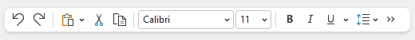

# Overview

Actipro Bars includes a standalone toolbar control that has many features beyond what the native `ToolBar` control offers.

## Standalone Toolbars

The `StandaloneToolBar` control is meant to be a replacement for a native `ToolBar` control.  It supports horizontal and vertical orientation, can make use of all the [Bars controls](../controls/index.md) and their features (including menu galleries), and overflows items to a popup.  As with the other root bar controls, it can be fully configured via MVVM.

*A standalone toolbar is ideal as a main toolbar instead of a ribbon in apps with fewer commands*

See the [Standalone Toolbars](standalone-toolbars.md) topic for more information.

