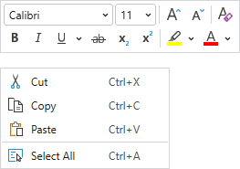
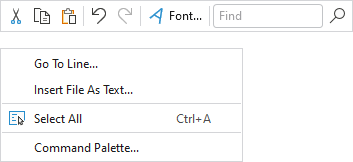

# Overview

The [MiniToolBar](xref:@ActiproUIRoot.Controls.Bars.MiniToolBar) control is intended for display in a popup, providing a compact set of controls that can alter the current selection or state of a target control.  Any toolbar controls, including popup buttons with galleries, can be used on the mini-toolbar.



*A context menu with a multi-row mini-toolbar*

## Usage Scenarios

### In a Context Menu

A mini-toolbar can be paired and displayed with a [context menu](../menu-features/context-menus.md). Normally the mini-toolbar appears above the context menu. If a menu item on the context menu is chosen, both the context menu and mini-toolbar close. Alternatively, if the end user clicks a control on the mini-toolbar, the mini-toolbar remains open but the context menu closes. After this point the mini-toolbar behaves as if it was opened standalone.

This sample code shows how to define a context menu with a mini-toolbar for a `TextBox`:

```xaml
xmlns:bars="http://schemas.actiprosoftware.com/winfx/xaml/bars"
...
<TextBox>
	<TextBox.ContextMenu>
		<bars:BarContextMenu>
			<!-- Labels are auto-generated from Command -->
			<bars:BarMenuItem Command="SelectAll" SmallImageSource="/Images/Icons/SelectAll16.png" />
			...
			<bars:BarContextMenu.MiniToolBarContent>
				<bars:MiniToolBar>
					<bars:BarButton Command="ApplicationCommands.Cut" SmallImageSource="/Images/Icons/Cut16.png" />
					<bars:BarButton Command="ApplicationCommands.Copy" SmallImageSource="/Images/Icons/Copy16.png" />
					<bars:BarButton Command="ApplicationCommands.Paste" SmallImageSource="/Images/Icons/Paste16.png" />
					<bars:BarSeparator />
					<bars:BarButton Command="ApplicationCommands.Undo" SmallImageSource="/Images/Icons/Undo16.png" />
					<bars:BarButton Command="ApplicationCommands.Redo" SmallImageSource="/Images/Icons/Redo16.png" />
					...
				</bars:MiniToolBar>
			</bars:BarContextMenu.MiniToolBarContent>
		</bars:BarContextMenu>
	</TextBox.ContextMenu>
</TextBox>
```

The [BarContextMenu](xref:@ActiproUIRoot.Controls.Bars.BarContextMenu).[MiniToolBarContent](xref:@ActiproUIRoot.Controls.Bars.BarContextMenu.MiniToolBarContent) property can be set to a [MiniToolBar](xref:@ActiproUIRoot.Controls.Bars.MiniToolBar) control instance directly, or to a view model (see the "MVVM Support" section below) that will generate a [MiniToolBar](xref:@ActiproUIRoot.Controls.Bars.MiniToolBar) instance.  In either case, the resolved [MiniToolBar](xref:@ActiproUIRoot.Controls.Bars.MiniToolBar) control is returned in the read-only [BarContextMenu](xref:@ActiproUIRoot.Controls.Bars.BarContextMenu).[MiniToolBar](xref:@ActiproUIRoot.Controls.Bars.BarContextMenu.MiniToolBar) property.

## Child Controls

The toolbar can host all [Bars controls](../controls/index.md) that are meant for a toolbar context.  A powerful feature is the ability to use a [popup button](../controls/popup-button.md) or [split button](../controls/split-button.md) to show a graphically-rich [menu gallery](../controls/gallery.md) in its popup menu.

Most controls define a `ToolBarItemVariantBehavior` property (e.g., [BarButton](xref:@ActiproUIRoot.Controls.Bars.BarButton).[ToolBarItemVariantBehavior](xref:@ActiproUIRoot.Controls.Bars.BarButton.ToolBarItemVariantBehavior)) that determines the allowed variant sizes of a control when it is displayed in a toolbar.  The property defaults to `AlwaysSmall`, causing controls to display in a `Small` variant, which often means icon only.

Since the mini-toolbar doesn't dynamically adjust child control variants as space decreases like a ribbon does, it only uses each child's `ToolBarItemVariantBehavior` property as a guideline for what single variant size to support for that child.  Therefore as an example, to display an icon and label for a particular button, set the [BarButton](xref:@ActiproUIRoot.Controls.Bars.BarButton).[ToolBarItemVariantBehavior](xref:@ActiproUIRoot.Controls.Bars.BarButton.ToolBarItemVariantBehavior) property to `AlwaysMedium`.

## Multi-Row Layouts

A mini-toolbar will arrange its child controls in a single row by default.  Set the [MiniToolBar](xref:@ActiproUIRoot.Controls.Bars.MiniToolBar).[CanUseMultiRowLayout](xref:@ActiproUIRoot.Controls.Bars.MiniToolBar.CanUseMultiRowLayout) property to `true` to use two rows for child controls.



*A context menu with a single-row mini-toolbar*

When a multi-row layout is in effect, the mini-toolbar will attempt to split the controls such that the rows have as equal width as possible, while still maintaining the same child control order.  If the mini-toolbar doesn't contain any separators, it will split the rows between two controls.  If the mini-toolbar does contain separators, it will split the rows at a separator.

## Screen Tips

The child controls support screen tips, which are formatted tool tips.  Screen tips attempt to display below the [MiniToolBar](xref:@ActiproUIRoot.Controls.Bars.MiniToolBar).

See the [Screen Tips](../ribbon-features/screen-tips.md) topic for more information on screen tips.

## MVVM Support

The mini-toolbar may be defined in a context menu by setting the [BarContextMenu](xref:@ActiproUIRoot.Controls.Bars.BarContextMenu).[MiniToolBarContent](xref:@ActiproUIRoot.Controls.Bars.BarContextMenu.MiniToolBarContent) property to a view model that generates a [MiniToolBar](xref:@ActiproUIRoot.Controls.Bars.MiniToolBar) control via the context menu's `ItemContainerTemplateSelector`.

The optional companion [MVVM Library](../mvvm-support.md) defines a [MiniToolBarViewModel](xref:@ActiproUIRoot.Controls.Bars.Mvvm.MiniToolBarViewModel) class that is intended to be used as a view model for a [MiniToolBar](xref:@ActiproUIRoot.Controls.Bars.MiniToolBar) control, and the [BarControlTemplateSelector](xref:@ActiproUIRoot.Controls.Bars.Mvvm.BarControlTemplateSelector) class in the library generates a [MiniToolBar](xref:@ActiproUIRoot.Controls.Bars.MiniToolBar) for that view model.

> [!TIP]
> See the [MVVM Support](../mvvm-support.md) topic for more information on how to use the library's view models and view templates to create and manage your application's bars controls with MVVM techniques.

## Customizing the Toolbar Style

The [MiniToolBar](xref:@ActiproUIRoot.Controls.Bars.MiniToolBar) instance can be customized by setting a `Style` to the [BarContextMenu](xref:@ActiproUIRoot.Controls.Bars.BarContextMenu).[MiniToolBarStyle](xref:@ActiproUIRoot.Controls.Bars.BarContextMenu.MiniToolBarStyle) property.  This `Style` is applied to the control when it is added to the context menu.
