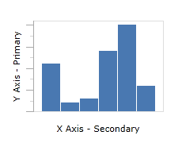
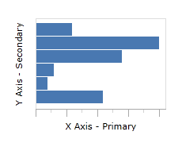

# Chart Basics

This topic discusses some of the basic concepts for using Charts.

## Primary vs. Secondary Axis

The [XYChart](xref:@ActiproUIRoot.Controls.Charts.XYChart) control supports two axes, X and Y.  The X axis runs horizontally along the control, and the Y axis runs vertically.  All series default to rendering horizontally, which means that Y is the primary axis and X is the secondary axis.

Certain series types, such as `Bar`, support vertical orientations as well as the default horizontal orientation.  With vertically oriented series, X is the primary axis and Y is the secondary axis.

See the [Chart Types](chart-types/index.md) topic for additional information.

*Horizontal Bar Chart*

*Vertical Bar Chart*

## Adding a Series

Each series is represented by an individual .NET type.  For instance, a `Line` series is implemented by the [LineSeries](xref:@ActiproUIRoot.Controls.Charts.LineSeries) class.

Add any series you would like to display to the [XYChart](xref:@ActiproUIRoot.Controls.Charts.XYChart).[Series](xref:@ActiproUIRoot.Controls.Charts.XYChart.Series) collection.  The chart will automatically scale the X and Y axes to fit the data of each series properly, however you can also specify axes and control how they are displayed.  See [Axes](xy-chart-features/axes.md) for more details.

See the [Chart Types](chart-types/index.md) topic for a list of the available chart types.

## Specifying Items

Each series is bound to it's own data source, which is indicated by the [ItemsSource](xref:@ActiproUIRoot.Controls.Charts.Primitives.SeriesBase.ItemsSource) property.  The [XPath](xref:@ActiproUIRoot.Controls.Charts.Primitives.XYSeriesBase.XPath) and [YPath](xref:@ActiproUIRoot.Controls.Charts.Primitives.XYSeriesBase.YPath) will determine the property path used for values on the X and Y axes.

When [XPath](xref:@ActiproUIRoot.Controls.Charts.Primitives.XYSeriesBase.XPath) and [YPath](xref:@ActiproUIRoot.Controls.Charts.Primitives.XYSeriesBase.YPath) are not specified, then the respective X and Y values will instead be the items in the [ItemsSource](xref:@ActiproUIRoot.Controls.Charts.Primitives.SeriesBase.ItemsSource) collection.

When X or Y axes values resolve to a quantifiable or numeric data type, such as `Double`, `Decimal`, `Int32` or `DateTime`, then the respective axis should match the data type.  If axes are not specified, they wil be set automatically.

When X or Y axes values resolve to a complex object or reference type, such as `String` or a user-provided type, then the respective axis should be [XYGroupedAxis](xref:@ActiproUIRoot.Controls.Charts.XYGroupedAxis).  By default, these type of values will be grouped based on object equality.  Grouping can be determined based on custom criteria by specifying [XYGroupedAxis](xref:@ActiproUIRoot.Controls.Charts.XYGroupedAxis).[GroupingFunc](xref:@ActiproUIRoot.Controls.Charts.XYGroupedAxis.GroupingFunc).

See the [Specifying Items](xy-chart-features/specifying-items.md) topic for additional information.
