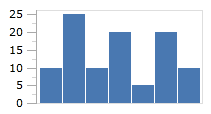

# Bar

A bar chart displays rectangular bars with lengths proportional to the values they represent.

## Baseline Value

The bar series will pivot it's bars based on the chart's baseline value, as specified by the `Baseline` property on [XYDateTimeAxis](xref:@ActiproUIRoot.Controls.Charts.XYDateTimeAxis), [XYDoubleAxis](xref:@ActiproUIRoot.Controls.Charts.XYDoubleAxis), or [XYDecimalAxis](xref:@ActiproUIRoot.Controls.Charts.XYDecimalAxis).

In the following example, the data rendered by the chart uses the index postion along the X-axis and the fixed values `10, 25, 10, 20, 5, 20, 10` for the Y-axis.  The first image shows the series using `5` as the minimum value along the Y-axis, and `25` for the maximum.  Since our baseline is `0` (the default), the bars are not pivoted.

If we explicitly set our baseline value to `15`, then any values below the baseline will be considered "negative" and the bars will appear to "grow" down instead of up.

## Orientation

The bar chart can be oriented horizontally (the default) or vertically by setting the [Orientation](xref:@ActiproUIRoot.Controls.Charts.Primitives.BarSeriesBase.Orientation) property.  When switching orientation, the values of the [XPath](xref:@ActiproUIRoot.Controls.Charts.Primitives.XYSeriesBase.XPath) and [YPath](xref:@ActiproUIRoot.Controls.Charts.Primitives.XYSeriesBase.YPath) properties may need to be swapped.

## Bar Spacing

The [BarSpacing](xref:@ActiproUIRoot.Controls.Charts.Primitives.XYAxisBase.BarSpacing) property can be used to configure the space between the bars. The default value is `1px`, which indicates there should be a 1 pixel space between the bars.
