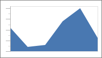
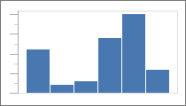
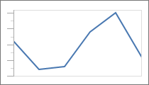
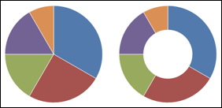
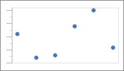

# Overview

Actipro Charts includes a number of built-in chart types.

<table>
<thead>

<tr>
<th>Name</th>
<th>Description</th>
</tr>

</thead>
<tbody>

<tr>
<td>

[Area](area.md)

</td>
<td>

An area chart is a derivative of a line chart.  The area between the line and axis is filled in.  Markers and lines can optionally be displayed.

</td>
</tr>

<tr>
<td>

[Bar](bar.md)

</td>
<td>

A bar chart displays rectangular bars with lengths proportional to the values they represent.

</td>
</tr>

<tr>
<td>

[Line](line.md)

</td>
<td>

A line chart render quantitative data as a series of points connected by line segments.  Lines can be straight, curved, or stepped.  Markers can optionally be displayed.

</td>
</tr>

<tr>
<td>

[Pie / Donut](pie.md)

</td>
<td>

A pie chart can display data points as pie slices, or in the case of a donut chart, cocentric rings.

</td>
</tr>

<tr>
<td>

[Scatter](scatter.md)

</td>
<td>

Scatter charts render data points where each point is represented by a marker.

</td>
</tr>

</tbody>
</table>
