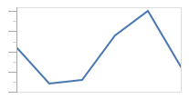
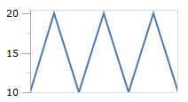
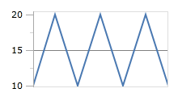
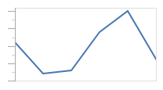
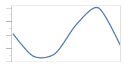
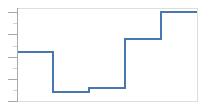

# Line

A line chart renders quantitative data as a series of points connected by line segments, which can be straight, curved, or stepped.

## Baseline Value

The chart's baseline value, as specified by the `Baseline` property on [XYDateTimeAxis](xref:ActiproSoftware.Windows.Controls.Charts.XYDateTimeAxis), [XYDoubleAxis](xref:ActiproSoftware.Windows.Controls.Charts.XYDoubleAxis), or [XYDecimalAxis](xref:ActiproSoftware.Windows.Controls.Charts.XYDecimalAxis).

In the following example, the data rendered by the chart uses the index postion along the X-axis and the fixed values `10, 20, 10, 20, 10, 20, 10` for the Y-axis.  The first image shows the series using `10` as the minimum value along the Y-axis, and `20` for the maximum.

If we explicitly set our baseline value to `15`, then any values below the baseline will be considered "negative".  Visually nothing will change unless the baseline is shown, using [XYChart](xref:ActiproSoftware.Windows.Controls.Charts.XYChart).[IsAxisBaselineVisible](xref:ActiproSoftware.Windows.Controls.Charts.XYChart.IsAxisBaselineVisible).

## Line Kind

The line series supports three kinds of lines specified by the [LineKind](xref:ActiproSoftware.Windows.Controls.Charts.Primitives.LineSeriesBase.LineKind).  By default, the `Normal` kind of line is used which simply draws a line to connect the data points.

*An line series using a normal line kind*

The `Spline` line kind builds a canonical spline that runs through the data points, producing a smooth line.

*An line series using a spline line kind*

The `Step` line kind creates a line that only uses horizontal and vertical lines to connect the data points, producing a step look.

*An line series using a step line kind*

## Markers

The line series can render a markers at each data point to highlight the actual location.  By default the markers is not rendered, but they can be shown by setting [MarkerVisibility](xref:ActiproSoftware.Windows.Controls.Charts.Primitives.LineSeriesBase.MarkerVisibility) to a value other than `None`.  The line series has the same configuration properties available as the scatter series, with regards to marker rendering.

See the [Scatter](scatter.md) topic for more information on the options available.
