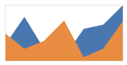

# Multiple and Stacked Series

The chart control supports multiple series which can be optionally stacked on top of the previous series.

## Multiple Series

Any number of series can be added to the chart, which will simply render one on top of each (in z-order) Simply add the series to the [XYChart](xref:@ActiproUIRoot.Controls.Charts.XYChart).[Series](xref:@ActiproUIRoot.Controls.Charts.XYChart.Series) collection that you would like to be rendered.

In this example, we display a bar and line series in the same chart:

```xaml
<charts:XYChart Width="200" Height="100" >
	<charts:BarSeries ItemsSource="4;11;3;1;8;9;14" />
	<charts:LineSeries ItemsSource="7;3;5;1;1;3;10" />
	<charts:XYChart.YAxes>
		<charts:XYDoubleAxis Minimum="0"/>
	</charts:XYChart.YAxes>
</charts:XYChart>
```

This results in the following chart:


The chart will automatically align the multiple series along the secondary axis (X in this example).  So, if the series have data with disparate values, then it will automatically adjust to fit the data.

In this example, we add additional data points to the line series:

```xaml
<charts:XYChart Width="200" Height="100">
	<charts:BarSeries ItemsSource="4;11;3;1;8;9;14" />
	<charts:LineSeries ItemsSource="7;3;5;1;1;3;10;5;2;8;1;14" />
	<charts:XYChart.YAxes>
		<charts:XYDoubleAxis Minimum="0"/>
	</charts:XYChart.YAxes>
</charts:XYChart>
```

This results in the following chart, which has extended the line series beyond the bar series since it has more data points:


## No Stacking

When not stacked, series will render on top of each other. For [BarSeries](xref:@ActiproUIRoot.Controls.Charts.BarSeries), bars will be rendered next to each other.  This can be done by setting [StackKind](xref:@ActiproUIRoot.Controls.Charts.Primitives.XYSeriesBase.StackKind) on the series to `None`.




```xaml
<charts:XYChart Width="200" Height="150" >
	<charts:AreaSeries ItemsSource="{Binding Data1}" StackKind="None" />
	<charts:AreaSeries ItemsSource="{Binding Data2}" StackKind="None" />
</charts:XYChart>
```

## Normal Stacking

Two or more series can be stacked one on top of the other to convey cumulative values to the end user.

By setting [StackKind](xref:@ActiproUIRoot.Controls.Charts.Primitives.XYSeriesBase.StackKind) on the series to `Normal`, the values of each series will be added to the previous stacked series.


In this sample the second series will be stacked on top of the first series.

```xaml
<charts:XYChart Width="200" Height="150" >
	<charts:AreaSeries ItemsSource="{Binding Data1}" StackKind="Normal" />
	<charts:AreaSeries ItemsSource="{Binding Data2}" StackKind="Normal" />
</charts:XYChart>
```

## Percentage Stacking

Two or more area series can be stacked one on top of the other to convey proportional values to the end user.  In this mode, the series renders to fill the chart height.  At any given location, the height of each rendered series indicates its value percentage relative to the total.

By setting [StackKind](xref:@ActiproUIRoot.Controls.Charts.Primitives.XYSeriesBase.StackKind) on the series to `Percentage`, the values of each series will be added to the previous stacked series and a percentage of the total value will be used.


In this sample the second series will be stacked on top of the first series.

```xaml
<charts:XYChart Width="200" Height="150" >
	<charts:AreaSeries ItemsSource="{Binding Data1}" StackKind="Percentage" />
	<charts:AreaSeries ItemsSource="{Binding Data2}" StackKind="Percentage" />
</charts:XYChart>
```
