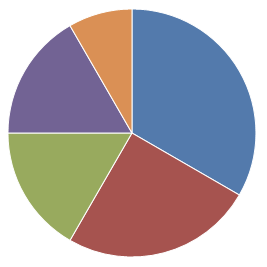
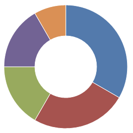

# Pie / Donut

A pie / donut chart displays pie slices with sizes proportional to the values they represent.

## Donut Chart

Donut charts act just like pie charts, except for an adjustable donut hole in the center of the chart.  Refer to [Donut Chart](../pie-chart-features/donut-chart.md) for more information.

## Customization

Pie / donut charts support several customization options, such as labels, legends, multiple series and more.  Refer to [Pie Chart Features](../pie-chart-features/index.md) for details on how to use these features.
