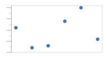

# Scatter

Scatter charts render data points where each point is represented by a marker.

## Marker Shape Kinds

Markers support several built in shape kinds, which include:

| Kind | Example |
|-----|-----|
| Diamond |  |
| Ellipse |  |
| Hexagon |  |
| Pentagon |  |
| Octagon |  |
| Rectangle |  |
| RoundedRectangle |  |
| Star4Points |  |
| Star5Points |  |
| Star6Points |  |
| Star8Points |  |
| Triangle |  |
