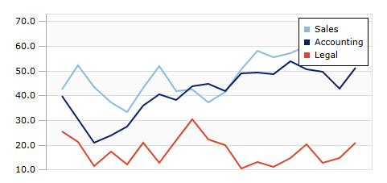
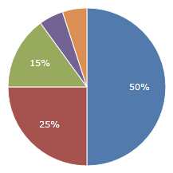

# Overview

Actipro Charts are meant to help visualize quantitative data.  They are the full-featured counterpart to [Micro Charts](../microcharts/index.md), and include rich visual elements such as legends, axes, labels, and more.  Use charts to convey rich data and trends in your custom apps, dashboards, and reports.

*Sample sales illustrated using three-line series on an XYChart*

*Sample sales illustrated using PieChart*

Charts can be generated based on any custom data source.  They automatically calculate the best scales to fit data into the control, or you can customize the scales as needed.  They include support for aggregation of large data sets to improve performance and readability, highlighting ranges or key data points, and much more.

Several types of charts are supported, which include [Area](chart-types/area.md), [Bar](chart-types/bar.md), [Line](chart-types/line.md), [Pie](chart-types/pie.md), [Donut](chart-types/pie.md), and [Scatter](chart-types/scatter.md).  Stacked and 100% stacked variations of area and bar charts are available as well.

## Features

### Chart Types

- [Area](chart-types/area.md)

  - Includes support for spline curves and stepped lines.
  - Optionally display a line along the series.
  - Optionally display markers to highlight data points.
  - Show markers for first, last, high, low, and negative data points.

- [Bar](chart-types/bar.md)

  - Quickly customize the spacing between the bars and groups of bars to fit your needs.
  - Stack bars side-by-side, on top of each other, or by percentage (100%).
  - Customize the range that a bar represents.
  - Advanced customization of bars using styles.

- [Line](chart-types/line.md)

  - Includes support for spline curves and stepped lines.
  - Optionally display markers to highlight data points.
  - Show markers for first, last, high, low, and negative data points.

- [Pie / Donut](chart-types/pie.md)

  - Nest multiple series or support hierarchical data.
  - Several label display options.
  - 'Other' slice for aggregating small pie slices.

- [Scatter](chart-types/scatter.md)

  - Show markers for first, last, high, low, and negative data points.

### Data Source Features

- Supports displaying any numeric and date/time values from custom data sources.
- Supports displaying and grouping complex data based on equality or custom logic.
- Data can be automatically aggregated to reduce the number of data points rendered.
- Automatically group data together under single bars in a bar chart, based on a numeric or date range.

### Appearance Features

- Combine any number of different series into a single chart.
- Supports stacking multiple series, both normally and using 100% scale.
- Customizable baseline value, which dictates which values are considered 'negative', and optional display of baseline.
- Customizable minimum and maximum values of each axis for fixed scales.
- Add horizontal or vertical ranges, which are used to highlight specific data ranges.
- Easily customize the various brushes used to render charts via palettes and palette selectors.
- Set the visibility of any series to dictate whether or not it is rendered on the chart.
- Over 10 built-in palettes.
- Show axis ticks, labels, and title; with customizable appearance.
- Stack multiple axis and assign each axis to a specific series or share with multiple series.
- Show customizable labels and markers on data points; labels move to avoid overlapping each other.
- Display grid lines and stripes behind chart for easy viewing; with customizable appearance.
- Customize bars in bar charts to fit the look and style you want.
- Show and position a customizable legend.

*This product is written in 100% pure C#, and includes detailed documentation and samples.*
