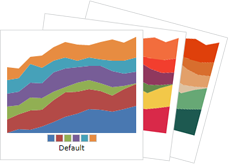
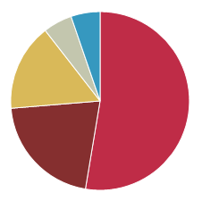
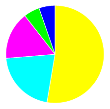
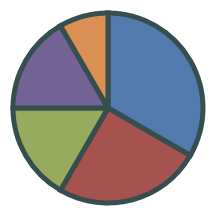
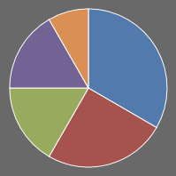

# Customizing Appearance

Several properties allow you to change the colors used for the pie slices, along with other elements in pie charts.

## Built-In Palettes

Style selectors determine what style will be applied to each pie slice. To change the style selector, set [PieSeries](xref:@ActiproUIRoot.Controls.Charts.PieSeries).[SliceStyleSelector](xref:@ActiproUIRoot.Controls.Charts.PieSeries.SliceStyleSelector) to an instance of [PieSlicePaletteStyleSelector](xref:@ActiproUIRoot.Controls.Charts.Palettes.PieSlicePaletteStyleSelector), or a custom implementation of [IPieSliceStyleSelector](xref:@ActiproUIRoot.Controls.Charts.IPieSliceStyleSelector).

[PieSlicePaletteStyleSelector](xref:@ActiproUIRoot.Controls.Charts.Palettes.PieSlicePaletteStyleSelector) contains several built-in palettes to make styling your pie chart or donut chart easier. The full list can be found in the [PaletteKind](xref:@ActiproUIRoot.Controls.Charts.Palettes.PaletteKind) enumeration.



A built-in palette can be assigned to a pie / donut chart like this (in this case the `Roman` palette):

```xaml
<charts:PieChart>
	<charts:PieSeries>
		<charts:PieSeries.SliceStyleSelector>
			<charts:PieSlicePaletteStyleSelector>
				<charts:Palette Kind="Roman"/>
			</charts:PieSlicePaletteStyleSelector>
		</charts:PieSeries.SliceStyleSelector>
	</charts:PieSeries>
</charts:PieChart>
```



## Custom Palettes

Custom palettes can be assigned by specifying your own colors on an instance of [Palette](xref:@ActiproUIRoot.Controls.Charts.Palettes.Palette).

```xaml
<charts:PieChart>
	<charts:PieSeries>
		<charts:PieSeries.SliceStyleSelector>
			<charts:PieSlicePaletteStyleSelector>
				<charts:Palette>
					<Color>#FFFF00</Color>
					<Color>#00FFFF</Color>
					<Color>#FF00FF</Color>
					<Color>#00FF00</Color>
					<Color>#FF0000</Color>
					<Color>#0000FF</Color>
				</charts:Palette>
			</charts:PieSlicePaletteStyleSelector>
		</charts:PieSeries.SliceStyleSelector>
	</charts:PieSeries>
</charts:PieChart>
```



## Chart Border

The color and thickness of a pie / donut chart border can be changed using the [PieChart](xref:@ActiproUIRoot.Controls.Charts.PieChart).`BorderBrush` and [PieChart](xref:@ActiproUIRoot.Controls.Charts.PieChart).`BorderThickness` properties, respectively.

```xaml
<charts:PieChart BorderBrush="DarkSlateGray" BorderThickness="3"/>
```



## Chart Background

The color of a pie / donut chart background can be changed using the [PieChart](xref:@ActiproUIRoot.Controls.Charts.PieChart).`Background` property.

```xaml
<charts:PieChart Background="DimGray"/>
```


