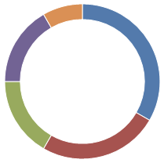

# Donut Chart

Donut charts act just like pie charts, except for an adjustable donut hole in the center of the chart. [DonutChart](xref:@ActiproUIRoot.Controls.Charts.DonutChart) is a subclass of [PieChart](xref:@ActiproUIRoot.Controls.Charts.PieChart), so all pie chart documentation also applies to donut chart.

## Specifying Hole Radius

The hole radius of a donut chart can be specified by changing [DonutChart](xref:@ActiproUIRoot.Controls.Charts.DonutChart).[HoleRadiusPercentage](xref:@ActiproUIRoot.Controls.Charts.DonutChart.HoleRadiusPercentage).  HoleRadiusPercentage determines what percentage of the DonutChart is consumed by the donut hole, from `0.0` (0%) to `1.0` (100%).

A donut chart with a donut hole radius at 80%:

```xaml
<charts:DonutChart HoleRadiusPercentage="0.8"/>
```


