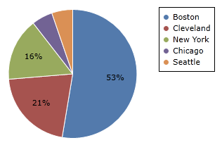
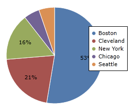

# Legend

A legend can provide context for what each pie slice represents.  Legends are fully stylable to match the look and feel of your application.

## Getting Started

The legend will display the title of each pie slice in the pie chart, along with the color of each pie slice as a key in the legend.  To display a legend on a pie / donut chart, set [PieChart](xref:@ActiproUIRoot.Controls.Charts.PieChart).[IsLegendVisible](xref:@ActiproUIRoot.Controls.Charts.PieChart.IsLegendVisible) to `true`.

```xaml
<charts:PieChart IsLegendVisible="true"/>
```


## Legend Position

The position of the legend can be controlled using [PieChart](xref:@ActiproUIRoot.Controls.Charts.PieChart).[LegendHorizontalPosition](xref:@ActiproUIRoot.Controls.Charts.PieChart.LegendHorizontalPosition) and [PieChart](xref:@ActiproUIRoot.Controls.Charts.PieChart).[LegendVerticalPosition](xref:@ActiproUIRoot.Controls.Charts.PieChart.LegendVerticalPosition).  Legend positions have two modifiers, `Inside` and `Outside` (for example, [LeftInside](xref:@ActiproUIRoot.Controls.Charts.LegendHorizontalPosition.LeftInside) and [TopOutside](xref:@ActiproUIRoot.Controls.Charts.LegendVerticalPosition.TopOutside)).

`Inside` means the legend will be positioned within the pie chart drawing area and may overlap labels and other elements. `Outside` means the legend will be positioned outside of the pie chart drawing area and space will be made so that it does not overlap the pie chart or labels.

This is a legend displayed at `TopInside` and `RightInside`.  Note how it overlaps other elements on the pie chart.

```xaml
<charts:PieChart LegendVerticalPosition="TopInside" LegendHorizontalPosition="RightInside"/>
```


This is a legend displayed at `TopInside` and `RightOutside`.  Note how room is made to place the legend on the right, outside the chart.

```xaml
<charts:PieChart LegendVerticalPosition="TopInside" LegendHorizontalPosition="RightOutside"/>
```



Legend position can also be fine-tuned using [PieChart](xref:@ActiproUIRoot.Controls.Charts.PieChart).[LegendMargin](xref:@ActiproUIRoot.Controls.Charts.PieChart.LegendMargin).  LegendMargin is a `Thickness` that determines how the legend is placed after [PieChart](xref:@ActiproUIRoot.Controls.Charts.PieChart).[LegendHorizontalPosition](xref:@ActiproUIRoot.Controls.Charts.PieChart.LegendHorizontalPosition) and [PieChart](xref:@ActiproUIRoot.Controls.Charts.PieChart).[LegendVerticalPosition](xref:@ActiproUIRoot.Controls.Charts.PieChart.LegendVerticalPosition) are applied.

This is a legend displayed at `TopInside` and `RightInside`, with a `LegendMargin` of `"0,40,0,0"`.  Note how the legend is placed 40 pixels lower than it normally would be without the margin.

```xaml
<charts:PieChart LegendVerticalPosition="TopInside"
						LegendHorizontalPosition="RightInside" LegendMargin="0,40,0,0"/>
```



## Styling Legend

The legend can be styled using [PieChart](xref:@ActiproUIRoot.Controls.Charts.PieChart).[LegendStyle](xref:@ActiproUIRoot.Controls.Charts.PieChart.LegendStyle).  The style you provide should have a `TargetType` of `ItemsControl`.


This is an example of providing a custom `LegendStyle`.

```xaml
<charts:PieChart.LegendStyle>
	<Style TargetType="ItemsControl">
		<Setter Property="BorderBrush" Value="LightGray"/>
		<Setter Property="BorderThickness" Value="3"/>
		<Setter Property="Background">
			<Setter.Value>
				<LinearGradientBrush StartPoint="0,0" EndPoint="0,1">
					<GradientStop Color="#222222" Offset="0.0"/>
					<GradientStop Color="#444444" Offset="0.2"/>
					<GradientStop Color="#444444" Offset="0.8"/>
					<GradientStop Color="#222222" Offset="1.0"/>
				</LinearGradientBrush>
			</Setter.Value>
		</Setter>
		<Setter Property="Padding" Value="10"/>
		<Setter Property="Effect">
			<Setter.Value>
				<DropShadowEffect Opacity="0.5"/>
			</Setter.Value>
		</Setter>
		<Setter Property="FontFamily" Value="Trebuchet MS"/>
		<Setter Property="FontWeight" Value="Normal"/>
		<Setter Property="FontStyle" Value="Italic"/>
		<Setter Property="FontSize" Value="14"/>
		<Setter Property="Foreground" Value="White"/>
	</Style>
</charts:PieChart.LegendStyle>
```

## Legend Item Customization

Each individual legend item can be re-templated by setting `ItemTemplate` in [PieChart](xref:@ActiproUIRoot.Controls.Charts.PieChart).[LegendStyle](xref:@ActiproUIRoot.Controls.Charts.PieChart.LegendStyle).  The data source for the template is [LegendKey](xref:@ActiproUIRoot.Controls.Charts.LegendKey), allowing you to bind to properties from the template such as [LegendKey](xref:@ActiproUIRoot.Controls.Charts.LegendKey).[Label](xref:@ActiproUIRoot.Controls.Charts.LegendKey.Label) and [LegendKey](xref:@ActiproUIRoot.Controls.Charts.LegendKey).[LegendMarkerStyle](xref:@ActiproUIRoot.Controls.Charts.LegendKey.LegendMarkerStyle).


This is an example of providing a custom `LegendStyle` to re-template the legend items.

```xaml
<charts:PieChart.LegendStyle>
	<Style TargetType="ItemsControl">
		<Setter Property="ItemTemplate">
			<Setter.Value>
				<DataTemplate>
					<Border Padding="5,0">
						<StackPanel Orientation="Horizontal">
							<charts:ChartMarker Margin="0,0,5,0" Style="{Binding LegendMarkerStyle}" BorderBrush="#333333" ShapeKind="Star5Points" Width="15" Height="15" />
							<TextBlock Text="{Binding Label}" Foreground="#111111" FontFamily="Arial" FontSize="16"/>
						</StackPanel>
					</Border>
				</DataTemplate>
			</Setter.Value>
		</Setter>
	</Style>
</charts:PieChart.LegendStyle>
```
