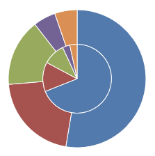
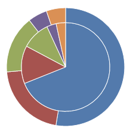
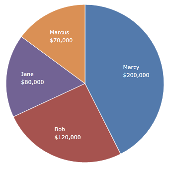
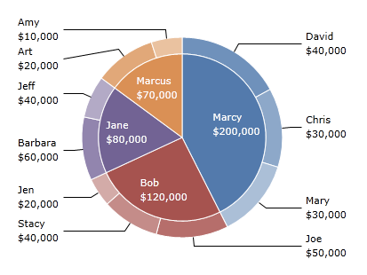

# Multiple Series

Pie charts and donut charts can contain multiple series, displayed as concentric rings.  They also support hierarchical data, displaying a child ring outside or inside the parent.

## Stacked Pie Series

To display multiple pie series, simply specify them as [PieChart](xref:@ActiproUIRoot.Controls.Charts.PieChart).`Content` the same way you would specify a single pie series:

```xaml
<charts:PieChart>
	<charts:PieSeries ItemsSource="[...]"/>
	<charts:PieSeries ItemsSource="[...]"/>
</charts:PieChart>
```



The size of pie series can be adjusted using the [PieSeries](xref:@ActiproUIRoot.Controls.Charts.PieSeries).[Length](xref:@ActiproUIRoot.Controls.Charts.PieSeries.Length) property.  This is a number that is relative to the other pie series on the chart.  If there are two pie series with a length of `1.0`, both pie series will display at 50%.  In the example below, one pie series has a length of `1.0` and the other `3.0`.  Because of this, one will display at 25% and the other at 75%.

```xaml
<charts:PieChart>
	<charts:PieSeries Length="1" ItemsSource="[...]"/>
	<charts:PieSeries Length="3" ItemsSource="[...]"/>
</charts:PieChart>
```



## Child (Hierarchical) Pie Series

Data can be displayed hierarchically, so that inside or outside of each pie slice there are child slices. To display children, you must set [PieSeries](xref:@ActiproUIRoot.Controls.Charts.PieSeries).[ChildrenPath](xref:@ActiproUIRoot.Controls.Charts.PieSeries.ChildrenPath). `ChildrenPath` is a property path to an item on your data source that contains an `IEnumerable` of child items. At a minimum, children must have values, so [PieSeries](xref:@ActiproUIRoot.Controls.Charts.PieSeries).[ChildSliceValuePath](xref:@ActiproUIRoot.Controls.Charts.PieSeries.ChildSliceValuePath) must be set as well, and resolve to a numeric value.

There are numerous properties on [PieSeries](xref:@ActiproUIRoot.Controls.Charts.PieSeries) that have a matching counterpart for child slices: [ChildLabelBrush](xref:@ActiproUIRoot.Controls.Charts.PieSeries.ChildLabelBrush), [ChildLabelPosition](xref:@ActiproUIRoot.Controls.Charts.PieSeries.ChildLabelPosition), [ChildLabelStyle](xref:@ActiproUIRoot.Controls.Charts.PieSeries.ChildLabelStyle), [ChildSliceLabelFormat](xref:@ActiproUIRoot.Controls.Charts.PieSeries.ChildSliceLabelFormat), [ChildSliceLabelFunc](xref:@ActiproUIRoot.Controls.Charts.PieSeries.ChildSliceLabelFunc), [ChildSliceTitlePath](xref:@ActiproUIRoot.Controls.Charts.PieSeries.ChildSliceTitlePath), and [ChildSliceValuePath](xref:@ActiproUIRoot.Controls.Charts.PieSeries.ChildSliceValuePath) are all properties that have a matching counterpart for parent pie slices.

See the relevant sections of the [Pie Chart Features](index.md) topic to better understand how these properties work.

### Example

As an example, let's say we have an `IEnumerable` of `Person` for our [PieSeries](xref:@ActiproUIRoot.Controls.Charts.PieSeries).[ItemsSource](xref:@ActiproUIRoot.Controls.Charts.PieSeries.ItemsSource).

```csharp
public class Person {
	public string Name { get; set; }
	public double Income { get; set; }
	public IEnumerable<Person> Employees { get; set; }
}
```

 Our `IEnumerable` of `Person` is called `People`, and we set it as our data source:

```xaml
<charts:PieChart>
	<charts:PieSeries ItemsSource="{Binding People}" SliceValuePath="Income" SliceTitlePath="Name"/>
</charts:PieChart>
```



 Note how the `Person` class has an `Employees` property, which is also an `IEnumerable` of `Person`. Let's use that as our child data source for each pie slice.  We also need to set the [ChildSliceValuePath](xref:@ActiproUIRoot.Controls.Charts.PieSeries.ChildSliceValuePath) and the [ChildSliceTitlePath](xref:@ActiproUIRoot.Controls.Charts.PieSeries.ChildSliceTitlePath).

```xaml
<charts:PieChart>
	<charts:PieSeries ItemsSource="{Binding People}" ChildrenPath="Employees"
					  SliceValuePath="Income" SliceTitlePath="Name"
					  ChildSliceValuePath="Income" ChildSliceTitlePath="Name"
					  Length="5" ChildrenLength="1" [...]/>
</charts:PieChart>
```

 Now we can see each child as a slice under the parent:


