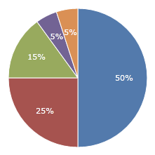

# 'Other' Slice

Small slices can be aggregated into an 'Other' slice. This can be based on a numeric threshold or a percentage.

## Specifying Threshold

To aggregate smaller slices into an 'Other' slice, you can set [PieSeries](xref:ActiproSoftware.Windows.Controls.Charts.PieSeries).[OtherThreshold](xref:ActiproSoftware.Windows.Controls.Charts.PieSeries.OtherThreshold).  If [PieSeries](xref:ActiproSoftware.Windows.Controls.Charts.PieSeries).[IsOtherThresholdPercent](xref:ActiproSoftware.Windows.Controls.Charts.PieSeries.IsOtherThresholdPercent) is set to `true`, then OtherThreshold will represent a percentage between `0.0` (0%) and `1.0` (100%).  If set to `false`, then OtherThreshold will represent a numeric value. All values below this threshold will get aggregated into an 'Other' slice.

In this example, all values below 6% are aggregated into an 'Other' slice.

```xaml
<charts:PieChart>
	<charts:PieSeries IsOtherThresholdPercent="true" OtherThreshold="0.6"/>
</charts:PieChart>
```




