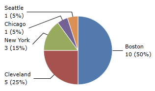
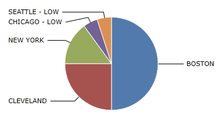
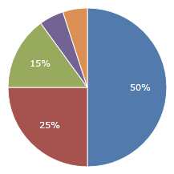
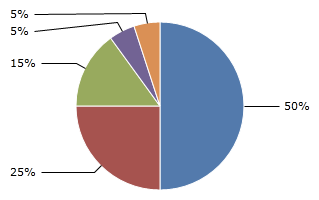
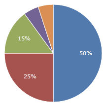
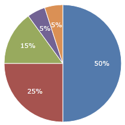
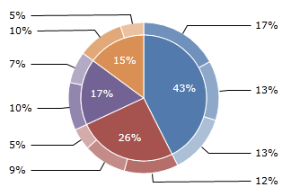
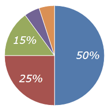

# Pie Slice Labels and ToolTips

Labels can be displayed on each pie slice and fully customized.  Tooltips are also available for each pie slice.

## Customizing Labels

### Label Format

Pie slice labels by default display percentage only. They can be customized using [PieSeries](xref:@ActiproUIRoot.Controls.Charts.PieSeries).[SliceLabelFormat](xref:@ActiproUIRoot.Controls.Charts.PieSeries.SliceLabelFormat) and [PieSeries](xref:@ActiproUIRoot.Controls.Charts.PieSeries).[ChildSliceLabelFormat](xref:@ActiproUIRoot.Controls.Charts.PieSeries.ChildSliceLabelFormat).  This is a format string with three parameters:

- \{0} - The percentage of the pie slice, between 0.0 (0%) and 1.0 (100%).
- \{1} - The original value of the pie slice.
- \{2} - The title of the pie slice.

In this example, the pie slice label is configured to show all three parameters, with the first parameter displayed in percent formatting.  Note a couple things of interest: the :P0 used to format the first parameter as a percent, the opening angle brackets used to escape future angle brackets in the string, and the &#x0a; used to add new lines in XAML.

```xaml
<charts:PieChart>
	<charts:PieSeries SliceLabelFormat="{}{2}&#x0a;{1} ({0:P0})" AreLabelsVisible="True"/>
</charts:PieChart>
```



### Label Func

In some cases, [PieSeries](xref:@ActiproUIRoot.Controls.Charts.PieSeries).[SliceLabelFormat](xref:@ActiproUIRoot.Controls.Charts.PieSeries.SliceLabelFormat) may be too limited. Some labels may require additional customization that can not be done using standard .NET format strings. In this case, you may provide a custom function that will allow you to fully customize pie slice labels with [PieSeries](xref:@ActiproUIRoot.Controls.Charts.PieSeries).[SliceLabelFunc](xref:@ActiproUIRoot.Controls.Charts.PieSeries.SliceLabelFunc) and [PieSeries](xref:@ActiproUIRoot.Controls.Charts.PieSeries).[ChildSliceLabelFunc](xref:@ActiproUIRoot.Controls.Charts.PieSeries.ChildSliceLabelFunc).  The function must match the signature `string MethodName(double, object, string)`.  The label function takes in percentage, original value, and title as parameters, and returns the desired label.

In this example, [SliceLabelFunc](xref:@ActiproUIRoot.Controls.Charts.PieSeries.SliceLabelFunc) is bound to a function in the code behind.

```csharp
public MainControl() {
	CustomLabelFunc = GetLabel;
	DataContext = this;
	InitializeComponent();
}

public Func<double, object, string, string> CustomLabelFunc { get; set; }

public static string GetLabel(double percent, object originalValue, string title) {
	string format = "{0}";
	if (percent < 0.1)
		format = "{0} - LOW";

	return string.Format(format, title.ToUpper());
}

```

```xaml
<charts:PieChart>
	<charts:PieSeries SliceLabelFunc="{Binding CustomLabelFunc}"/>
</charts:PieChart>
```



## Label Position

By default, labels are displayed on the inside of each pie slice. They can also be displayed on the outside of the chart by setting [PieSeries](xref:@ActiproUIRoot.Controls.Charts.PieSeries).[LabelPosition](xref:@ActiproUIRoot.Controls.Charts.PieSeries.LabelPosition) to [PieSliceLabelPosition](xref:@ActiproUIRoot.Controls.Charts.PieSliceLabelPosition).[Sides](xref:@ActiproUIRoot.Controls.Charts.PieSliceLabelPosition.Sides).  This will place the labels in one of two columns on either side of the pie chart.

Pie slice labels positioned on the insides of the pie slices.

```xaml
<charts:PieChart>
	<charts:PieSeries LabelPosition="Inside"/>
</charts:PieChart>
```



Pie slice labels positioned on the sides of the pie chart.

```xaml
<charts:PieChart>
	<charts:PieSeries LabelPosition="Sides"/>
</charts:PieChart>
```



## Label Inside Fit Mode

When labels are positioned inside pie slices, they will automatically be hidden if they overlap the pie slice. To disable this, you can set [PieSeries](xref:@ActiproUIRoot.Controls.Charts.PieSeries).[LabelInsideFitMode](xref:@ActiproUIRoot.Controls.Charts.PieSeries.LabelInsideFitMode) to [PieSliceLabelInsideFitMode](xref:@ActiproUIRoot.Controls.Charts.PieSliceLabelInsideFitMode).[None](xref:@ActiproUIRoot.Controls.Charts.PieSliceLabelInsideFitMode.None).  This will display all labels regardless of whether or not they fit inside the pie slice.

Labels hidden when they do not fit inside pie slices.

```xaml
<charts:PieChart>
	<charts:PieSeries LabelInsideFitMode="Hide"/>
</charts:PieChart>
```



Labels always shown, even if they do not fit inside pie slices.

```xaml
<charts:PieChart>
	<charts:PieSeries LabelInsideFitMode="None"/>
</charts:PieChart>
```



## Label Appearance

### Label Color

To set the same label color for the entire pie chart, you can simply set [PieChart](xref:@ActiproUIRoot.Controls.Charts.PieChart).Foreground.  To set different label colors for different pie series, set [PieSeries](xref:@ActiproUIRoot.Controls.Charts.PieSeries).[LabelBrush](xref:@ActiproUIRoot.Controls.Charts.PieSeries.LabelBrush) and [PieSeries](xref:@ActiproUIRoot.Controls.Charts.PieSeries).[ChildLabelBrush](xref:@ActiproUIRoot.Controls.Charts.PieSeries.ChildLabelBrush).

This example shows a different color set on parent and child pie slice labels.

```xaml
<charts:PieChart>
	<charts:PieSeries LabelPosition="Inside" ChildLabelPosition="Sides"
					  ChildrenPosition="Outside" 
					  AreLabelsVisible="True" AreChildLabelsVisible="True"
					  LabelBrush="White" ChildLabelBrush="Black"
					  [...]/> 
</charts:PieChart>
```



### Label Style

For more advanced customization, you can set [PieSeries](xref:@ActiproUIRoot.Controls.Charts.PieSeries).[LabelStyle](xref:@ActiproUIRoot.Controls.Charts.PieSeries.LabelStyle) and [PieSeries](xref:@ActiproUIRoot.Controls.Charts.PieSeries).[ChildLabelStyle](xref:@ActiproUIRoot.Controls.Charts.PieSeries.ChildLabelStyle).  The style must have a `TargetType` of `TextBlock`.

This example shows a custom style applied to pie slice labels.

```xaml
<charts:PieChart>
	<charts:PieSeries>
		<charts:PieSeries.LabelStyle>
			<Style TargetType="TextBlock">
				<Setter Property="FontSize" Value="20"/>
				<Setter Property="FontStyle" Value="Italic"/>
			</Style>
		</charts:PieSeries.LabelStyle>					
	</charts:PieSeries>
</charts:PieChart>
```



## Customizing ToolTips

### ToolTip Format

Sometimes you may wish to show pie slice data in a tooltip in addition to, or instead of, a label.  Pie slices do not have any tooltips by default, but they can easily be added using the exact same formatting options as labels.  If specified, the [PieSeries](xref:@ActiproUIRoot.Controls.Charts.PieSeries).[SliceToolTipFormat](xref:@ActiproUIRoot.Controls.Charts.PieSeries.SliceToolTipFormat) and [PieSeries](xref:@ActiproUIRoot.Controls.Charts.PieSeries).[ChildSliceToolTipFormat](xref:@ActiproUIRoot.Controls.Charts.PieSeries.ChildSliceToolTipFormat) properties designate that pie slices should have tooltips.  Like labels, this is a format string with three parameters:

- \{0} - The percentage of the pie slice, between 0.0 (0%) and 1.0 (100%).
- \{1} - The original value of the pie slice.
- \{2} - The title of the pie slice.

See the "Label Format" section above for an example of how to specify the format string.

### ToolTip Func

In some cases, [PieSeries](xref:@ActiproUIRoot.Controls.Charts.PieSeries).[SliceToolTipFormat](xref:@ActiproUIRoot.Controls.Charts.PieSeries.SliceToolTipFormat) may be too limited. Some tooltips may require additional customization that can not be done using standard .NET format strings. In this case, you may provide a custom function that will allow you to fully customize pie slice tooltips with [PieSeries](xref:@ActiproUIRoot.Controls.Charts.PieSeries).[SliceToolTipFunc](xref:@ActiproUIRoot.Controls.Charts.PieSeries.SliceToolTipFunc) and [PieSeries](xref:@ActiproUIRoot.Controls.Charts.PieSeries).[ChildSliceToolTipFunc](xref:@ActiproUIRoot.Controls.Charts.PieSeries.ChildSliceToolTipFunc).  The function must match the signature `string MethodName(double, object, string)`.  The tooltip function takes in percentage, original value, and title as parameters, and returns the desired tooltip.

See the "Label Func" section above for an example of how to specify the format string.
