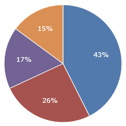
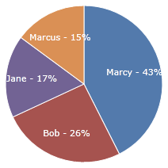

# Specifying Items

Pie / donut charts can be bound to any custom data source.

## Getting Started

To set a data source, set the [PieSeries](xref:ActiproSoftware.Windows.Controls.Charts.PieSeries).[ItemsSource](xref:ActiproSoftware.Windows.Controls.Charts.PieSeries.ItemsSource) property.  This is an `IEnumerable` of whatever your items are. Each item will represent a pie slice.

## Setting Value Path

The value path is a property path that points to a numeric property on the items in your [ItemsSource](xref:ActiproSoftware.Windows.Controls.Charts.PieSeries.ItemsSource) that will be used to determine how large the pie slice is in relation to the other pie slices. You **must** set [SliceValuePath](xref:ActiproSoftware.Windows.Controls.Charts.PieSeries.SliceValuePath) to use pie chart correctly.

As an example, let's say we have an `IEnumerable` of `Person` for our [PieSeries](xref:ActiproSoftware.Windows.Controls.Charts.PieSeries).[ItemsSource](xref:ActiproSoftware.Windows.Controls.Charts.PieSeries.ItemsSource).

```csharp
public class Person {
	public string Name { get; set; }
	public double Income { get; set; }
}
```

 Our `IEnumerable` of `Person` is called `People`, and we set it as our data source:

```xaml
<charts:PieChart>
	<charts:PieSeries ItemsSource="{Binding People}" SliceValuePath="Income" AreLabelsVisible="True"/>
</charts:PieChart>
```



> [!NOTE]
> The value path must point to a property with a numeric type (double, int, decimal, etc) or an exception will be thrown.

> [!NOTE]
> Negative values will be treated as zero (0).

## Setting Title Path

The value path is a property path that points to a property on the items in your [ItemsSource](xref:ActiproSoftware.Windows.Controls.Charts.PieSeries.ItemsSource) that will be used to determine what the title of the pie slice is. The title is, by default, displayed on the pie chart legend, but also can optionally be displayed on the pie chart label.

Using the previous example of Person:

```csharp
public class Person {
	public string Name { get; set; }
	public double Income { get; set; }
}
```

 We can set our title as the person's name and use a custom label format to display it:

```xaml
<charts:PieChart>
	<charts:PieSeries ItemsSource="{Binding People}" SliceValuePath="Income" SliceTitlePath="Name" SliceLabelFormat="{}{2} - {0:P0}" AreLabelsVisible="True"/>
</charts:PieChart>
```


