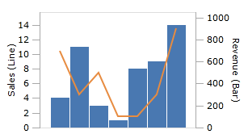

# Axes

Axes control the range of values that are visible on a chart.  Visually, they provide a quick reference to look up the value of data points on a chart.

## Getting Started

If you do not specify axes on your chart, then default values will be used.  If your axis is a numeric or quantifiable type, then the `Minimum` and `Maximum` values will be automatically set to the lowest and highest values in your data set.  To specify axes and axis properties on your chart, you must choose the correct axis for your data.

Note the example below, where the X axis data contains `DateTime` values and the Y axis data contains `Double` values.

```xaml
<charts:XYChart Width="300" Height="200">
	<charts:AreaSeries ItemsSource="{Binding}" XPath="MyDateProperty" YPath="MyDoubleProperty" />
</charts:XYChart>
```

For this case, you would add a [XYDateTimeAxis](xref:@ActiproUIRoot.Controls.Charts.XYDateTimeAxis) to [XYChart](xref:@ActiproUIRoot.Controls.Charts.XYChart).[XAxes](xref:@ActiproUIRoot.Controls.Charts.XYChart.XAxes), and a [XYDoubleAxis](xref:@ActiproUIRoot.Controls.Charts.XYDoubleAxis) to [XYChart](xref:@ActiproUIRoot.Controls.Charts.XYChart).[YAxes](xref:@ActiproUIRoot.Controls.Charts.XYChart.YAxes), like in the following example.

```xaml
<charts:XYChart Width="300" Height="200">
	<charts:XYChart.XAxes>
		<XYDateTimeAxis"/>
	</charts:XYChart.XAxes>
	<charts:XYChart.YAxes>
		<XYDoubleAxis/>
	</charts:XYChart.YAxes>
	<charts:AreaSeries ItemsSource="{Binding}" XPath="MyDateProperty" YPath="MyDoubleProperty" />
</charts:XYChart>
```

Once the axis is specified, you can set properties on it, like the example below:

```xaml
<charts:XYChart Width="300" Height="200">
	<charts:XYChart.XAxes>
		<XYDateTimeAxis Minimum="1/1/1990" Maximum="1/1/2000"/>
	</charts:XYChart.XAxes>
	<charts:XYChart.YAxes>
		<XYDoubleAxis Minimum="100" Maximum"100000"/>
	</charts:XYChart.YAxes>
	<charts:AreaSeries ItemsSource="{Binding}" XPath="MyDateProperty" YPath="MyDoubleProperty" />
</charts:XYChart>
```

## Minimum and Maximum

The `Minimum` and `Maximum` properties on [XYDateTimeAxis](xref:@ActiproUIRoot.Controls.Charts.XYDateTimeAxis), [XYDoubleAxis](xref:@ActiproUIRoot.Controls.Charts.XYDoubleAxis), and [XYDecimalAxis](xref:@ActiproUIRoot.Controls.Charts.XYDecimalAxis) control the range of values that are displayed on the chart. Any values outside of the `Minimum` / `Maximum` range will not be displayed on the chart (unless they fall in the space around the chart created by [XYChart](xref:@ActiproUIRoot.Controls.Charts.XYChart).[PaddingPercentage](xref:@ActiproUIRoot.Controls.Charts.XYChart.PaddingPercentage)).

When `Minimum` and `Maximum` are not specified, or when the axes are not defined in markup, `Minimum` will be automatically set to the lowest value in the data set, and `Maximum` will be set to the highest.

## Grouped Axis

When your X or Y axis values are a `String` or other complex data type, then [XYGroupedAxis](xref:@ActiproUIRoot.Controls.Charts.XYGroupedAxis) will be used.

Note the example below, where the X axis data contains `String` values and the Y axis data contains `Double` values.

```xaml
<charts:XYChart Width="300" Height="200">
	<charts:BarSeries ItemsSource="{Binding}" XPath="MyStringProperty" YPath="MyDoubleProperty" />
</charts:XYChart>
```

In the example above, and by default, values on the secondary axis (in this case, the X axis) will be grouped based on object equality. So, any strings that are equal to each other will be grouped under the same bar. In cases where multiple objects are grouped, the values on the primary axis (in this case, the Y axis) will be summed up, if they are a numeric data type.  If the primary axis values are not set, or are a non-numeric data type, they will be ignored and replaced with the number of items in each group.

### Grouping

By default, items will be grouped by object equality. To change how groups are determined, you can specify [XYGroupedAxis](xref:@ActiproUIRoot.Controls.Charts.XYGroupedAxis).[GroupingFunc](xref:@ActiproUIRoot.Controls.Charts.XYGroupedAxis.GroupingFunc).  This is a `Func<object,object,bool>` that takes two objects to compare and returns a `bool`.  Return `true` if they should be grouped together, elsewise, return `false`.

This example shows a custom grouping function that groups by the first letter in each string.

```csharp
GroupByFirstLetter = (a, b) => {
	char firstLetterForA = ((string)a).ToLower()[0];
	char firstLetterForB = ((string)b).ToLower()[0];
	return firstLetterForA.Equals(firstLetterForB);
};
```

### Labeling Groups

By default, groups will be labelled using the `ToString()` result on the first object in each group.  To change how groups are labelled, you can specify [XYGroupedAxis](xref:@ActiproUIRoot.Controls.Charts.XYGroupedAxis).[LabelFunc](xref:@ActiproUIRoot.Controls.Charts.XYGroupedAxis.LabelFunc).  This is a `Func<object,string>` that takes the first object in a group and returns a `string` to be used as the group label.

This example shows a custom labeling function that labels using the first letter in each string.

```csharp
Func<object,string> labelWithFirstLetter = a => ((string) a).Substring(0, 1);
```

### Sorting Groups

By default, groups will not be sorted. To change how groups are sorted, you can specify [XYGroupedAxis](xref:@ActiproUIRoot.Controls.Charts.XYGroupedAxis).[SortingFunc](xref:@ActiproUIRoot.Controls.Charts.XYGroupedAxis.SortingFunc).  This is a `Func<object,object,int>` that takes the first object from two groups and returns an `int` describing how they compare to each other.

- If the function returns a negative value, then the first instance is sorted before the second.
- If the function returns zero, then the instances are considered equal and sorted next to each other.
- If the function returns a positive value, then the first instance is sorted after the second.

This example shows a custom sorting function that sorts using the first letter in each string.

```csharp
Func<object,object,int> sortAlphabetically = (a, b) => {
	char firstLetterForA = ((string)a).ToLower()[0];
	char firstLetterForB = ((string)b).ToLower()[0];
	return firstLetterForA - firstLetterForB;
};
```

## Percentage Axis

When your series has [XYSeriesBase](xref:@ActiproUIRoot.Controls.Charts.Primitives.XYSeriesBase).[StackKind](xref:@ActiproUIRoot.Controls.Charts.Primitives.XYSeriesBase.StackKind) set to [XYSeriesStackKind](xref:@ActiproUIRoot.Controls.Charts.XYSeriesStackKind).[Percentage](xref:@ActiproUIRoot.Controls.Charts.XYSeriesStackKind.Percentage), then [XYPercentageAxis](xref:@ActiproUIRoot.Controls.Charts.XYPercentageAxis) will be used and data will be stacked by percentage on the secondary axis.

"Stacked by percentage" means that instead of a value being placed on a cartesian axis, it is instead stacked on top of values from other series. The position and size of the value is relative to the sum of all values in that slot.

So, if there are two values in a slot, `5.0` and `5.0`, they will both occupy 50% of the available size since they are both half of the sum (`5.0` + `5.0` = `10.0`).  If there are two values in a slot, `2.0` and `8.0`, they will occupy 20% and 80% of the available size.


Note that [XYPercentageAxis](xref:@ActiproUIRoot.Controls.Charts.XYPercentageAxis) can only be used on numeric data. `DateTime` and complex types cannot be placed on the axis.

### Labeling

By default, major ticks on [XYPercentageAxis](xref:@ActiproUIRoot.Controls.Charts.XYPercentageAxis) will be labeled using the percentage formatting of the environment's current culture.

For simple custom formatting, you can specify [XYAxisBase](xref:@ActiproUIRoot.Controls.Charts.Primitives.XYAxisBase).[LabelFormat](xref:@ActiproUIRoot.Controls.Charts.Primitives.XYAxisBase.LabelFormat).  The parameter `"{0}"` will be the percentage of the tick, represented by a value between `0.0` and `1.0`.  You can reference [this MSDN article](http://msdn.microsoft.com/en-us/library/dwhawy9k.aspx) for numeric format strings.

This example will format the percent with two decimal places (note the use of the additional `{}` to escape the use of curly brackets in XAML).  So, a percentage value of `0.2543` would be displayed as `"25.43 %"` in the `en-US` culture.

```xaml
<XYPercentageAxis LabelFormat="{}{0:P2}/>
```

For more advanced labeling scenarios, you can specify [XYPercentageAxis](xref:@ActiproUIRoot.Controls.Charts.XYPercentageAxis).[LabelFunc](xref:@ActiproUIRoot.Controls.Charts.XYPercentageAxis.LabelFunc).  Setting this will override whatever is specified for [XYAxisBase](xref:@ActiproUIRoot.Controls.Charts.Primitives.XYAxisBase).[LabelFormat](xref:@ActiproUIRoot.Controls.Charts.Primitives.XYAxisBase.LabelFormat).  LabelFunc is a `Func<double,string>` that takes an object (the percentage of the current tick) and returns a string to be used as the label for the tick.

This example shows a custom labeling function that spells out the word "Percent".

```csharp
Func<double,string> labelFunc = percent => (percent*100).ToString() + " Percent";
```

## Ticks

Axis ticks create a "guide" that helps to communicate the value of any given point in your chart.  Major ticks generally are more prominent and have labels associated with them, while minor ticks are less prominent and do not have labels.

### Tick Visibility

Major and minor ticks can be shown or hidden using [XYAxisBase](xref:@ActiproUIRoot.Controls.Charts.Primitives.XYAxisBase).[AreMajorTicksVisible](xref:@ActiproUIRoot.Controls.Charts.Primitives.XYAxisBase.AreMajorTicksVisible) and [XYAxisBase](xref:@ActiproUIRoot.Controls.Charts.Primitives.XYAxisBase).[AreMinorTicksVisible](xref:@ActiproUIRoot.Controls.Charts.Primitives.XYAxisBase.AreMinorTicksVisible), respectively.


This example shows a chart with minor and major ticks visible on Y axis.

```xaml
<XYDoubleAxis AreMajorTicksVisible="True" AreMinorTicksVisible="True" ... TickMajorInterval="5" TickMinorInterval="2.5"/>
```

### Intervals

Tick intervals control how frequently major and minor ticks occur on the axis.

For [XYDoubleAxis](xref:@ActiproUIRoot.Controls.Charts.XYDoubleAxis) and [XYDecimalAxis](xref:@ActiproUIRoot.Controls.Charts.XYDecimalAxis), `TickMajorInterval` and `TickMinorInterval` are used.  When tick intervals are not specified, they will automatically be calculated based on the chart data.


This example shows a chart with a major tick interval set to `10`, and a minor tick interval set to `5`.  Compare with the examples above and note how the ticks are further spread out.

```xaml
<XYDoubleAxis TickMajorInterval="10" TickMinorInterval="5" ... />
```

For [XYPercentageAxis](xref:@ActiproUIRoot.Controls.Charts.XYPercentageAxis), tick intervals work slightly differently. You can control how far major and minor ticks are spaced apart by setting [XYPercentageAxis](xref:@ActiproUIRoot.Controls.Charts.XYPercentageAxis).[TickMajorInterval](xref:@ActiproUIRoot.Controls.Charts.XYPercentageAxis.TickMajorInterval) and [XYPercentageAxis](xref:@ActiproUIRoot.Controls.Charts.XYPercentageAxis).[TickMinorInterval](xref:@ActiproUIRoot.Controls.Charts.XYPercentageAxis.TickMinorInterval).  Both of these properties take a `Double` value between `0.0` and `1.0`. This represents how far apart the ticks are spaced, by percentage.  For example, if the interval is set to `0.25`, a tick will be placed every 25%.  So, there will be ticks at 0%, 25%, 50%, 75%, and 100%.

For [XYDateTimeAxis](xref:@ActiproUIRoot.Controls.Charts.XYDateTimeAxis), tick intervals can be set via the [TickMajorInterval](xref:@ActiproUIRoot.Controls.Charts.XYDateTimeAxis.TickMajorInterval) and [TickMinorInterval](xref:@ActiproUIRoot.Controls.Charts.XYDateTimeAxis.TickMinorInterval) properties.  However, the [TickMajorIntervalUnit](xref:@ActiproUIRoot.Controls.Charts.XYDateTimeAxis.TickMajorIntervalUnit) and [TickMinorIntervalUnit](xref:@ActiproUIRoot.Controls.Charts.XYDateTimeAxis.TickMinorIntervalUnit) properties must also be set to a [TimeUnit](xref:@ActiproUIRoot.Controls.Charts.TimeUnit) that describes the unit specified by the tick intervals (days, hours, etc.).  A major tick interval will automatically be calculated if none is set.

## Labels

### Label Visibility

Labels can be displayed on the major ticks using [XYAxisBase](xref:@ActiproUIRoot.Controls.Charts.Primitives.XYAxisBase).[AreLabelsVisible](xref:@ActiproUIRoot.Controls.Charts.Primitives.XYAxisBase.AreLabelsVisible).


This example shows a chart with labels and ticks visible on Y axis.

```xaml
<XYDoubleAxis AreLabelsVisible="True" ... TickMajorInterval="5" TickMinorInterval="2.5"/>
```

### Label Visibility

## Titles

An axis can be titled using [XYAxisBase](xref:@ActiproUIRoot.Controls.Charts.Primitives.XYAxisBase).[Title](xref:@ActiproUIRoot.Controls.Charts.Primitives.XYAxisBase.Title).


This example shows a chart with a title set on the Y axis.

```xaml
<XYDoubleAxis Title="Sales" ... />
```

An axis title can be styled using [XYAxisBase](xref:@ActiproUIRoot.Controls.Charts.Primitives.XYAxisBase).[TitleStyle](xref:@ActiproUIRoot.Controls.Charts.Primitives.XYAxisBase.TitleStyle).


This example shows a chart with a title style set on the Y axis.

```xaml
<charts:XYDoubleAxis Title="Sales" ...>
	<charts:XYDoubleAxis.TitleStyle>
		<Style TargetType="ContentControl">
			<Setter Property="FontSize" Value="18"/>
			<Setter Property="Foreground" Value="#004dee"/>
		</Style>
	</charts:XYDoubleAxis.TitleStyle>
</charts:XYDoubleAxis>
```

## Position

Axes can be placed on the near edge or far edge of the chart using the [XYAxisBase](xref:@ActiproUIRoot.Controls.Charts.Primitives.XYAxisBase).[Position](xref:@ActiproUIRoot.Controls.Charts.Primitives.XYAxisBase.Position) property.


This example shows a chart with both axes on the far edge of the chart.

```xaml
<charts:XYChart ...>
	<charts:LineSeries .../>
	<charts:XYChart.XAxes>
		<charts:XYDoubleAxis Position="FarEdge" .../>
	</charts:XYChart.XAxes>
	<charts:XYChart.YAxes>
		<charts:XYDoubleAxis Position="FarEdge" .../>
	</charts:XYChart.YAxes>
</charts:XYChart>
```

## Stacking / Sharing Axis

A chart can contain multiple Y axes and multiple X axes. You can specify which series is bound to which axis by using [XYSeriesBase](xref:@ActiproUIRoot.Controls.Charts.Primitives.XYSeriesBase).[XAxis](xref:@ActiproUIRoot.Controls.Charts.Primitives.XYSeriesBase.XAxis) and [XYSeriesBase](xref:@ActiproUIRoot.Controls.Charts.Primitives.XYSeriesBase).[YAxis](xref:@ActiproUIRoot.Controls.Charts.Primitives.XYSeriesBase.YAxis).



This example shows a chart with two series, each bound to a different Y axis with a unique range of values.

```xaml
<charts:XYChart Width="300" Height="150" >
	<charts:BarSeries ItemsSource="4;11;3;1;8;9;14" YAxis="{Binding ElementName=yAxis1}" />
	<charts:LineSeries ItemsSource="700;300;500;100;100;300;900" YAxis="{Binding ElementName=yAxis2}"/>
	<charts:XYChart.YAxes>
		<charts:XYDoubleAxis x:Name="yAxis1" Minimum="0" Maximum="15" IsTickMajorVisible="True" TickMajorInterval="2" AreLabelsVisible="True" Title="Sales (Line)"/>
		<charts:XYDoubleAxis x:Name="yAxis2" Position="FarEdge" Minimum="0" Maximum="1000" AreMajorTicksVisible="True" TickMajorInterval="200"  AreLabelsVisible="True" Title="Revenue (Bar)"/>
	</charts:XYChart.YAxes>
	<charts:XYChart.XAxes>
		<charts:XYDoubleAxis AreMajorTicksVisible="False" AreMinorTicksVisible="False" AreLabelsVisible="False"/>
	</charts:XYChart.XAxes>
</charts:XYChart>
```

 Note that each series is bound by `ElementName` to an axis in the [XYChart](xref:@ActiproUIRoot.Controls.Charts.XYChart).[YAxes](xref:@ActiproUIRoot.Controls.Charts.XYChart.YAxes) collection.

## Display Optimizations (Removing Anti-Aliasing)

The [XYAxisBase](xref:@ActiproUIRoot.Controls.Charts.Primitives.XYAxisBase).[UseDisplayOptimizations](xref:@ActiproUIRoot.Controls.Charts.Primitives.XYAxisBase.UseDisplayOptimizations) determines if data point values are rounded to better appear on display pixels.  This property is usually good to leave as its default value of `true` because it will ensure that lines render with minimal anti-aliasing.  It accomplishes this by slightly rounding data point values as needed.

However, if precise data point locations are required, such as when rendering a smooth curved line graph, set this property to `false` to remove line jaggedness.
