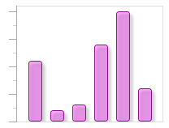

# Bar Chart Custom Styles

Bar Charts can be customized to have a unique look that fits your needs.

## Brushes & Styling

Bar Series can have custom styles applied to the bars using [BarSeriesBase](xref:@ActiproUIRoot.Controls.Charts.Primitives.BarSeriesBase).[BarStyle](xref:@ActiproUIRoot.Controls.Charts.Primitives.BarSeriesBase.BarStyle).



This example shows a chart the bars styled uniquely.

```xaml
<charts:BarSeries ItemsSource="11;2;3;14;20;6">
	<charts:BarSeries.BarStyle>
		<Style TargetType="Border">
			<Setter Property="Background" Value="#55ee00ee"/>
			<Setter Property="BorderBrush" Value="#ee880088"/>
			<Setter Property="CornerRadius" Value="3"/>
			<Setter Property="BorderThickness" Value="1"/>
			<Setter Property="Effect">
				<Setter.Value>
					<DropShadowEffect Opacity="0.4"/>
				</Setter.Value>
			</Setter>
		</Style>
	</charts:BarSeries.BarStyle>
</charts:BarSeries>
```

## Custom Template

For a more dramatic change, you can retemplate the bar content completely by using [BarSeriesBase](xref:@ActiproUIRoot.Controls.Charts.Primitives.BarSeriesBase).[BarTemplate](xref:@ActiproUIRoot.Controls.Charts.Primitives.BarSeriesBase.BarTemplate).


This example shows a chart the bars retemplated uniquely.

```xaml
<charts:XYChart Width="200" Height="150" Margin="20" HorizontalAlignment="Left">
	<charts:BarSeries ItemsSource="11;2;3;14;20;6">
		<charts:BarSeries.BarStyle>
			<Style TargetType="Border">
				<Setter Property="Background" Value="Transparent"/>
				<Setter Property="BorderBrush" Value="Transparent"/>
			</Style>
		</charts:BarSeries.BarStyle>
		<charts:BarSeries.BarTemplate>
			<DataTemplate>
				<Viewbox shared:ClipToBoundsBehavior.ClipToBounds="True" StretchDirection="DownOnly" 
								Stretch="UniformToFill" Margin="0" VerticalAlignment="Bottom" >
					<StackPanel Width="20" Orientation="Vertical">
						<StackPanel.Resources>
							<Style x:Key="EllipseStyle" TargetType="Ellipse">
								<Setter Property="Width" Value="20"/>
								<Setter Property="Height" Value="20"/>
								<Setter Property="Fill" Value="#8bbcde"/>
							</Style>
						</StackPanel.Resources>
						<Ellipse Style="{StaticResource EllipseStyle}"/>
						<Ellipse Style="{StaticResource EllipseStyle}"/>
						<Ellipse Style="{StaticResource EllipseStyle}"/>
						<Ellipse Style="{StaticResource EllipseStyle}"/>
						<Ellipse Style="{StaticResource EllipseStyle}"/>
						<Ellipse Style="{StaticResource EllipseStyle}"/>
						<Ellipse Style="{StaticResource EllipseStyle}"/>
						<Ellipse Style="{StaticResource EllipseStyle}"/>
					</StackPanel>
				</Viewbox>
			</DataTemplate>
		</charts:BarSeries.BarTemplate>
	</charts:BarSeries>
	<charts:XYChart.XAxes>
		<charts:XYDoubleAxis BarSpacing="10" IsTickMajorVisible="False" IsTickMinorVisible="False" AreLabelsVisible="False"/>
	</charts:XYChart.XAxes>
	<charts:XYChart.YAxes>
		<charts:XYDoubleAxis AreMajorTicksVisible="True" AreMinorTicksVisible="True" AreLabelsVisible="False" TickMajorInterval="5" TickMinorInterval="2.5" Minimum="0"/>
	</charts:XYChart.YAxes>
</charts:XYChart>
```
