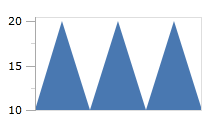
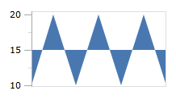
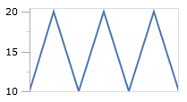
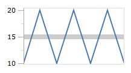

# Baseline

Baseline is the point on an axis that separates positive and negative values.  A baseline value can be used to alter the look of area and bar series, and can be optionally displayed on the chart.

## Baseline Value

The baseline value determines what the chart considers "positive" and "negative" values.  Any value greater than or equal to the baseline value is considered positive, and any value less than the baseline value is considered negative.

The baseline value can be customized using the `Baseline` property on [XYDoubleAxis](xref:@ActiproUIRoot.Controls.Charts.XYDoubleAxis), [XYDecimalAxis](xref:@ActiproUIRoot.Controls.Charts.XYDecimalAxis), and [XYDateTimeAxis](xref:@ActiproUIRoot.Controls.Charts.XYDateTimeAxis).  Baseline defaults to `0` for numeric values and `DateTime.MinValue` for date/time.

In addition, area and bar series will pivot their polygons around the baseline value, which alters their appearance.

In the following examples, the data rendered by the area chart uses the index postion along the X-axis and the fixed values `10, 20, 10, 20, 10, 20, 10` for the Y-axis.  The first image shows the series using `10` as the minimum value along the Y-axis, and `20` for the maximum.  Since our baseline is `0` (the default), the polygon is not pivoted.

If we explicitly set our baseline value to `15`, then any values below the baseline will be considered "negative" and the polyon will appear to pivot around the baseline.

## Baseline Visibility and Style

An actual line can be rendered at the specified baseline value to highlight its location in the chart.  The visibility of the line is configured using the [IsAxisBaselineVisible](xref:@ActiproUIRoot.Controls.Charts.XYChart.IsAxisBaselineVisible) property, which is `false` by default.

For example, the following line series uses the same fixed values from above (`10, 20, 10, 20, 10, 20, 10`) and a baseline value of `15`.  In this particular example, since the line is rendered with a single color, it is not possible to visually determine what is considered above or below the baseline.

If we set [IsAxisBaselineVisible](xref:@ActiproUIRoot.Controls.Charts.XYChart.IsAxisBaselineVisible) to `true`, then we can easily determine this information.

The style of the line can be customized using the [AxisBaselineStyle](xref:@ActiproUIRoot.Controls.Charts.XYChart.AxisBaselineStyle) property.  The associated `Style` should target the `Shape` type, which includes properties such as `Stroke` and `StrokeThickness`.
