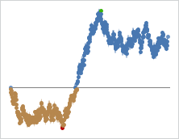
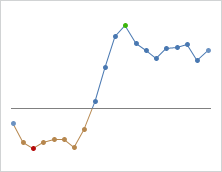
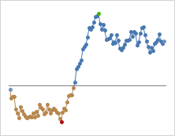

# Data Aggregation

The chart control supports aggregating its data to reduce the number of data points displayed.

## Aggregation Factor

In order to increase performance, the chart control will automatically determine the optimal number of data points to display based on the size of the control.  This is determined using the [AggregationFactor](xref:@ActiproUIRoot.Controls.Charts.Primitives.XYSeriesBase.AggregationFactor) property, which defaults to `0.2`.

For example, if the chart control is `100` pixels wide and uses an aggregation factor of `0.1`, then the optimal number of data points would be `10`.  If the data source contained `1000` items, then the chart would create `10` groups, each with `100` items in it.  Then some sort of aggregation function would be performed on each group to generate a single data point for display.

*A line series with markers visible with no aggregation, 10% aggregation, and 50% aggregation*

Aggregation is enabled by default and can be disabled by setting [IsAggregationEnabled](xref:@ActiproUIRoot.Controls.Charts.Primitives.XYSeriesBase.IsAggregationEnabled) to `false`.

## Aggregation Kinds

There are various aggregation functions that can be performed on the items in a group.  The supported aggregation kinds are specified using the [PrimaryAggregationKind](xref:@ActiproUIRoot.Controls.Charts.Primitives.XYSeriesBase.PrimaryAggregationKind) and [SecondaryAggregationKind](xref:@ActiproUIRoot.Controls.Charts.Primitives.XYSeriesBase.SecondaryAggregationKind).

The `PrimaryAggregationKind` is typically used for the Y values, but for vertically-oriented series this will be used by the X values.  Similarly the `SecondaryAggregationKind` is used for X values, but will be used by Y values for vertically-oriented series.

The following table lists the supported aggregation kinds:

| Aggregation Kind | Description |
|-----|-----|
| `Average` | Averages all the values in the group and uses that as the aggregated value. |
| `First` | Uses the first value in the group as the aggregated value. |
| `Last` | Uses the last value in the group as the aggregated value. |
| `Maximum` | Uses the maximum value in the group as the aggregated value. |
| `Minimum` | Uses the minimum value in the group as the aggregated value. |
| `SignedMaximum` | Uses the value with the maximum absolute value in the group as the aggregated value. For example, `4` is greater than `-5`, but `-5` has a greater absolute value. |
| `SignedMinimum` | Uses the value with the minimum absolute value in the group as the aggregated value. For example, `-4` is less than `3`, but `3` has a lesser absolute value. |
