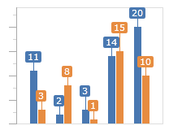
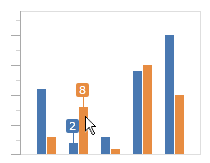
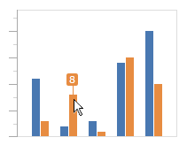
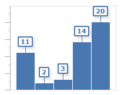
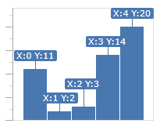
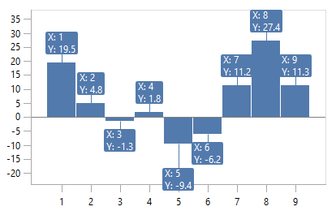
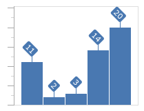
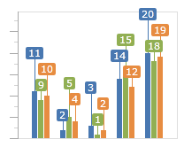
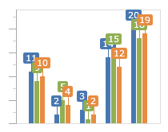

# Data Point Labels

Data point labels allow you to show the values of a given data point.

## Visibility

Visibility of data point labels can be controlled using [SeriesBase](xref:@ActiproUIRoot.Controls.Charts.Primitives.SeriesBase).[LabelVisibility](xref:@ActiproUIRoot.Controls.Charts.Primitives.SeriesBase.LabelVisibility).  LabelVisibility defaults to `Hidden`, in which no labels are visible.



This is an example of setting LabelVisibility to `Visible`, in which all labels are visible.

```xaml
<charts:BarSeries LabelVisibility="Visible" .../>
```



This is an example of setting LabelVisibility to `PointerAxis`, in which labels are visible on all data points near the mouse pointer on the secondary axis.

```xaml
<charts:BarSeries LabelVisibility="PointerAxis" .../>
```



This is an example of setting LabelVisibility to `PointerProximity`, in which labels are visible on all data points near the mouse pointer.

```xaml
<charts:BarSeries LabelVisibility="PointerProximity" .../>
```

LabelVisibility can also be `PointerProximitySingle`, where only the closest data point label to the mouse pointer is visible.

```xaml
<charts:BarSeries LabelVisibility="PointerProximitySingle" .../>
```

## Style

The sytle of the data point labels can be changed using [SeriesBase](xref:@ActiproUIRoot.Controls.Charts.Primitives.SeriesBase).[LabelStyle](xref:@ActiproUIRoot.Controls.Charts.Primitives.SeriesBase.LabelStyle).  The style `TargetType` must be [DataPointLabel](xref:@ActiproUIRoot.Controls.Charts.DataPointLabel).



This is an example of a custom data point label style. Note how the default label color is available by binding to [DataPointLabel](xref:@ActiproUIRoot.Controls.Charts.DataPointLabel).[SeriesDefaultBrush](xref:@ActiproUIRoot.Controls.Charts.DataPointLabel.SeriesDefaultBrush).

```xaml
<charts:BarSeries ItemsSource="11;2;3;14;20" LabelVisibility="Visible">
	<charts:BarSeries.LabelStyle>
		s<Style TargetType="charts:DataPointLabel">
			<Setter Property="Background" Value="White"/>
			<Setter Property="BorderBrush" Value="{Binding SeriesDefaultBrush}"/>
			<Setter Property="BorderThickness" Value="2"/>
			<Setter Property="Foreground" Value="{Binding SeriesDefaultBrush}"/>
			<Setter Property="FontWeight" Value="Bold"/>
			<Setter Property="Effect">
				<Setter.Value>
					<DropShadowEffect Opacity="0.1"/>
				</Setter.Value>
			</Setter>
		</Style>
	</charts:BarSeries.LabelStyle>
</charts:BarSeries>
```

## Formatting

The formatting of the data point labels can be changed using [SeriesBase](xref:@ActiproUIRoot.Controls.Charts.Primitives.SeriesBase).[LabelFormat](xref:@ActiproUIRoot.Controls.Charts.Primitives.SeriesBase.LabelFormat).  Label format provides four parameters:

- \{0} is the value on the primary axis.
- \{1} is the value on the secondary axis.
- \{2} is the value on the X axis.
- \{3} is the value on the Y axis.



This is an example of a custom data point label format. The label format is "X:\{2} Y:\{3}". Note the extra pair of curly-braces used to escape the format string in XAML.

```xaml
<charts:BarSeries LabelFormat="{}X:{2} Y:{3}" .../>
```

## Advanced Customization

There may be situations where [SeriesBase](xref:@ActiproUIRoot.Controls.Charts.Primitives.SeriesBase).[LabelFormat](xref:@ActiproUIRoot.Controls.Charts.Primitives.SeriesBase.LabelFormat) is not sufficient for your needs. In those cases, you can use [SeriesBase](xref:@ActiproUIRoot.Controls.Charts.Primitives.SeriesBase).[LabelFunc](xref:@ActiproUIRoot.Controls.Charts.Primitives.SeriesBase.LabelFunc) to create custom labels using a custom function. `LabelFunc` is a `Func<object,object,object,object,object,string>`. It has the following parameters: primary axis value, secondary axis value, X axis value, Y axis value, and original value. The string that is returned is used for the data point label.



This is an example of a custom data point label func.

```xaml
<charts:BarSeries LabelFunc="{Binding CustomLabelFunc}" .../>
```

 It is bound to a `Func<object,object,object,object,object,string>` property on the DataContext, which has a function pointer with a matching signature assigned to it.

```csharp
private readonly Func<object, object, object, object, object, string> customLabelFunc = GetCustomLabel;

public Func<object, object, object, object, object, string> CustomLabelFunc {
	get { return customLabelFunc; }
}

public static string GetCustomLabel(object primaryValue, object secondaryValue, object xValue, object yValue, object originalValue) {
	return string.Format("X: {0}{1}Y: {2}", xValue, Environment.NewLine, yValue);
}
```

## Angle

The angle of data point labels can be changed using [SeriesBase](xref:@ActiproUIRoot.Controls.Charts.Primitives.SeriesBase).[LabelAngle](xref:@ActiproUIRoot.Controls.Charts.Primitives.SeriesBase.LabelAngle).



This is an example of a custom data point label angle at 45 degrees.

```xaml
<charts:BarSeries LabelAngle="45" .../>
```

## Layout

Each series uses the best method for determining label position by default, but this can be customized when needed.  You can set `LabelPositioningMode` on [BarSeries](xref:@ActiproUIRoot.Controls.Charts.BarSeries), [LineSeries](xref:@ActiproUIRoot.Controls.Charts.LineSeries), [AreaSeries](xref:@ActiproUIRoot.Controls.Charts.AreaSeries), or [ScatterSeries](xref:@ActiproUIRoot.Controls.Charts.ScatterSeries) to determine how labels are positioned. The two possible values are [LabelPositioningMode](xref:@ActiproUIRoot.Controls.Charts.LabelPositioningMode).[FromBaseline](xref:@ActiproUIRoot.Controls.Charts.LabelPositioningMode.FromBaseline), which positions labels away from the baseline, and [LabelPositioningMode](xref:@ActiproUIRoot.Controls.Charts.LabelPositioningMode).[FromAverage](xref:@ActiproUIRoot.Controls.Charts.LabelPositioningMode.FromAverage), which positions labels away from the average value of the primary axis.

## Collision Avoidance

By default, data point labels have collision detection enabled and will attempt to not overlap each other by stacking away from the baseline.



If you want to disable this behavior, you can use [XYChart](xref:@ActiproUIRoot.Controls.Charts.XYChart).[LabelCollisionMode](xref:@ActiproUIRoot.Controls.Charts.XYChart.LabelCollisionMode) and set it to [None](xref:@ActiproUIRoot.Controls.Charts.LabelCollisionMode.None).



This is an example of the label collision detection being disabled.

```xaml
<charts:XYChart LabelCollisionMode="None" .../>
```
