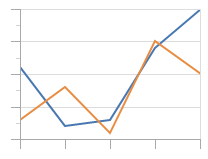
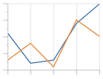
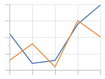
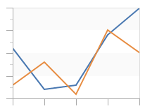
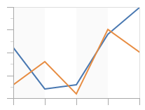
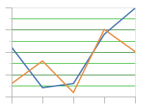
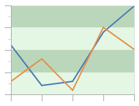

# Grid Lines and Stripes

Grid lines and stripes appear behind the chart data and allow the user to easily compare data against axis values.

## Line Visibility

Visibility of the grid lines is controlled using [XYChart](xref:ActiproSoftware.Windows.Controls.Charts.XYChart).[GridLineMajorVisibility](xref:ActiproSoftware.Windows.Controls.Charts.XYChart.GridLineMajorVisibility) and [XYChart](xref:ActiproSoftware.Windows.Controls.Charts.XYChart).[GridLineMinorVisibility](xref:ActiproSoftware.Windows.Controls.Charts.XYChart.GridLineMinorVisibility).  These properties can be set to [None](xref:ActiproSoftware.Windows.Controls.Charts.GridLineVisibility.None), [All](xref:ActiproSoftware.Windows.Controls.Charts.GridLineVisibility.All), [X](xref:ActiproSoftware.Windows.Controls.Charts.GridLineVisibility.X), or [Y](xref:ActiproSoftware.Windows.Controls.Charts.GridLineVisibility.Y).



This is an example of setting GridLineMajorVisibility to `Y`, in which grid lines are shown for each major tick on the Y axis.

```xaml
<charts:XYChart GridLineVisibility="Y" .../>
```



This is an example of setting GridLineMajorVisibility to `X`, in which grid lines are shown for each major tick on the X axis.

```xaml
<charts:XYChart GridLineVisibility="X" .../>
```



This is an example of setting GridLineMajorVisibility to `All`, in which grid lines are shown for each major tick on the X and Y axis.

```xaml
<charts:XYChart GridLineVisibility="All" .../>
```

## Stripe Visibility

Visibility of the grid stripes is controlled using [XYChart](xref:ActiproSoftware.Windows.Controls.Charts.XYChart).[GridStripeVisibility](xref:ActiproSoftware.Windows.Controls.Charts.XYChart.GridStripeVisibility).  This property can be set to [None](xref:ActiproSoftware.Windows.Controls.Charts.GridStripeVisibility.None), [X](xref:ActiproSoftware.Windows.Controls.Charts.GridStripeVisibility.X), or [Y](xref:ActiproSoftware.Windows.Controls.Charts.GridStripeVisibility.Y).



This is an example of setting GridLineMajorVisibility to `Y`, in which grid stripes are shown alternating between each major tick on the Y axis.

```xaml
<charts:XYChart GridLineVisibility="Y" .../>
```



This is an example of setting GridLineMajorVisibility to `X`, in which grid stripes are shown alternating between each major tick on the X axis.

```xaml
<charts:XYChart GridLineVisibility="X" .../>
```

## Line Customization

The color of major and minor grid lines can be controlled using [XYChart](xref:ActiproSoftware.Windows.Controls.Charts.XYChart).[GridLineMajorBrush](xref:ActiproSoftware.Windows.Controls.Charts.XYChart.GridLineMajorBrush) and [XYChart](xref:ActiproSoftware.Windows.Controls.Charts.XYChart).[GridLineMinorBrush](xref:ActiproSoftware.Windows.Controls.Charts.XYChart.GridLineMinorBrush), respectively.



This is an example of setting GridLineMajorBrush and GridLineMinorBrush to custom colors.

```xaml
<charts:XYChart .... GridLineMajorBrush="#338833" GridLineMinorBrush="#33bb33">
```

## Stripe Customization

The color of grid stripes and alternating grid stripes can be controlled using [XYChart](xref:ActiproSoftware.Windows.Controls.Charts.XYChart).[GridStripeBrush](xref:ActiproSoftware.Windows.Controls.Charts.XYChart.GridStripeBrush) and [XYChart](xref:ActiproSoftware.Windows.Controls.Charts.XYChart).[GridStripeAlternatingBrush](xref:ActiproSoftware.Windows.Controls.Charts.XYChart.GridStripeAlternatingBrush).



This is an example of setting GridStripeBrush and GridStripeAlternatingBrush to custom colors.

```xaml
<charts:XYChart .... GridStripeBrush="#55338833" GridStripeAlternatingBrush="#2233bb33">
```
