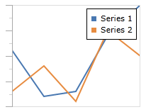
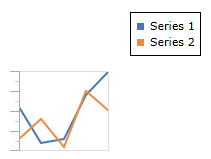
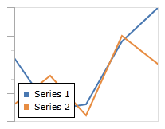
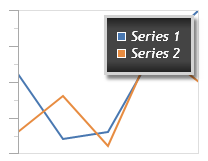
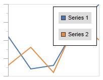

# Legend

A chart legend is a reference that shows a description of each data set and the color it is represented by.

## Description

The [XYSeriesBase](xref:@ActiproUIRoot.Controls.Charts.Primitives.XYSeriesBase).[Description](xref:@ActiproUIRoot.Controls.Charts.Primitives.XYSeriesBase.Description) property determines the textual description that is used in the legend to represent each series.

## Visibility

The visibility of the legend can be controlled using [XYChart](xref:@ActiproUIRoot.Controls.Charts.XYChart).[IsLegendVisible](xref:@ActiproUIRoot.Controls.Charts.XYChart.IsLegendVisible).



This is an example of setting `IsLegendVisible` to `true`.

```xaml
<charts:XYChart IsLegendVisible="true" .../>
```

## Position

The position of the legend can be controlled using [XYChart](xref:@ActiproUIRoot.Controls.Charts.XYChart).[LegendHorizontalPosition](xref:@ActiproUIRoot.Controls.Charts.XYChart.LegendHorizontalPosition) and [XYChart](xref:@ActiproUIRoot.Controls.Charts.XYChart).[LegendVerticalPosition](xref:@ActiproUIRoot.Controls.Charts.XYChart.LegendVerticalPosition).  Legend positions have two modifiers, `Inside` and `Outside` (for example, [LeftInside](xref:@ActiproUIRoot.Controls.Charts.LegendHorizontalPosition.LeftInside) and [TopOutside](xref:@ActiproUIRoot.Controls.Charts.LegendVerticalPosition.TopOutside)). `Inside` means the legend will be positioned relative to the chart drawing area, and `Outside` means the legend will be positioned relative to the entire chart control.  So `CenterInside` will be in the center of the chart drawing area, whereas `CenterOutside` will be in the center of the entire chart control.



This is an example of setting `LegendHorizontalPosition` to `RightOutside` and `LegendVerticalPosition` to `TopOutside`. Note how when placed outside the chart drawing area, the chart will resize to make room for the legend.

```xaml
<charts:XYChart LegendHorizontalPosition="RightOutside" LegendVerticalPosition="TopOutside" .../>
```



This is an example of setting `LegendHorizontalPosition` to `LeftInside` and `LegendVerticalPosition` to `BottomInside`.

```xaml
<charts:XYChart LegendHorizontalPosition="LeftInside" LegendVerticalPosition="BottomInside" .../>
```

## Legend Customization

The legend can be styled using [XYChart](xref:@ActiproUIRoot.Controls.Charts.XYChart).[LegendStyle](xref:@ActiproUIRoot.Controls.Charts.XYChart.LegendStyle).  The style you provide should have a `TargetType` of `ItemsControl`.



This is an example of providing a custom `LegendStyle`.

```xaml
<charts:XYChart.LegendStyle>
	<Style TargetType="ItemsControl">
		<Setter Property="BorderBrush" Value="LightGray"/>
		<Setter Property="BorderThickness" Value="3"/>
		<Setter Property="Background">
			<Setter.Value>
				<LinearGradientBrush StartPoint="0,0" EndPoint="0,1">
					<GradientStop Color="#222222" Offset="0.0"/>
					<GradientStop Color="#444444" Offset="0.2"/>
					<GradientStop Color="#444444" Offset="0.8"/>
					<GradientStop Color="#222222" Offset="1.0"/>
				</LinearGradientBrush>
			</Setter.Value>
		</Setter>
		<Setter Property="Padding" Value="10"/>
		<Setter Property="Effect">
			<Setter.Value>
				<DropShadowEffect Opacity="0.5"/>
			</Setter.Value>
		</Setter>
		<Setter Property="FontFamily" Value="Trebuchet MS"/>
		<Setter Property="FontWeight" Value="Normal"/>
		<Setter Property="FontStyle" Value="Italic"/>
		<Setter Property="FontSize" Value="14"/>
		<Setter Property="Foreground" Value="White"/>
	</Style>
</charts:XYChart.LegendStyle>
```

## Legend Item Customization

Each individual legend item can be re-templated by setting `ItemTemplate` in [XYChart](xref:@ActiproUIRoot.Controls.Charts.XYChart).[LegendStyle](xref:@ActiproUIRoot.Controls.Charts.XYChart.LegendStyle).  The data source for the template is [LegendKey](xref:@ActiproUIRoot.Controls.Charts.LegendKey), allowing you to bind to properties from the template such as [LegendKey](xref:@ActiproUIRoot.Controls.Charts.LegendKey).[Label](xref:@ActiproUIRoot.Controls.Charts.LegendKey.Label) and [LegendKey](xref:@ActiproUIRoot.Controls.Charts.LegendKey).[LegendMarkerStyle](xref:@ActiproUIRoot.Controls.Charts.LegendKey.LegendMarkerStyle).



This is an example of providing a custom `LegendStyle` to re-template the legend items.

```xaml
<charts:XYChart.LegendStyle>
	<Style TargetType="ItemsControl">
		<Setter Property="ItemTemplate">
			<Setter.Value>
				<DataTemplate>
					<Border Background="#dddddd" Padding="5" Margin="5">
						<StackPanel Orientation="Horizontal">
							<charts:ChartMarker Margin="0,0,5,0" Style="{Binding LegendMarkerStyle}" BorderBrush="#333333"/>
							<TextBlock Text="{Binding Label}" Foreground="#111111" FontFamily="Arial"/>
						</StackPanel>
					</Border>
				</DataTemplate>
			</Setter.Value>
		</Setter>
	</Style>
</charts:XYChart.LegendStyle>
```
