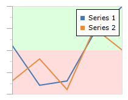
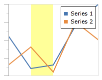
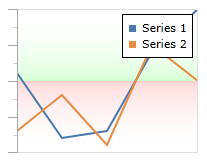

# Ranges

Specific value ranges of the chart can be highlighted to convey additional information to the end-user.



*A line chart with a green and red range for positive and negative values, respectively*

## Orientation

By default, ranges will be aligned horizontally, which means they highlight value ranges along the Y-axis.  A vertical range can be created by setting the [Orientation](xref:@ActiproUIRoot.Controls.Charts.XYRange.Orientation) property to `Vertical`.  Vertical ranges highlight value ranges along the X-axis.



*A line chart with a yellow range between the X values 2 and 5*

In this example, the line series is set to a collection of doubles. Therefore, the X values will range from 0 to 7 (since there are 8 entries) and the actual values shown will be used along the Y axis:

```xaml
<charts:XYChart IsLegendVisible="True" ...>
	<charts:LineSeries ItemsSource="11;2;3;14;20" />
	<charts:LineSeries ItemsSource="3;8;1;15;10" />
	<charts:XYChart.XAxes>
		<charts:XYDoubleAxis ...>
			<charts:XYDoubleAxis.Ranges>
				<charts:XYRange Background="#66FFFF00" Minimum="1" Maximum="2" Orientation="Vertical"/>
			</charts:XYDoubleAxis.Ranges>
		</charts:XYDoubleAxis>
	</charts:XYChart.XAxes>
	<charts:XYChart.YAxes>
		<charts:XYDoubleAxis .../>
	</charts:XYChart.YAxes>
</charts:XYChart>
```

## Minimum and Maximum Values

The values of a range are specified using the [Maximum](xref:@ActiproUIRoot.Controls.Charts.XYRange.Maximum) and [Minimum](xref:@ActiproUIRoot.Controls.Charts.XYRange.Minimum) properties.

If either of these properties is unset (or set to `null`), then it's value will be auto-calculated based on the data points from all series.  The `Maximum` will run to the highest value and likewise the `Minimum` will run to the lowest value.

For example, we can produce two ranges that run up (green) and down (red) from 0 using the following code:

```xaml
<charts:XYChart ...>
	<charts:LineSeries ItemsSource="11;2;3;14;20" />
	<charts:LineSeries ItemsSource="3;8;1;15;10" />
	<charts:XYChart.XAxes>
		<charts:XYDoubleAxis .../>
	</charts:XYChart.XAxes>
	<charts:XYChart.YAxes>
		<charts:XYDoubleAxis ...>
			<charts:XYDoubleAxis.Ranges>
				<charts:XYRange Minimum="10">
					<charts:XYRange.Background>
						<LinearGradientBrush StartPoint="0,0" EndPoint="0,1">
							<GradientStop Color="Transparent" Offset="0" />
							<GradientStop Color="#2200FF00" Offset="0.95" />
							<GradientStop Color="#3300FF00" Offset="1" />
						</LinearGradientBrush>
					</charts:XYRange.Background>
				</charts:XYRange>
				<charts:XYRange Maximum="10">
					<charts:XYRange.Background>
						<LinearGradientBrush StartPoint="0,0" EndPoint="0,1">
							<GradientStop Color="#33FF0000" Offset="0" />
							<GradientStop Color="#22FF0000" Offset="0.05" />
							<GradientStop Color="Transparent" Offset="1" />
						</LinearGradientBrush>
					</charts:XYRange.Background>
				</charts:XYRange>
			</charts:XYDoubleAxis.Ranges>
		</charts:XYDoubleAxis>
	</charts:XYChart.YAxes>
</charts:XYChart>
```

This produces the following chart:


