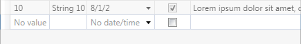
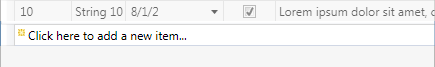

# Attached Behaviors

The Acitpro WPF DataGrid Contrib assembly includes attached behaviors, which are described in this topic.

> [!NOTE]
> The attached behaviors described in this topic can be applied to the WPF `DataGrid` or the [ThemedDataGrid](xref:@ActiproUIRoot.Controls.DataGrid.ThemedDataGrid) .

## FocusBehavior

This class provides attached behavior for `DataGrid` controls to track the focus, which is configured by setting the [FocusBehavior](xref:@ActiproUIRoot.Controls.DataGrid.FocusBehavior).[TrackingModesProperty](xref:@ActiproUIRoot.Controls.DataGrid.FocusBehavior.TrackingModesProperty) attached property to one or more values from the [FocusTrackingModes](xref:@ActiproUIRoot.Controls.DataGrid.FocusTrackingModes) enumeration.

### Column Header

When [FocusBehavior](xref:@ActiproUIRoot.Controls.DataGrid.FocusBehavior).[TrackingModesProperty](xref:@ActiproUIRoot.Controls.DataGrid.FocusBehavior.TrackingModesProperty) includes the `Headers` enumeration flag, then the read-only [FocusBehavior](xref:@ActiproUIRoot.Controls.DataGrid.FocusBehavior).[IsFocusedHeaderProperty](xref:@ActiproUIRoot.Controls.DataGrid.FocusBehavior.IsFocusedHeaderProperty) attached property will be tracked/maintained. This allows one or more triggers to alter the look of the column headers when one of the associated cells has focus.

## NewRowTemplateBehavior

This class provides attached behavior for `DataGrid` controls to customize the new row template.  The [NewRowTemplateBehavior](xref:@ActiproUIRoot.Controls.DataGrid.NewRowTemplateBehavior).[TemplateProperty](xref:@ActiproUIRoot.Controls.DataGrid.NewRowTemplateBehavior.TemplateProperty) attached property can be set to a custom `ControlTemplate` to use when the new row is not currently editing.

By default, the new row looks identical to actual data rows, but with empty cells. Using [NewRowTemplateBehavior](xref:@ActiproUIRoot.Controls.DataGrid.NewRowTemplateBehavior), a more appealling look can easily be achieved.

*The DataGrid control with default (top) and custom (bottom) looks of the new row*

## SelectionBehavior

This class provides attached behavior for `DataGrid` controls to track the selection, which is configured by setting the [SelectionBehavior](xref:@ActiproUIRoot.Controls.DataGrid.SelectionBehavior).[TrackingModesProperty](xref:@ActiproUIRoot.Controls.DataGrid.SelectionBehavior.TrackingModesProperty) attached property to one or more values from the [SelectionTrackingModes](xref:@ActiproUIRoot.Controls.DataGrid.SelectionTrackingModes) enumeration.

### Column Header

When [SelectionBehavior](xref:@ActiproUIRoot.Controls.DataGrid.SelectionBehavior).[TrackingModesProperty](xref:@ActiproUIRoot.Controls.DataGrid.SelectionBehavior.TrackingModesProperty) includes the `Headers` enumeration flag, then the read-only [SelectionBehavior](xref:@ActiproUIRoot.Controls.DataGrid.SelectionBehavior).[IsSelectedHeaderProperty](xref:@ActiproUIRoot.Controls.DataGrid.SelectionBehavior.IsSelectedHeaderProperty) attached property will be tracked/maintained. This allows one or more triggers to alter the look of the column headers when one or more of the associated cells is selected.
