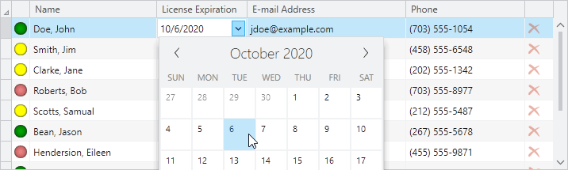

# Editors

The controls provided by the Editors product can be easily integrated into Microsoft's WPF `DataGrid`, through the use of custom `DataGridColumn` objects.  An Interop assembly is provided that ties the two products together.

*DataGrid with Editors integrated using the Interop assembly*

See the [Interoperability](../../editors/interoperability/datagrid.md) topic under Actipro Editors for more information.
