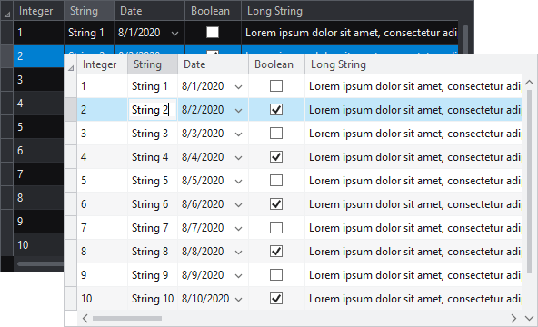

# Themes

Acitpro WPF DataGrid Contrib adds the [ThemedDataGrid](xref:ActiproSoftware.Windows.Controls.DataGrid.ThemedDataGrid), which supports dynamic theme changing, sharper looking system themes, as well was Office themes.

*A couple themes applied to the ThemedDataGrid control*

> [!NOTE]
> Be sure to read the [Actipro Themes](../themes/index.md) product documentation too since that explains in great detail how the themes management works with Actipro controls.
