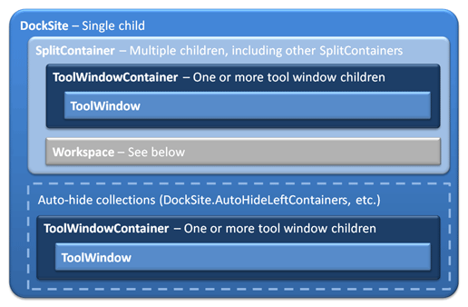
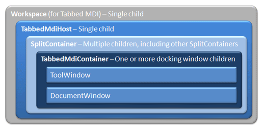
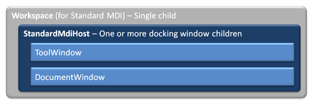

# Control Hierarchy

Since a number of controls are involved in creating a docking window and MDI hierarchy, this topic delves into what can be contained by what in your XAML.

> [!NOTE]
> When creating a layout programmatically (not in XAML), refer to some of the other topics in this documentation.

## DockSite Hierarchy

The [DockSite](xref:ActiproSoftware.Windows.Controls.Docking.DockSite) is always the root control in a docking window and/or MDI hierarchy.  It implicitly creates a primary [DockHost](xref:ActiproSoftware.Windows.Controls.Docking.DockHost) within its template.  The [DockSite](xref:ActiproSoftware.Windows.Controls.Docking.DockSite) has a single child control that becomes the child control of the primary [DockHost](xref:ActiproSoftware.Windows.Controls.Docking.DockHost) in the template.



*A DockSite hierarchy diagram*

### Child Content

The [DockSite](xref:ActiproSoftware.Windows.Controls.Docking.DockSite).[Child](xref:ActiproSoftware.Windows.Controls.Docking.DockSite.Child) can be one of the following:

- [SplitContainer](xref:ActiproSoftware.Windows.Controls.Docking.SplitContainer)
- [ToolWindowContainer](xref:ActiproSoftware.Windows.Controls.Docking.ToolWindowContainer)
- [Workspace](xref:ActiproSoftware.Windows.Controls.Docking.Workspace)

Each [SplitContainer](xref:ActiproSoftware.Windows.Controls.Docking.SplitContainer) has an [Orientation](xref:ActiproSoftware.Windows.Controls.Docking.SplitContainer.Orientation) property that indicates whether the splits are horizontal or vertical. [SplitContainer](xref:ActiproSoftware.Windows.Controls.Docking.SplitContainer) objects can be nested to create complex hierarchies. [SplitContainer](xref:ActiproSoftware.Windows.Controls.Docking.SplitContainer) children can be one of the following:

- [SplitContainer](xref:ActiproSoftware.Windows.Controls.Docking.SplitContainer)
- [ToolWindowContainer](xref:ActiproSoftware.Windows.Controls.Docking.ToolWindowContainer)
- [Workspace](xref:ActiproSoftware.Windows.Controls.Docking.Workspace)

[ToolWindowContainer](xref:ActiproSoftware.Windows.Controls.Docking.ToolWindowContainer) controls contain one or more [ToolWindow](xref:ActiproSoftware.Windows.Controls.Docking.ToolWindow) controls and provide a title bar and tabs for selecting between tool windows.

[Workspace](xref:ActiproSoftware.Windows.Controls.Docking.Workspace) defines the area around which tool window can be docked.  If no [Workspace](xref:ActiproSoftware.Windows.Controls.Docking.Workspace) is included within the hierarchy, tool window inner-fill mode is activated.  A [Workspace](xref:ActiproSoftware.Windows.Controls.Docking.Workspace) control has a single child.  If the [Workspace](xref:ActiproSoftware.Windows.Controls.Docking.Workspace)`.Content` is a [TabbedMdiHost](xref:ActiproSoftware.Windows.Controls.Docking.TabbedMdiHost), tabbed MDI is activated.  If the [Workspace](xref:ActiproSoftware.Windows.Controls.Docking.Workspace)`.Content` is a [StandardMdiHost](xref:ActiproSoftware.Windows.Controls.Docking.StandardMdiHost), standard MDI is activated.

This example shows two attached tool windows docked on the right side of a workspace with empty tabbed MDI:

```xaml
xmlns:docking="http://schemas.actiprosoftware.com/winfx/xaml/docking"
...

<docking:DockSite>
	<docking:SplitContainer>
		<docking:Workspace>
			<docking:TabbedMdiHost />
		</docking:Workspace>

		<docking:ToolWindowContainer>
			<docking:ToolWindow Title="Tool Window 1" />
			<docking:ToolWindow Title="Tool Window 2" />
		</docking:ToolWindowContainer>
	</docking:SplitContainer>
</docking:DockSite>
```

### Auto-Hide Configuration

To add tool windows into an auto-hide state, use the four auto-hide properties:

- [DockSite](xref:ActiproSoftware.Windows.Controls.Docking.DockSite).[AutoHideLeftContainers](xref:ActiproSoftware.Windows.Controls.Docking.DockSite.AutoHideLeftContainers)
- [DockSite](xref:ActiproSoftware.Windows.Controls.Docking.DockSite).[AutoHideTopContainers](xref:ActiproSoftware.Windows.Controls.Docking.DockSite.AutoHideTopContainers)
- [DockSite](xref:ActiproSoftware.Windows.Controls.Docking.DockSite).[AutoHideRightContainers](xref:ActiproSoftware.Windows.Controls.Docking.DockSite.AutoHideRightContainers)
- [DockSite](xref:ActiproSoftware.Windows.Controls.Docking.DockSite).[AutoHideBottomContainers](xref:ActiproSoftware.Windows.Controls.Docking.DockSite.AutoHideBottomContainers)

 Each of those accepts one or more [ToolWindowContainer](xref:ActiproSoftware.Windows.Controls.Docking.ToolWindowContainer) controls, each of which can contain one or more [ToolWindow](xref:ActiproSoftware.Windows.Controls.Docking.ToolWindow) controls.

This example shows two tool windows docked vertically on the right side of a workspace with empty tabbed MDI, and an auto-hidden tool window on the left:

```xaml
xmlns:docking="http://schemas.actiprosoftware.com/winfx/xaml/docking"
...

<docking:DockSite>
	<docking:DockSite.AutoHideLeftContainers>
		<docking:ToolWindowContainer>
			<docking:ToolWindow Title="Tool Window 3" />
		</docking:ToolWindowContainer>
	</docking:DockSite.AutoHideLeftContainers>
							
	<docking:SplitContainer>
		<docking:Workspace>
			<docking:TabbedMdiHost />
		</docking:Workspace>
							
		<docking:SplitContainer Orientation="Vertical">
			<docking:ToolWindowContainer>
				<docking:ToolWindow Title="Tool Window 1" />
			</docking:ToolWindowContainer>
			<docking:ToolWindowContainer>
				<docking:ToolWindow Title="Tool Window 2" />
			</docking:ToolWindowContainer>
		</docking:SplitContainer>
	</docking:SplitContainer>
</docking:DockSite>
```

## Tabbed MDI Hierarchy

When the [Workspace](xref:ActiproSoftware.Windows.Controls.Docking.Workspace)`.Content` is a [TabbedMdiHost](xref:ActiproSoftware.Windows.Controls.Docking.TabbedMdiHost), tabbed MDI mode is activated.  Tabbed MDI is where the full size of the workspace is filled with one or more tabbed containers, with each tab representing a document. Windows can be cascaded or tiled.



*A tabbed MDI hierarchy diagram*

The [TabbedMdiHost](xref:ActiproSoftware.Windows.Controls.Docking.TabbedMdiHost) control has a single child, which can be one of the following:

- [SplitContainer](xref:ActiproSoftware.Windows.Controls.Docking.SplitContainer)
- [TabbedMdiContainer](xref:ActiproSoftware.Windows.Controls.Docking.TabbedMdiContainer)

Each [SplitContainer](xref:ActiproSoftware.Windows.Controls.Docking.SplitContainer) has an [Orientation](xref:ActiproSoftware.Windows.Controls.Docking.SplitContainer.Orientation) property that indicates whether the splits are horizontal or vertical. [SplitContainer](xref:ActiproSoftware.Windows.Controls.Docking.SplitContainer) objects can be nested to create complex hierarchies. [SplitContainer](xref:ActiproSoftware.Windows.Controls.Docking.SplitContainer) children can be one of the following:

- [SplitContainer](xref:ActiproSoftware.Windows.Controls.Docking.SplitContainer)
- [TabbedMdiContainer](xref:ActiproSoftware.Windows.Controls.Docking.TabbedMdiContainer)

[TabbedMdiContainer](xref:ActiproSoftware.Windows.Controls.Docking.TabbedMdiContainer) controls contain one or more [ToolWindow](xref:ActiproSoftware.Windows.Controls.Docking.ToolWindow) and/or [DocumentWindow](xref:ActiproSoftware.Windows.Controls.Docking.DocumentWindow) controls and provide tabs for selecting between the documents.

This example shows a single document open in tabbed MDI:

```xaml
xmlns:docking="http://schemas.actiprosoftware.com/winfx/xaml/docking"
...

<docking:DockSite>
	<docking:Workspace>
		<docking:TabbedMdiHost>
			<docking:TabbedMdiContainer>
				<docking:DocumentWindow Title="Document1.txt" Description="Text document" FileName="Document1.rtf">
					<TextBox BorderThickness="0" TextWrapping="Wrap" Text="This is a document window." />
				</docking:DocumentWindow>
			</docking:TabbedMdiContainer>						
		</docking:TabbedMdiHost>
	</docking:Workspace>
</docking:DockSite>
```

## Standard MDI Hierarchy

When the [Workspace](xref:ActiproSoftware.Windows.Controls.Docking.Workspace)`.Content` is a [StandardMdiHost](xref:ActiproSoftware.Windows.Controls.Docking.StandardMdiHost), standard MDI mode is activated.  Standard MDI is the windowed variation of MDI, where each document is represented by a window that can be moved around within the workspace.  Windows can be cascaded or tiled.



*A standard MDI hierarchy diagram*

The [StandardMdiHost](xref:ActiproSoftware.Windows.Controls.Docking.StandardMdiHost) control contains one or more [ToolWindow](xref:ActiproSoftware.Windows.Controls.Docking.ToolWindow) and/or [DocumentWindow](xref:ActiproSoftware.Windows.Controls.Docking.DocumentWindow) controls.  It renders each document as a window.

This example shows a single document open in standard MDI:

```xaml
xmlns:docking="http://schemas.actiprosoftware.com/winfx/xaml/docking"
...

<docking:DockSite>
	<docking:Workspace>
		<docking:StandardMdiHost>
			<docking:DocumentWindow Title="Document1.txt" Description="Text document" FileName="Document1.rtf">
				<TextBox BorderThickness="0" TextWrapping="Wrap" Text="This is a document window." />
			</docking:DocumentWindow>
		</docking:StandardMdiHost>
	</docking:Workspace>
</docking:DockSite>
```
