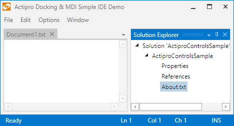

# Docked Tool Windows

Tool windows in [docked state](docking-window-states.md) appear docked in containers around an optional workspace within their dock host.  When two or more tool windows are in the same container, tabs allow for selecting which one is visible.

When a tool window is docked, it appears within a [ToolWindowContainer](xref:ActiproSoftware.Windows.Controls.Docking.ToolWindowContainer).

*The Solution Explorer tool window docked*

## Allowing Docking

Only tool windows can be docked.  A global [DockSite](xref:ActiproSoftware.Windows.Controls.Docking.DockSite).[CanToolWindowsDock](xref:ActiproSoftware.Windows.Controls.Docking.DockSite.CanToolWindowsDock) property (defaults to `true`) determines the default value for whether they have that capability, but it can be overridden at an instance-level by setting the [DockingWindow](xref:ActiproSoftware.Windows.Controls.Docking.DockingWindow).[CanDock](xref:ActiproSoftware.Windows.Controls.Docking.DockingWindow.CanDock) property.

The [DockingWindow](xref:ActiproSoftware.Windows.Controls.Docking.DockingWindow).[CanAttach](xref:ActiproSoftware.Windows.Controls.Docking.DockingWindow.CanAttach) property can be set to `false` to prevent a tool window from attaching (becoming tabbed with) another tool window in the same container.

## Programmatically Docking a Tool Window

A tool window can be programmatically docked by calling the [ToolWindow](xref:ActiproSoftware.Windows.Controls.Docking.ToolWindow).[Dock](xref:ActiproSoftware.Windows.Controls.Docking.ToolWindow.Dock*) method.  An overload of the method allows you to specify the [IDockTarget](xref:ActiproSoftware.Windows.Controls.Docking.IDockTarget) and [Side](xref:ActiproSoftware.Windows.Controls.Side) against which to dock around the target.

The [IDockTarget](xref:ActiproSoftware.Windows.Controls.Docking.IDockTarget) can be a [DockSite](xref:ActiproSoftware.Windows.Controls.Docking.DockSite), [DockHost](xref:ActiproSoftware.Windows.Controls.Docking.DockHost), [Workspace](xref:ActiproSoftware.Windows.Controls.Docking.Workspace), or another docking window.

## Appearance Options

These options control the appearance of tool window containers:

| Member | Description |
|-----|-----|
| [DockSite](xref:ActiproSoftware.Windows.Controls.Docking.DockSite).[ToolWindowsHaveCloseButtons](xref:ActiproSoftware.Windows.Controls.Docking.DockSite.ToolWindowsHaveCloseButtons) Property | Gets or sets whether `ToolWindowContainer` controls can have title bar close buttons. |
| [DockSite](xref:ActiproSoftware.Windows.Controls.Docking.DockSite).[ToolWindowsHaveOptionsButtons](xref:ActiproSoftware.Windows.Controls.Docking.DockSite.ToolWindowsHaveOptionsButtons) Property | Gets or sets whether `ToolWindowContainer` controls can have title bar options buttons. |
| [DockSite](xref:ActiproSoftware.Windows.Controls.Docking.DockSite).[ToolWindowsHaveTitleBarIcons](xref:ActiproSoftware.Windows.Controls.Docking.DockSite.ToolWindowsHaveTitleBarIcons) Property | Gets or sets the global setting for whether tool window title bars display the icon of the selected tool window. |
| [DockSite](xref:ActiproSoftware.Windows.Controls.Docking.DockSite).[ToolWindowsHaveTitleBars](xref:ActiproSoftware.Windows.Controls.Docking.DockSite.ToolWindowsHaveTitleBars) Property | Gets or sets the global setting for whether tool windows display a title bar when not in MDI. |
| [DockSite](xref:ActiproSoftware.Windows.Controls.Docking.DockSite).[ToolWindowTabItemContainerStyle](xref:ActiproSoftware.Windows.Controls.Docking.DockSite.ToolWindowTabItemContainerStyle) Property | Gets or sets the `Style` to use for rendering the tab item containers in a `ToolWindowContainer`. |

The [ToolWindowContainer](xref:ActiproSoftware.Windows.Controls.Docking.ToolWindowContainer) control also defines [TitleBarMinHeight](xref:ActiproSoftware.Windows.Controls.Docking.ToolWindowContainer.TitleBarMinHeight), [TitleFontFamily](xref:ActiproSoftware.Windows.Controls.Docking.ToolWindowContainer.TitleFontFamily), and [TitleFontSize](xref:ActiproSoftware.Windows.Controls.Docking.ToolWindowContainer.TitleFontSize) properties that can adjust the look of a title in a tool window container.  These properties can only be altered with an implicit `Style` that targets [ToolWindowContainer](xref:ActiproSoftware.Windows.Controls.Docking.ToolWindowContainer) that is in your application's `Resources`.

## Title vs. Tab Text

The [DockingWindow](xref:ActiproSoftware.Windows.Controls.Docking.DockingWindow).[Title](xref:ActiproSoftware.Windows.Controls.Docking.DockingWindow.Title) property is normally set to determine the title text that is rendered in tabs as well as in title bars and on the standard switcher.  In some cases, it might be desirable to have longer text for the [Title](xref:ActiproSoftware.Windows.Controls.Docking.DockingWindow.Title), such as "Properties - Document1.txt", while having shorting text that renders on tabs, such as "Properties".  This allows your title to provide more extensive contextual information.

By setting the [TabText](xref:ActiproSoftware.Windows.Controls.Docking.DockingWindow.TabText) property to a non-null value, its value will be used to render the tab text instead of the [Title](xref:ActiproSoftware.Windows.Controls.Docking.DockingWindow.Title) value.  In that scenario, the [Title](xref:ActiproSoftware.Windows.Controls.Docking.DockingWindow.Title) value will still be used in title bars and on the standard switcher when the window is selected.

## Tab Tool Tip

The [DockingWindow](xref:ActiproSoftware.Windows.Controls.Docking.DockingWindow).[TabToolTip](xref:ActiproSoftware.Windows.Controls.Docking.DockingWindow.TabToolTip) property is automatically bound to the [Title](xref:ActiproSoftware.Windows.Controls.Docking.DockingWindow.Title) property for tool windows.  Override the [TabToolTip](xref:ActiproSoftware.Windows.Controls.Docking.DockingWindow.TabToolTip) property to set alternate tool tip content.

## Tab Images

By default the [DockingWindow](xref:ActiproSoftware.Windows.Controls.Docking.DockingWindow).[ImageSource](xref:ActiproSoftware.Windows.Controls.Docking.DockingWindow.ImageSource) image will not appear on tool window tabs.

You can force the image to display on the tabs by setting the [DockSite](xref:ActiproSoftware.Windows.Controls.Docking.DockSite).[ToolWindowsHaveTabImages](xref:ActiproSoftware.Windows.Controls.Docking.DockSite.ToolWindowsHaveTabImages) property to `true`.

## Tab and Title Bar Contextual Content

Tool window tabs and tool window container title bars can display any context-related content to the right of the title.  This content is set via the [ToolWindow](xref:ActiproSoftware.Windows.Controls.Docking.ToolWindow).[ToolWindowContainerTabContextContentTemplate](xref:ActiproSoftware.Windows.Controls.Docking.ToolWindow.ToolWindowContainerTabContextContentTemplate) and [ToolWindow](xref:ActiproSoftware.Windows.Controls.Docking.ToolWindow).[ToolWindowContainerTitleBarContextContentTemplate](xref:ActiproSoftware.Windows.Controls.Docking.ToolWindow.ToolWindowContainerTitleBarContextContentTemplate) properties respectively.

See the [Contextual Content](../docking-window-features/contextual-content.md) topic for some more information.

## Tab Strip Placement

By default the tool window tabs will appear below their content, but can be changed to appear on any side of the content.

You can alter the location of the tool window tabs by changing the value of the [DockSite](xref:ActiproSoftware.Windows.Controls.Docking.DockSite).[ToolWindowsTabStripPlacement](xref:ActiproSoftware.Windows.Controls.Docking.DockSite.ToolWindowsTabStripPlacement) property.

## Tab Overflow Behavior

There are numerous options from the [TabOverflowBehavior](xref:ActiproSoftware.Windows.Controls.Docking.TabOverflowBehavior) enumeration for selecting what happens when the tabs overflow the available tab strip space.

By default, the tabs shrink to fit within the available tab strip space.  This can be changed via the [DockSite](xref:ActiproSoftware.Windows.Controls.Docking.DockSite).[ToolWindowsTabOverflowBehavior](xref:ActiproSoftware.Windows.Controls.Docking.DockSite.ToolWindowsTabOverflowBehavior) property.

## Single Tab Behavior

Use the [DockSite](xref:ActiproSoftware.Windows.Controls.Docking.DockSite).[ToolWindowsSingleTabLayoutBehavior](xref:ActiproSoftware.Windows.Controls.Docking.DockSite.ToolWindowsSingleTabLayoutBehavior) property to adjust whether tool window containers that have a single tool window should show a tab or not.  By default, tabs only show when there are two or more tool windows in a container.

## Keyboard Shortcuts

The `Alt+-` keyboard shortcut shows the options menu for the currently selected tool window in the container.

Other keyboard shortcuts allow you to jump directly to a tab. `Ctrl+1` will activate the first tab, with `Ctrl+2` activating the second tab, and so on.
