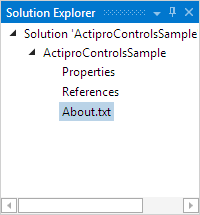
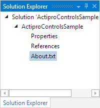
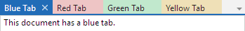

# Docking Window Capabilities

One of the best features of Actipro Docking & MDI is the number of options that are available to you as a developer.  Many options control the behaviors and capabilities of the docking windows and can be set at a global level as well as at a docking window instance level.

## Global Default Options

A number of global default options appear on the [DockSite](xref:ActiproSoftware.Windows.Controls.Docking.DockSite) and [TabbedMdiHost](xref:ActiproSoftware.Windows.Controls.Docking.TabbedMdiHost) classes.  By default, docking windows will use these options unless their instance settings overrides them.

| Member | Description |
|-----|-----|
| [DockSite](xref:ActiproSoftware.Windows.Controls.Docking.DockSite).[AreDocumentWindowsDestroyedOnClose](xref:ActiproSoftware.Windows.Controls.Docking.DockSite.AreDocumentWindowsDestroyedOnClose) Property | Gets or sets whether document windows are automatically destroyed (removed from the `DockSite`) when closed.  The default value is `true`. |
| [DockSite](xref:ActiproSoftware.Windows.Controls.Docking.DockSite).[AreNewTabsInsertedBeforeExistingTabs](xref:ActiproSoftware.Windows.Controls.Docking.DockSite.AreNewTabsInsertedBeforeExistingTabs) Property | Gets or sets whether new tabs are inserted before existing tabs when they are added, such as when dragging and attaching a tool window to an existing tool window container.  The default value is `true`. |
| [TabbedMdiHost](xref:ActiproSoftware.Windows.Controls.Docking.TabbedMdiHost).[CanDocumentsAttach](xref:ActiproSoftware.Windows.Controls.Docking.TabbedMdiHost.CanDocumentsAttach) Property | Gets or sets the global setting for whether documents may be attached to another document, creating a tabbed grouping.  The default value is `true`. |
| [TabbedMdiHost](xref:ActiproSoftware.Windows.Controls.Docking.TabbedMdiHost).[CanDocumentsCloseOnMiddleClick](xref:ActiproSoftware.Windows.Controls.Docking.TabbedMdiHost.CanDocumentsCloseOnMiddleClick) Property | Gets or sets a value indicating whether documents can be closed by clicking the tab with the middle mouse button.  The default value is `true`. |
| [TabbedMdiHost](xref:ActiproSoftware.Windows.Controls.Docking.TabbedMdiHost).[CanDocumentTabsDrag](xref:ActiproSoftware.Windows.Controls.Docking.TabbedMdiHost.CanDocumentTabsDrag) Property | Gets or sets the global setting for whether document tabs may be dragged to another location.  The default value is `true`. |
| [DockSite](xref:ActiproSoftware.Windows.Controls.Docking.DockSite).[CanDocumentWindowsClose](xref:ActiproSoftware.Windows.Controls.Docking.DockSite.CanDocumentWindowsClose) Property | Gets or sets the global setting for whether document windows can be closed.  The default value is `true`. |
| [DockSite](xref:ActiproSoftware.Windows.Controls.Docking.DockSite).[CanToolWindowsDragToFloatingDockHostsWithWorkspaces](xref:ActiproSoftware.Windows.Controls.Docking.DockSite.CanToolWindowsDragToFloatingDockHostsWithWorkspaces) Property | Gets or sets the global setting for whether tool windows may be dragged to floating dock hosts that contain a workspace.  The default value is `true`.  When `false`, tool windows can still be dragged and docked against floating dock hosts that only contain tool windows. |
| [DockSite](xref:ActiproSoftware.Windows.Controls.Docking.DockSite).[CanDocumentWindowsDragToLinkedDockSites](xref:ActiproSoftware.Windows.Controls.Docking.DockSite.CanDocumentWindowsDragToLinkedDockSites) Property | Gets or sets the global setting for whether document windows may be dragged to a linked dock site.  The default value is `true`. |
| [DockSite](xref:ActiproSoftware.Windows.Controls.Docking.DockSite).[CanDocumentWindowsFloat](xref:ActiproSoftware.Windows.Controls.Docking.DockSite.CanDocumentWindowsFloat) Property | Gets or sets the global setting for whether document windows may be contained in a floating window.  The default value is `false`. |
| [DockSite](xref:ActiproSoftware.Windows.Controls.Docking.DockSite).[CanFloatingDockHostsHideOnDockSiteUnload](xref:ActiproSoftware.Windows.Controls.Docking.DockSite.CanFloatingDockHostsHideOnDockSiteUnload) Property | Gets or sets whether [DockSite](xref:ActiproSoftware.Windows.Controls.Docking.DockSite).[FloatingDockHosts](xref:ActiproSoftware.Windows.Controls.Docking.DockSite.FloatingDockHosts) should hide when the `DockSite` is unloaded, such as in nested `DockSite` scenarios when the parent tab is deselected.  The default value is `false`. |
| [DockSite](xref:ActiproSoftware.Windows.Controls.Docking.DockSite).[CanToolWindowsAttach](xref:ActiproSoftware.Windows.Controls.Docking.DockSite.CanToolWindowsAttach) Property | Gets or sets the global setting for whether the end user can edit document window titles in-place when a document window tab is double-clicked.  The default value is `true`. |
| [DockSite](xref:ActiproSoftware.Windows.Controls.Docking.DockSite).[CanToolWindowsAutoHide](xref:ActiproSoftware.Windows.Controls.Docking.DockSite.CanToolWindowsAutoHide) Property | Gets or sets the global setting for whether tool windows may be placed in auto-hide mode.  The default value is `true`. |
| [DockSite](xref:ActiproSoftware.Windows.Controls.Docking.DockSite).[CanToolWindowsBecomeDocuments](xref:ActiproSoftware.Windows.Controls.Docking.DockSite.CanToolWindowsBecomeDocuments) Property | Gets or sets the global setting for whether tool windows may be placed in a document state.  The default value is `true`. |
| [DockSite](xref:ActiproSoftware.Windows.Controls.Docking.DockSite).[CanToolWindowsClose](xref:ActiproSoftware.Windows.Controls.Docking.DockSite.CanToolWindowsClose) Property | Gets or sets the global setting for whether tool windows can be closed.  The default value is `true`. |
| [DockSite](xref:ActiproSoftware.Windows.Controls.Docking.DockSite).[CanToolWindowsCloseOnMiddleClick](xref:ActiproSoftware.Windows.Controls.Docking.DockSite.CanToolWindowsCloseOnMiddleClick) Property | Gets or sets a value indicating whether tool windows can be closed by clicking the tab with the middle mouse button.  The default value is `true`. |
| [DockSite](xref:ActiproSoftware.Windows.Controls.Docking.DockSite).[CanToolWindowsDock](xref:ActiproSoftware.Windows.Controls.Docking.DockSite.CanToolWindowsDock) Property | Gets or sets the global setting for whether tool windows can be docked.  The default value is `true`. |
| [DockSite](xref:ActiproSoftware.Windows.Controls.Docking.DockSite).[CanToolWindowTabsDrag](xref:ActiproSoftware.Windows.Controls.Docking.DockSite.CanToolWindowTabsDrag) Property | Gets or sets the global setting for whether tool window tabs may be dragged to another location.  The default value is `true`. |
| [DockSite](xref:ActiproSoftware.Windows.Controls.Docking.DockSite).[CanToolWindowsDragToLinkedDockSites](xref:ActiproSoftware.Windows.Controls.Docking.DockSite.CanToolWindowsDragToLinkedDockSites) Property | Gets or sets the global setting for whether tool windows may be dragged to a linked dock site.  The default value is `true`. |
| [DockSite](xref:ActiproSoftware.Windows.Controls.Docking.DockSite).[CanToolWindowsFloat](xref:ActiproSoftware.Windows.Controls.Docking.DockSite.CanToolWindowsFloat) Property | Gets or sets the global setting for whether tool windows may be floated into separate top-level containers.  The default value is `true`. |
| [DockSite](xref:ActiproSoftware.Windows.Controls.Docking.DockSite).[ClosePerContainer](xref:ActiproSoftware.Windows.Controls.Docking.DockSite.ClosePerContainer) Property | Gets or sets the global setting for whether tool windows may be attached to another tool window, creating a tabbed grouping.  The default value is `false`. |
| [DockSite](xref:ActiproSoftware.Windows.Controls.Docking.DockSite).[ContainersHaveNewTabButtons](xref:ActiproSoftware.Windows.Controls.Docking.TabbedMdiHost.ContainersHaveNewTabButtons) Property | Gets or sets whether containers have new tab buttons.  The default value is `false`. |
| [DockSite](xref:ActiproSoftware.Windows.Controls.Docking.DockSite).[FloatingToolWindowContainersHaveMaximizeButtons](xref:ActiproSoftware.Windows.Controls.Docking.DockSite.FloatingToolWindowContainersHaveMaximizeButtons) Property | Gets or sets whether floating [ToolWindowContainer](xref:ActiproSoftware.Windows.Controls.Docking.ToolWindowContainer) controls can have title bar maximize buttons.  The default value is `true`. |
| [DockSite](xref:ActiproSoftware.Windows.Controls.Docking.DockSite).[FloatingToolWindowContainersHaveMinimizeButtons](xref:ActiproSoftware.Windows.Controls.Docking.DockSite.FloatingToolWindowContainersHaveMinimizeButtons) Property | Gets or sets whether floating [ToolWindowContainer](xref:ActiproSoftware.Windows.Controls.Docking.ToolWindowContainer) controls can have title bar maximize buttons.  The default value is `false`. |
| [DockSite](xref:ActiproSoftware.Windows.Controls.Docking.DockSite).[HasTabCloseButtons](xref:ActiproSoftware.Windows.Controls.Docking.TabbedMdiHost.HasTabCloseButtons) Property | Gets or sets whether close buttons should appear on document tabs.  The default value is `true`. |
| [TabbedMdiHost](xref:ActiproSoftware.Windows.Controls.Docking.TabbedMdiHost).[TabOverflowBehavior](xref:ActiproSoftware.Windows.Controls.Docking.TabbedMdiHost.TabOverflowBehavior) Property | Gets or sets the global setting for the overflow behavior of the document tabs.  The default value is `TabOverflowBehavior.Menu`. |
| [DockSite](xref:ActiproSoftware.Windows.Controls.Docking.DockSite).[IsDockGuideAnimationEnabled](xref:ActiproSoftware.Windows.Controls.Docking.DockSite.IsDockGuideAnimationEnabled) Property | Gets or sets whether dock guide animation is enabled.  The default value is `true`. |
| [DockSite](xref:ActiproSoftware.Windows.Controls.Docking.DockSite).[IsFloatingWindowSnapToScreenEnabled](xref:ActiproSoftware.Windows.Controls.Docking.DockSite.IsFloatingWindowSnapToScreenEnabled) Property | Gets or sets whether floating windows are snapped onto the closest screen when displayed via a method other than being dragged.  The default value is `true`. |
| [DockSite](xref:ActiproSoftware.Windows.Controls.Docking.DockSite).[IsLiveSplittingEnabled](xref:ActiproSoftware.Windows.Controls.Docking.DockSite.IsLiveSplittingEnabled) Property | Gets or sets whether live splitting of docking windows is enabled.  The default value is `true`. |
| [DockSite](xref:ActiproSoftware.Windows.Controls.Docking.DockSite).[IsTabLayoutAnimationEnabled](xref:ActiproSoftware.Windows.Controls.Docking.DockSite.IsTabLayoutAnimationEnabled) Property | Gets or sets whether animation effects are applied during tab layout, such as when tabs are added or removed.  The default value is `true`. |
| [TabbedMdiHost](xref:ActiproSoftware.Windows.Controls.Docking.TabbedMdiHost).[TabStripPlacement](xref:ActiproSoftware.Windows.Controls.Docking.TabbedMdiHost.TabStripPlacement) Property | Gets or sets a [Side](xref:ActiproSoftware.Windows.Controls.Side) indicating the side upon which the tabs are located.  The default value is `Top`. |
| [DockSite](xref:ActiproSoftware.Windows.Controls.Docking.DockSite).[ToolWindowsHaveCloseButtons](xref:ActiproSoftware.Windows.Controls.Docking.DockSite.ToolWindowsHaveCloseButtons) Property | Gets or sets whether [ToolWindowContainer](xref:ActiproSoftware.Windows.Controls.Docking.ToolWindowContainer) controls can have title bar close buttons.  The default value is `true`. |
| [DockSite](xref:ActiproSoftware.Windows.Controls.Docking.DockSite).[ToolWindowsHaveOptionsButtons](xref:ActiproSoftware.Windows.Controls.Docking.DockSite.ToolWindowsHaveOptionsButtons) Property | Gets or sets whether [ToolWindowContainer](xref:ActiproSoftware.Windows.Controls.Docking.ToolWindowContainer) controls can have title bar options buttons.  The default value is `true`. |
| [DockSite](xref:ActiproSoftware.Windows.Controls.Docking.DockSite).[ToolWindowsHaveTitleBarIcons](xref:ActiproSoftware.Windows.Controls.Docking.DockSite.ToolWindowsHaveTitleBarIcons) Property | Gets or sets the global setting for whether tool window title bars display the icon of the selected tool window.  The default value is `false`. |
| [DockSite](xref:ActiproSoftware.Windows.Controls.Docking.DockSite).[ToolWindowsHaveTitleBars](xref:ActiproSoftware.Windows.Controls.Docking.DockSite.ToolWindowsHaveTitleBars) Property | Gets or sets the global setting for whether tool windows display a title bar when not in MDI.  The default value is `true`. |
| [DockSite](xref:ActiproSoftware.Windows.Controls.Docking.DockSite).[ToolWindowsHaveToggleAutoHideButtons](xref:ActiproSoftware.Windows.Controls.Docking.DockSite.ToolWindowsHaveToggleAutoHideButtons) Property | Gets or sets whether [ToolWindowContainer](xref:ActiproSoftware.Windows.Controls.Docking.ToolWindowContainer) controls can have title bar toggle auto-hide buttons.  The default value is `true`. |
| [DockSite](xref:ActiproSoftware.Windows.Controls.Docking.DockSite).[ToolWindowsSingleTabLayoutBehavior](xref:ActiproSoftware.Windows.Controls.Docking.DockSite.ToolWindowsSingleTabLayoutBehavior) Property | Gets or sets the global setting for the behavior used when a single tool window is in a container.  The default value is `SingleTabLayoutBehavior.Hide`. |
| [DockSite](xref:ActiproSoftware.Windows.Controls.Docking.DockSite).[ToolWindowsTabOverflowBehavior](xref:ActiproSoftware.Windows.Controls.Docking.DockSite.ToolWindowsTabOverflowBehavior) Property | Gets or sets the global setting for the overflow behavior of the tool window tabs.  The default value is `TabOverflowBehavior.Shrink`. |
| [DockSite](xref:ActiproSoftware.Windows.Controls.Docking.DockSite).[ToolWindowsTabStripPlacement](xref:ActiproSoftware.Windows.Controls.Docking.DockSite.ToolWindowsTabStripPlacement) Property | Gets or sets the global setting for the overflow behavior of the tool window tabs.  The default value is `Bottom`. |
| [DockSite](xref:ActiproSoftware.Windows.Controls.Docking.DockSite).[UseDragFloatPreviews](xref:ActiproSoftware.Windows.Controls.Docking.DockSite.UseDragFloatPreviews) Property | Gets or sets whether to use float previews when dragging windows instead of instantly creating floating windows.  The default value is `false`. |
| [DockSite](xref:ActiproSoftware.Windows.Controls.Docking.DockSite).[UseHostedFloatingWindows](xref:ActiproSoftware.Windows.Controls.Docking.DockSite.UseHostedFloatingWindows) Property | Gets or sets whether floating windows should be hosted within the bounds of the dock site.  The default value is `false`. |
| [DockSite](xref:ActiproSoftware.Windows.Controls.Docking.DockSite).[UseHostedPopups](xref:ActiproSoftware.Windows.Controls.Docking.DockSite.UseHostedPopups) Property | Gets or sets whether popups should be hosted within the bounds of the dock site.  The default value is `true`. |

## Docking Window Instance Options

All of the global default options listed above will apply to docking windows by default.  Related docking window instance options are all nullable booleans with default values of `null`, indicating that they will inherit the global defaults.

| Member | Description |
|-----|-----|
| [DockingWindow](xref:ActiproSoftware.Windows.Controls.Docking.DockingWindow).[CanAttach](xref:ActiproSoftware.Windows.Controls.Docking.DockingWindow.CanAttach) Property | Gets or sets whether the window may be attached to another window, creating a tabbed grouping. |
| [ToolWindow](xref:ActiproSoftware.Windows.Controls.Docking.ToolWindow).[CanAutoHide](xref:ActiproSoftware.Windows.Controls.Docking.ToolWindow.CanAutoHide) Property | Gets or sets whether the tool window may be placed in auto-hide mode. |
| [ToolWindow](xref:ActiproSoftware.Windows.Controls.Docking.ToolWindow).[CanBecomeDocument](xref:ActiproSoftware.Windows.Controls.Docking.ToolWindow.CanBecomeDocument) Property | Gets or sets whether the tool window may be placed in a document state. |
| [DockingWindow](xref:ActiproSoftware.Windows.Controls.Docking.DockingWindow).[CanClose](xref:ActiproSoftware.Windows.Controls.Docking.DockingWindow.CanClose) Property | Gets or sets whether the window may be closed. |
| [DockingWindow](xref:ActiproSoftware.Windows.Controls.Docking.DockingWindow).[CanDock](xref:ActiproSoftware.Windows.Controls.Docking.DockingWindow.CanDock) Property | Gets or sets whether the tool window may be docked. |
| [DockingWindow](xref:ActiproSoftware.Windows.Controls.Docking.DockingWindow).[CanDragTab](xref:ActiproSoftware.Windows.Controls.Docking.DockingWindow.CanDragTab) Property | Gets or sets whether the window's tab may be dragged to another location. |
| [DockingWindow](xref:ActiproSoftware.Windows.Controls.Docking.DockingWindow).[CanDragToLinkedDockSites](xref:ActiproSoftware.Windows.Controls.Docking.DockingWindow.CanDragToLinkedDockSites) Property | Gets or sets whether the window may be dragged to a linked dock site. |
| [DockingWindow](xref:ActiproSoftware.Windows.Controls.Docking.DockingWindow).[CanFloat](xref:ActiproSoftware.Windows.Controls.Docking.DockingWindow.CanFloat) Property | Gets or sets whether the window may be floated into a separate top-level container. |
| [DockingWindow](xref:ActiproSoftware.Windows.Controls.Docking.DockingWindow).[CanSerialize](xref:ActiproSoftware.Windows.Controls.Docking.DockingWindow.CanSerialize) Property | Gets or sets whether the window's layout information may be serialized. |
| [DockingWindow](xref:ActiproSoftware.Windows.Controls.Docking.DockingWindow).[CanStandardMdiMaximize](xref:ActiproSoftware.Windows.Controls.Docking.DockingWindow.CanStandardMdiMaximize) Property | Gets or sets whether the window may be maximized when hosted in a [StandardMdiHost](xref:ActiproSoftware.Windows.Controls.Docking.StandardMdiHost). |
| [DockingWindow](xref:ActiproSoftware.Windows.Controls.Docking.DockingWindow).[CanStandardMdiMinimize](xref:ActiproSoftware.Windows.Controls.Docking.DockingWindow.CanStandardMdiMinimize) Property | Gets or sets whether the window may be minimized when hosted in a [StandardMdiHost](xref:ActiproSoftware.Windows.Controls.Docking.StandardMdiHost). |
| [ToolWindow](xref:ActiproSoftware.Windows.Controls.Docking.ToolWindow).[HasOptionsButton](xref:ActiproSoftware.Windows.Controls.Docking.ToolWindow.HasOptionsButton) Property | Gets or sets whether the window has an options menu available. |
| [ToolWindow](xref:ActiproSoftware.Windows.Controls.Docking.ToolWindow).[HasTitleBar](xref:ActiproSoftware.Windows.Controls.Docking.ToolWindow.HasTitleBar) Property | Gets or sets whether the window displays a title bar when docked. |

## How to Allow Tabs to Be Reordered, But Not Dragged Elsewhere

In some situations you may wish to keep docking windows in their current container but still want to allow them to be reordered.

To accomplish this, turn all the appropriate options off such as can dock and can raft, etc.  but leave can drag on.  This will allow the user to reorder tabs by dragging them within their container but will prevent the docking window from moving outside of the container.

## Limiting the Allowed Dock Guides While Dragging

The [DockSite](xref:ActiproSoftware.Windows.Controls.Docking.DockSite).[WindowsDragOver](xref:ActiproSoftware.Windows.Controls.Docking.DockSite.WindowsDragOver) event is raised while dragging docking windows over a new drop target.  This event is passed an instance of [DockingWindowsDragOverEventArgs](xref:ActiproSoftware.Windows.Controls.Docking.DockingWindowsDragOverEventArgs), which indicates the [DockHost](xref:ActiproSoftware.Windows.Controls.Docking.DockHost) being dragged, the docking windows inside that [DockHost](xref:ActiproSoftware.Windows.Controls.Docking.DockHost), and the [IDockTarget](xref:ActiproSoftware.Windows.Controls.Docking.IDockTarget) control that the pointer is currently over.

The [DockingWindowsDragOverEventArgs](xref:ActiproSoftware.Windows.Controls.Docking.DockingWindowsDragOverEventArgs).[SupportedDockGuideKinds](xref:ActiproSoftware.Windows.Controls.Docking.DockingWindowsDragOverEventArgs.SupportedDockGuideKinds) property lists the dock guide kinds (a [DockGuideKinds](xref:ActiproSoftware.Windows.Controls.Docking.DockGuideKinds) flags enumeration value) that are supported with this particular combination and will be shown by default.

If you wish to prevent certain supported dock guides from being displayed, change the [DockingWindowsDragOverEventArgs](xref:ActiproSoftware.Windows.Controls.Docking.DockingWindowsDragOverEventArgs).[AllowedDockGuideKinds](xref:ActiproSoftware.Windows.Controls.Docking.DockingWindowsDragOverEventArgs.AllowedDockGuideKinds) property value.  It defaults to the [SupportedDockGuideKinds](xref:ActiproSoftware.Windows.Controls.Docking.DockingWindowsDragOverEventArgs.SupportedDockGuideKinds) property value.

For instance, if you'd only like docking windows to be able to dock left, right, or center (attach), you could set the [AllowedDockGuideKinds](xref:ActiproSoftware.Windows.Controls.Docking.DockingWindowsDragOverEventArgs.AllowedDockGuideKinds) property to `OuterLeft | InnerLeft | Center | InnerRight | OuterRight`.  Any values that you set to this property that aren't "supported" at the time will be ignored.

You can use complex logic to tailor the allowed dock guides based on your application design and its current state.

## Magnetism

Magnetism allows floating windows to be "snapped" together when moving or resizing.  This makes it easier for the end-user to line up the windows into rows or columns.

Magnetism can be configured using [DockSite](xref:ActiproSoftware.Windows.Controls.Docking.DockSite).[MagnetismSnapDistance](xref:ActiproSoftware.Windows.Controls.Docking.DockSite.MagnetismSnapDistance) and [DockSite](xref:ActiproSoftware.Windows.Controls.Docking.DockSite).[MagnetismGapDistance](xref:ActiproSoftware.Windows.Controls.Docking.DockSite.MagnetismGapDistance).  The snap distance indicates the distance at which magnetism begins to snap windows being dragged.  The gap distance indicates the distance between windows that are snapped together via magnetism.  Magnetism can be disabled by setting the snap distance to `0`.

## Images on Tabs Option

The [DockingWindow](xref:ActiproSoftware.Windows.Controls.Docking.DockingWindow).[ImageSource](xref:ActiproSoftware.Windows.Controls.Docking.DockingWindow.ImageSource) image can appear on docking window tabs when tab images are enabled. Several themes, such as the non-Metro themes, turn this feature on by default.

You can force the image to display on the tool window tabs by setting the [DockSite](xref:ActiproSoftware.Windows.Controls.Docking.DockSite).[ToolWindowsHaveTabImages](xref:ActiproSoftware.Windows.Controls.Docking.DockSite.ToolWindowsHaveTabImages) property to `true`, or on tabbed MDI tabs by setting the [TabbedMdiHost](xref:ActiproSoftware.Windows.Controls.Docking.TabbedMdiHost).[HasTabImages](xref:ActiproSoftware.Windows.Controls.Docking.TabbedMdiHost.HasTabImages) property to `true`.

## Single Tab Layout Behavior

By default, when a [ToolWindowContainer](xref:ActiproSoftware.Windows.Controls.Docking.ToolWindowContainer) only has a single [ToolWindow](xref:ActiproSoftware.Windows.Controls.Docking.ToolWindow), then the tabs are hidden.  This mimics the behavior seen in Visual Studio, but can be customized.  The tab for the single window can be hidden or shown.

The behavior can be customized using the [DockSite](xref:ActiproSoftware.Windows.Controls.Docking.DockSite).[ToolWindowsSingleTabLayoutBehavior](xref:ActiproSoftware.Windows.Controls.Docking.DockSite.ToolWindowsSingleTabLayoutBehavior) property, whose default value is `Hide`.



*A ToolWindowContainer with a single window using Hide and Show behaviors*

## Tinting Tabs

Tabs can be tinted towards a color by setting the [DockingWindow](xref:ActiproSoftware.Windows.Controls.Docking.DockingWindow).[TabTintColor](xref:ActiproSoftware.Windows.Controls.Docking.DockingWindow.TabTintColor) property.  The tab will have the same general visual appearance but the colors will be skewed towards the tint color.



*Several tinted tabs*

## Flashing Tabs

Tabs can enter a flashing mode by setting the [DockingWindow](xref:ActiproSoftware.Windows.Controls.Docking.DockingWindow).[TabFlashMode](xref:ActiproSoftware.Windows.Controls.Docking.DockingWindow.TabFlashMode) property to either `Blink` or `Smooth`.  The `Blink` mode will cause the tab to appear as flashing for a bit, then instantly restore it to normal for a bit, then appear as flashing for a bit, and so on until the mode is changed back to `None`.  The `Smooth` mode will do a smooth transition between the flashing appearance and normal appearance.

The [DockingWindow](xref:ActiproSoftware.Windows.Controls.Docking.DockingWindow).[TabFlashColor](xref:ActiproSoftware.Windows.Controls.Docking.DockingWindow.TabFlashColor) property specifies the color used to tint the tab for its flash effect.

Flashing is best used to grab the end user's attention, and let them know that a tab should be clicked.  Watch the [DockSite](xref:ActiproSoftware.Windows.Controls.Docking.DockSite).[WindowActivated](xref:ActiproSoftware.Windows.Controls.Docking.DockSite.WindowActivated) event to see when the docking window is activated.  At that point, set the [TabFlashMode](xref:ActiproSoftware.Windows.Controls.Docking.DockingWindow.TabFlashMode) property back to `None` to disable flashing.

## ToolWindowContainer Title Font

The [ToolWindowContainer](xref:ActiproSoftware.Windows.Controls.Docking.ToolWindowContainer) control has several properties that can be set to alter its title font appearance:

- [TitleFontFamily](xref:ActiproSoftware.Windows.Controls.Docking.ToolWindowContainer.TitleFontFamily)
- [TitleFontSize](xref:ActiproSoftware.Windows.Controls.Docking.ToolWindowContainer.TitleFontSize)
- [TitleFontWeight](xref:ActiproSoftware.Windows.Controls.Docking.ToolWindowContainer.TitleFontWeight)

Properties like these should never be set directly on specific instances of container controls since containers are created and destroyed dynamically at run-time with layout changes.  Instead, if you wish to change these properties, use an implicit `Style` that targets [ToolWindowContainer](xref:ActiproSoftware.Windows.Controls.Docking.ToolWindowContainer) in your application's `Resources`:

```xaml
<Style TargetType="docking:ToolWindowContainer">
	<Setter Property="TitleFontFamily" Value="Verdana" />
	<Setter Property="TitleFontSize" Value="14" />
	<Setter Property="TitleFontWeight" Value="Bold" />
</Style>
```

That implicit `Style` will update all instances of the container within your application.
