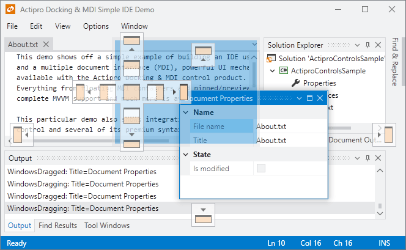

# Overview

Actipro Docking & MDI is a complete solution for easily adding a docking tool window and/or multiple document interface to your applications.

*Docking windows and tabbed MDI provided by this product*

Docking & MDI has been implemented with flexibility in mind.  It has more appearance and functionality options than nearly any other competitive product out there, and while it supports all the types of standard layouts you find in most docking window products, it also supports unique extended functionality.

@if (avalonia) {
Float document windows and use either tabbed or standard MDI styles.  Use custom workspace content or switch to tool window inner fill mode, where there is no workspace area.  MVVM is fully supported.
}
@if (wpf) {
Float document windows and use either tabbed or standard MDI styles.  Use custom workspace content or switch to tool window inner fill mode, where there is no workspace area.  Use MVVM and optionally integrate with frameworks like Prism.
}

Nest dock sites (create a self-contained set of docking windows within another docking window), position dock sites side-by-side (two or more self-contained sets of docking windows next to each other), and optionally link dock sites (two or more self-contained sets of docking windows whose windows can be moved to either site).

## Features

### MVVM Features

- Bind to separate document and tool view-model collections.
- Bind to VM properties to open, close, activate, and change the state of docking windows.
@if (avalonia) {
- Fully customizable themes and data templates for both document and tool windows.
}
@if (wpf) {
- Fully customizable styles and data templates for both document and tool windows.
}
- Can be optionally used in conjunction with non-MVVM defined document and tool windows.

### Docking Window Features

- Document windows that remain in MDI but can be floated.
- Tool windows that can be docked, auto-hidden, floated, or moved into MDI.
- Auto-hidden tool windows show as tabs along the outer edge of a dock host and show a popup when clicked.
- Create nested hierarchies of tool windows within a dock site or in separate floating windows.
- Resize any control via the use of built-in splitters.
- Rich object model for opening, closing, and repositioning docking windows anywhere in a layout.
- Tons of global options for controlling everything from whether windows can drag to whether tool windows have options buttons.
- Window-specific instance overrides for nearly all global options.
- Multiple ways to designate preferences for initial dock location when a docking window is opened.
- Ability to customize all context and drop-down menus.
- Multiple <kbd>Ctrl</kbd>+<kbd>Tab</kbd> switcher types, including one with a Visual Studio-like interface.
- Dock guides that make selecting document and tool window drop target locations easier.
- Drag to reorder windows within a tab group.
- Dragging floating windows can snap next to other floating windows using magnetism features. Also works for documents in standard MDI mode.
- Numerous centralized docking window-related events.

### Appearance Features

@if (wpf) {
- Built-in Metro, Office, and Windows system themes.
}
- Subtle fluid animations that occur throughout use of the product.
- Ability to create hosted floating windows that can fade out with inactivity.
- Create tool windows that don't have a title bar and/or cannot be moved.
@if (wpf) {
- An implementation of a control that mimics a standard Window but can be used in any control context.
}
- Specify custom contextual content (status indicators, buttons, etc.) within tabs or title bars.
- Tint specific docking window tabs.
- Built-in tab flashing capabilities to grab attention.

### Workspace and MDI Features

- Ability to host any sort of custom content in a workspace area.
- Tabbed MDI support that is capable of multi-directional hierarchies of documents.
- Tabbed MDI options like tab images and tab placement on any side.
- Document tabs can be rendered as pinned, normal, or preview tabs.
- Optional new tab button in the tab well.
- Built-in read-only document glyph display.
- Standard MDI that supports a windowed approach to managing documents.
- Cascade, tile horizontally, and tile vertically documents.

### Layout, Globalization, and Accessibility Features

- Full support for nested and side-by-side dock sites.
- Dock sites can be linked, which allows windows to be dragged from one dock site to another.
- Tool window inner-fill mode supported.
- Complete tool window layout save/load capabilities, for persisting end user customizations.
- Layout logic does its best to adhere to optional specified desired, minimum, and maximum container sizes.
- Size-to-content support for floating windows and standard MDI documents when displayed.
- Use any pointer such as mouse, touch, or pen to interact with docking windows.
@if (wpf) {
- Support for interop content such as WinForms or ActiveX controls.
}
- `AdvancedTabControl` control included that extends the standard `TabControl` with powerful capabilities.
- Right-to-left support is fully integrated for languages such as Hebrew or Arabic.
- All text properties use localization attributes, and string resources may be customized.
- Follows the standard accessibility model for UI automation.

*This product is written in 100% pure C#, and includes detailed documentation and samples.*
