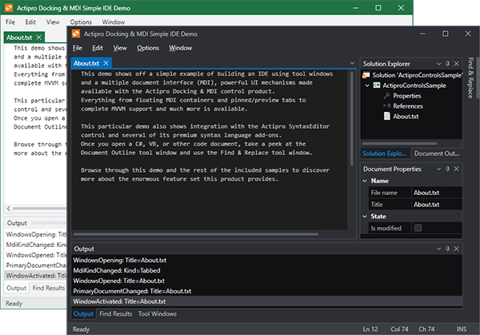

# Themes

This product includes multiple built-in themes for Metro, Office, and Windows system themes.  It is fully extensible so that other product themes can be custom developed.  Themes can be tinted towards any color or set of colors, and brush resources from them may be reused.

> [!NOTE]
> Be sure to read the [Actipro Themes](../themes/index.md) product documentation too since that explains in great detail how the themes management works with Actipro controls.

## Built-In Themes

Docking & MDI includes built-in themes that are color matched exactly with their real-world counterparts and Actipro's other controls like Ribbon.

*Several built-in Docking & MDI themes*
