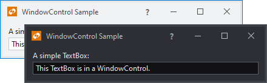

# WindowControl

During the implementation of standard MDI and hosted floating windows for this product, we ran into the need for a `Window`-like class that was skinnable and behaved like a regular `Control`.  Thus we developed [WindowControl](xref:ActiproSoftware.Windows.Controls.Docking.WindowControl), a control that looks and acts like a `Window` and can mimic both normal and tool window styles.

*A WindowControl displayed in a couple of the built-in themes*

[WindowControl](xref:ActiproSoftware.Windows.Controls.Docking.WindowControl) is a `Control` that implements most of same members as the standard WPF `Window` class.

## What Can I Do with WindowControl?

Unlike a normal `Window`, [WindowControl](xref:ActiproSoftware.Windows.Controls.Docking.WindowControl) can be put in any control hierarchy.  It also supports complete templating and can be animated.

Want to have a window that flies and rotates into view?  No problem!

While we use [WindowControl](xref:ActiproSoftware.Windows.Controls.Docking.WindowControl) in two general areas in this product, we wanted to make it available to you as well in case you find your own uses for it.

## Restrictions

Since [WindowControl](xref:ActiproSoftware.Windows.Controls.Docking.WindowControl) is a `Control` it still must be contained by a root `Window` (in Windows desktop apps) or a `Page`.

## Themes

This control has a number of built-in themes, with various Metro, Office, and operating system theme options.

## Working with the WindowControl

[WindowControl](xref:ActiproSoftware.Windows.Controls.Docking.WindowControl) inherits `ContentControl` so set its

As mentioned above we implemented many of the same members found in a WPF `Window` within [WindowControl](xref:ActiproSoftware.Windows.Controls.Docking.WindowControl).  You can set properties such as [WindowState](xref:ActiproSoftware.Windows.Controls.Docking.WindowControl.WindowState) or [ResizeMode](xref:ActiproSoftware.Windows.Controls.Docking.WindowControl.ResizeMode).  Browse through the members list on the [WindowControl](xref:ActiproSoftware.Windows.Controls.Docking.WindowControl) control to see what is available to you.

There are also a number of extra properties, methods, and events that aren't on `Window`, such as the [ToggleWindowState](xref:ActiproSoftware.Windows.Controls.Docking.WindowControl.ToggleWindowState*) method, the [TitleBarMenuOpening](xref:ActiproSoftware.Windows.Controls.Docking.WindowControl.TitleBarMenuOpening) event, etc.

Title bar drags and border resize operations will cause the control's `Left`, `Top`, `Width`, and `Height` properties to be altered.  To support drag operations visually, place the [WindowControl](xref:ActiproSoftware.Windows.Controls.Docking.WindowControl) in a `Canvas` and bind the `Canvas.Left` attached property to the `WindowControl.Left` property, and `Canvas.Top` attached property to the `WindowControl.Top` property.

## Managing the Title Bar

The title bar can be hidden entirely by setting [HasTitleBar](xref:ActiproSoftware.Windows.Controls.Docking.WindowControl.HasTitleBar) to `false`.  Alternatively, the buttons, icon, and text displayed by the title bar can be customized as described below.

### Buttons

A number of properties can be used to alter the state or visibility of the title bar buttons.  By default, the current window state governs which of the minimize, restore, and maximize buttons are visible.

The [CanClose](xref:ActiproSoftware.Windows.Controls.Docking.WindowControl.CanClose) property indicates if the close button is enabled.

Sometimes it is useful to be able to always force one or more of the buttons to be hidden.  One use case is where you don't wish to allow minimization of the window and never want the minimize button visible.  The [HasMinimizeButton](xref:ActiproSoftware.Windows.Controls.Docking.WindowControl.HasMinimizeButton), [HasRestoreButton](xref:ActiproSoftware.Windows.Controls.Docking.WindowControl.HasRestoreButton), [HasMaximizeButton](xref:ActiproSoftware.Windows.Controls.Docking.WindowControl.HasMaximizeButton), and [HasCloseButton](xref:ActiproSoftware.Windows.Controls.Docking.WindowControl.HasCloseButton) properties can be set to `false` to specify that their related button should never be visible.

### Icon

An icon can be displayed by setting [WindowControl](xref:ActiproSoftware.Windows.Controls.Docking.WindowControl).[Icon](xref:ActiproSoftware.Windows.Controls.Docking.WindowControl.Icon) to a valid `ImageSource`.  By default, the icon is displayed when an valid image is specified.  You can alter this behavior by explicitly setting [WindowControl](xref:ActiproSoftware.Windows.Controls.Docking.WindowControl).[HasIcon](xref:ActiproSoftware.Windows.Controls.Docking.WindowControl.HasIcon).  Therefore, you can force the [WindowControl](xref:ActiproSoftware.Windows.Controls.Docking.WindowControl) to display the specified image by setting [HasIcon](xref:ActiproSoftware.Windows.Controls.Docking.WindowControl.HasIcon) to `true`.

> [!NOTE]
> The icon is restricted to be 16 pixels wide by 16 pixels high.

### Context Content

Additional context content can be added to the right of the title bar text by using the [WindowControl](xref:ActiproSoftware.Windows.Controls.Docking.WindowControl).[ContextContent](xref:ActiproSoftware.Windows.Controls.Docking.WindowControl.ContextContent), [WindowControl](xref:ActiproSoftware.Windows.Controls.Docking.WindowControl).[ContextContentTemplate](xref:ActiproSoftware.Windows.Controls.Docking.WindowControl.ContextContentTemplate), and [WindowControl](xref:ActiproSoftware.Windows.Controls.Docking.WindowControl).[ContextContentTemplateSelector](xref:ActiproSoftware.Windows.Controls.Docking.WindowControl.ContextContentTemplateSelector) properties.
