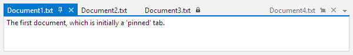
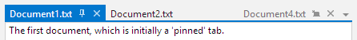
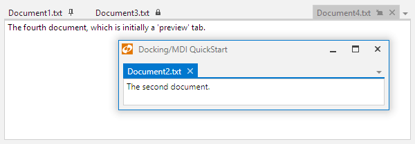

# Tabbed MDI

Tabbed MDI is the default type of MDI found in most modern applications and is fully supported by Actipro Docking & MDI.



*Tabbed MDI without any tool windows active*

With tabbed MDI, the [Workspace](workspace.md) area is filled with one or more tab controls (implemented by [TabbedMdiContainer](xref:ActiproSoftware.Windows.Controls.Docking.TabbedMdiContainer)) where each tab provides access to its related docking window.

## Implementation and Hierarchy

At design-time, the MDI area can be instantiated via XAML code.  The [Control Hierarchy](../control-hierarchy.md) topic has a diagram showing the controls that are needed to implement this type of MDI from XAML.  But essentially, to have tabbed MDI features available in your docking layout, you must place a [TabbedMdiHost](xref:ActiproSoftware.Windows.Controls.Docking.TabbedMdiHost) control directly as the `Content` of the [Workspace](workspace.md) within the dock site.

At run-time, you can use the common document framework (shared with [standard MDI](standard-mdi.md)) to manage the documents in the MDI area.  The [Working with Documents](working-with-documents.md) topic describes how to interact with this common document framework to open and close documents along with performing other common tasks.  But before doing so, please ensure that a [TabbedMdiHost](xref:ActiproSoftware.Windows.Controls.Docking.TabbedMdiHost) control is the direct `Content` of the [Workspace](workspace.md) within the dock site.

## Tab Layout Kinds (Pinned, Normal, Preview)

There are three kinds of tabs available: pinned, normal, and preview.



*The three kinds of tabs*

Normal tabs are the default kind of tab and render normally.

Pinned tabs are tabs that have been pinned by the end user and align to the leftmost end of the tab strip.  They also render like normal tabs other than having an unpin button visible.

Preview tabs render on the far right side of the tab strip, generally in a slightly faded-out appearance.  They have a keep open button visible that when clicked, will make the tab a normal tab.  It is advisable to only have a single preview tab in the UI at any given time.

### Switching Kinds

The [DockingWindow](xref:ActiproSoftware.Windows.Controls.Docking.DockingWindow).[TabbedMdiLayoutKind](xref:ActiproSoftware.Windows.Controls.Docking.DockingWindow.TabbedMdiLayoutKind) property specifies which kind of tab to use for the docking window when in tabbed MDI.

The end user can use context menus and tab buttons when appropriate to alter the tab layout kind.  You can toggle it manually by setting the above property.

## Behavior Options

Tabbed MDI has numerous behavior capability options that are available.  Several of these are global settings (like [TabbedMdiHost](xref:ActiproSoftware.Windows.Controls.Docking.TabbedMdiHost).[CanDocumentsAttach](xref:ActiproSoftware.Windows.Controls.Docking.TabbedMdiHost.CanDocumentsAttach)) and can be overridden by related window-instance settings on the [DockingWindow](xref:ActiproSoftware.Windows.Controls.Docking.DockingWindow) class.

| Member | Description |
|-----|-----|
| [TabbedMdiHost](xref:ActiproSoftware.Windows.Controls.Docking.TabbedMdiHost).[CanDocumentsAttach](xref:ActiproSoftware.Windows.Controls.Docking.TabbedMdiHost.CanDocumentsAttach) Property | Gets or sets the global setting for whether documents may be attached to another document, creating a tabbed grouping.  The default value is `true`. |
| [TabbedMdiHost](xref:ActiproSoftware.Windows.Controls.Docking.TabbedMdiHost).[CanDocumentsCloseOnMiddleClick](xref:ActiproSoftware.Windows.Controls.Docking.TabbedMdiHost.CanDocumentsCloseOnMiddleClick) Property | Gets or sets a value indicating whether documents can be closed by clicking the tab with the middle mouse button.  The default value is `true`. |
| [TabbedMdiHost](xref:ActiproSoftware.Windows.Controls.Docking.TabbedMdiHost).[CanDocumentTabsDrag](xref:ActiproSoftware.Windows.Controls.Docking.TabbedMdiHost.CanDocumentTabsDrag) Property | Gets or sets the global setting for whether document tabs may be dragged to another location.  The default value is `true`. |

## Tab Close Buttons

By default, a close button appears directly on the tabs.  This feature can be disabled by setting the [TabbedMdiHost](xref:ActiproSoftware.Windows.Controls.Docking.TabbedMdiHost).[HasTabCloseButtons](xref:ActiproSoftware.Windows.Controls.Docking.TabbedMdiHost.HasTabCloseButtons) property to `false`.

## Tab Pin Buttons

By default, no pin button appears directly on 'normal' tabs.  This feature can be enabled by setting the [TabbedMdiHost](xref:ActiproSoftware.Windows.Controls.Docking.TabbedMdiHost).[HasTabPinButtons](xref:ActiproSoftware.Windows.Controls.Docking.TabbedMdiHost.HasTabPinButtons) property to `true`.  That option will force a pin button to show on 'normal' tabs when the pointer is over the tab.

## Title vs. Tab Text

The [DockingWindow](xref:ActiproSoftware.Windows.Controls.Docking.DockingWindow).[Title](xref:ActiproSoftware.Windows.Controls.Docking.DockingWindow.Title) property is normally set to determine the title text that is rendered in tabs as well as in title bars and on the standard switcher.  In some cases, it might be desirable to have longer text for the [Title](xref:ActiproSoftware.Windows.Controls.Docking.DockingWindow.Title), such as "Properties - Document1.txt", while having shorting text that renders on tabs, such as "Properties".  This allows your title to provide more extensive contextual information.

By setting the [TabText](xref:ActiproSoftware.Windows.Controls.Docking.DockingWindow.TabText) property to a non-null value, its value will be used to render the tab text instead of the [Title](xref:ActiproSoftware.Windows.Controls.Docking.DockingWindow.Title) value.  In that scenario, the [Title](xref:ActiproSoftware.Windows.Controls.Docking.DockingWindow.Title) value will still be used in title bars and on the standard switcher when the window is selected.

## Tab Tool Tip

The [DockingWindow](xref:ActiproSoftware.Windows.Controls.Docking.DockingWindow).[TabToolTip](xref:ActiproSoftware.Windows.Controls.Docking.DockingWindow.TabToolTip) property is automatically bound to the [Title](xref:ActiproSoftware.Windows.Controls.Docking.DockingWindow.Title) property for tool windows and to the [FileName](xref:ActiproSoftware.Windows.Controls.Docking.DocumentWindow.FileName) property for document windows.  Override the [TabToolTip](xref:ActiproSoftware.Windows.Controls.Docking.DockingWindow.TabToolTip) property to set alternate tool tip content.

## Tab Images

By default the [DockingWindow](xref:ActiproSoftware.Windows.Controls.Docking.DockingWindow).[ImageSource](xref:ActiproSoftware.Windows.Controls.Docking.DockingWindow.ImageSource) image will not appear on document tabs.

You can force the image to display on the tabs by setting the [TabbedMdiHost](xref:ActiproSoftware.Windows.Controls.Docking.TabbedMdiHost).[HasTabImages](xref:ActiproSoftware.Windows.Controls.Docking.TabbedMdiHost.HasTabImages) property to `true`.

## Tab Contextual Content

Tabbed MDI tabs can display any context-related content to the right of the tab title.  This content is set via the [DockingWindow](xref:ActiproSoftware.Windows.Controls.Docking.DockingWindow).[TabbedMdiTabContextContentTemplate](xref:ActiproSoftware.Windows.Controls.Docking.DockingWindow.TabbedMdiTabContextContentTemplate) property.

See the [Contextual Content](../docking-window-features/contextual-content.md) topic for some more information.

## Tab Strip Placement

By default the document tabs will appear above their content, but can be changed to appear on any side of the content.

You can alter the location of the document tabs by changing the value of the [TabbedMdiHost](xref:ActiproSoftware.Windows.Controls.Docking.TabbedMdiHost).[TabStripPlacement](xref:ActiproSoftware.Windows.Controls.Docking.TabbedMdiHost.TabStripPlacement) property.

## Tab Overflow Behavior

There are numerous options from the [TabOverflowBehavior](xref:ActiproSoftware.Windows.Controls.Docking.TabOverflowBehavior) enumeration for selecting what happens when the tabs overflow the available tab strip space.

By default, a menu button is displayed that lists all open documents for a container when clicked.  This can be changed via the [TabbedMdiHost](xref:ActiproSoftware.Windows.Controls.Docking.TabbedMdiHost).[TabOverflowBehavior](xref:ActiproSoftware.Windows.Controls.Docking.TabbedMdiHost.TabOverflowBehavior) property.

## Tab Insertion Order

The [DockSite](xref:ActiproSoftware.Windows.Controls.Docking.DockSite).[AreNewTabsInsertedBeforeExistingTabs](xref:ActiproSoftware.Windows.Controls.Docking.DockSite.AreNewTabsInsertedBeforeExistingTabs) property determines whether new tabs are inserted at the start of a tabbed MDI container.  It defaults to `true` and may be set to `false` to add new tabs at the end of the container instead.

## New Tab Buttons

The [TabbedMdiHost](xref:ActiproSoftware.Windows.Controls.Docking.TabbedMdiHost).[ContainersHaveNewTabButtons](xref:ActiproSoftware.Windows.Controls.Docking.TabbedMdiHost.ContainersHaveNewTabButtons) property can be set to `true` to display a new tab button.  When this button is clicked, the [DockSite](xref:ActiproSoftware.Windows.Controls.Docking.DockSite).[NewWindowRequested](xref:ActiproSoftware.Windows.Controls.Docking.DockSite.NewWindowRequested) event fires.  A handler of this event should activate a new document.

This feature is useful for browser-like applications and works best when the [TabOverflowBehavior](xref:ActiproSoftware.Windows.Controls.Docking.TabbedMdiHost.TabOverflowBehavior) is set to `Shrink` or `ShrinkWithMenu`.

## Content for Empty MDI Hosts

The [TabbedMdiHost](xref:ActiproSoftware.Windows.Controls.Docking.TabbedMdiHost).[EmptyContentTemplate](xref:ActiproSoftware.Windows.Controls.Docking.TabbedMdiHost.EmptyContentTemplate) property can be set to a `DataTemplate` that should be displayed in the MDI host whenever there are no documents open.  If additional data needs to be passed into the data template, set it to the [EmptyContent](xref:ActiproSoftware.Windows.Controls.Docking.TabbedMdiHost.EmptyContent) property.

This is a great place to place a company or application logo, or give end users instructions on what to do next to open a document.

## Listing All Documents in the MDI Host

The [TabbedMdiHost](xref:ActiproSoftware.Windows.Controls.Docking.TabbedMdiHost).[GetDocuments](xref:ActiproSoftware.Windows.Controls.Docking.TabbedMdiHost.GetDocuments*) method returns a list of all documents that are within the MDI host.

## Cascading Documents

Call the [TabbedMdiHost](xref:ActiproSoftware.Windows.Controls.Docking.TabbedMdiHost).[Cascade](xref:ActiproSoftware.Windows.Controls.Docking.TabbedMdiHost.Cascade*) method to automatically cascade the documents into a single [TabbedMdiContainer](xref:ActiproSoftware.Windows.Controls.Docking.TabbedMdiContainer).

Alternatively, the [DockSite](xref:ActiproSoftware.Windows.Controls.Docking.DockSite).[CascadeDocuments](xref:ActiproSoftware.Windows.Controls.Docking.DockSite.CascadeDocuments*) method provides access to the same functionality but for all MDI hosts, including those on primary and floating dock hosts.

## Tiling Documents

The tiling of documents makes more efficient use of space and will position each document so that it is visible within the workspace.

Call the [TabbedMdiHost](xref:ActiproSoftware.Windows.Controls.Docking.TabbedMdiHost).[TileHorizontally](xref:ActiproSoftware.Windows.Controls.Docking.TabbedMdiHost.TileHorizontally*) method to tile documents horizontally.  Likewise, the [TabbedMdiHost](xref:ActiproSoftware.Windows.Controls.Docking.TabbedMdiHost).[TileVertically](xref:ActiproSoftware.Windows.Controls.Docking.TabbedMdiHost.TileVertically*) method will tile documents vertically.

Alternatively, two methods on [DockSite](xref:ActiproSoftware.Windows.Controls.Docking.DockSite), [TileDocumentsHorizontally](xref:ActiproSoftware.Windows.Controls.Docking.DockSite.TileDocumentsHorizontally*) and [TileDocumentsVertically](xref:ActiproSoftware.Windows.Controls.Docking.DockSite.TileDocumentsVertically*), provide access to the same functionality but for all MDI hosts, including those on primary and floating dock hosts.

## Switching to Tabbed MDI at Run-Time

You can easily switch to tabbed MDI mode at run-time by setting the [DockSite](xref:ActiproSoftware.Windows.Controls.Docking.DockSite).[MdiKind](xref:ActiproSoftware.Windows.Controls.Docking.DockSite.MdiKind) property to `Tabbed`, as long as a [Workspace](xref:ActiproSoftware.Windows.Controls.Docking.Workspace) is defined in the dock site.

## Floating Documents

While disabled by default, document windows can be floated, similar to tool windows.



*Tabbed MDI with a floating document*

To float a document window, click on the associated tab and drag it away from the tabbed MDI host.  A floating dock host is created with its own tabbed MDI host that contains the dragged document.  The document can be redocked at any time.

To enable this feature and allow document windows to be floated, set the [DockSite](xref:ActiproSoftware.Windows.Controls.Docking.DockSite).[CanDocumentWindowsFloat](xref:ActiproSoftware.Windows.Controls.Docking.DockSite.CanDocumentWindowsFloat) property to `true`.

## Tab Control Custom Styling

The [TabbedMdiHost](xref:ActiproSoftware.Windows.Controls.Docking.TabbedMdiHost).[TabControlStyle](xref:ActiproSoftware.Windows.Controls.Docking.TabbedMdiHost.TabControlStyle) property can be set to a custom `Style` for the [AdvancedTabControl](xref:ActiproSoftware.Windows.Controls.Docking.AdvancedTabControl) that is used within the templates of [TabbedMdiContainer](xref:ActiproSoftware.Windows.Controls.Docking.TabbedMdiContainer) controls in the host.

This code shows a custom `Style` assigned to the [TabbedMdiHost](xref:ActiproSoftware.Windows.Controls.Docking.TabbedMdiHost).[TabControlStyle](xref:ActiproSoftware.Windows.Controls.Docking.TabbedMdiHost.TabControlStyle) property to give the tabs a unique appearance:

```xaml
<Style TargetType="docking:AdvancedTabControl">
	<Setter Property="TabCornerRadius" Value="2,7,7,2" />
	<Setter Property="TabSpacing" Value="2" />
</Style>
```

The [TabbedMdiHost](xref:ActiproSoftware.Windows.Controls.Docking.TabbedMdiHost).[TabItemContainerStyle](xref:ActiproSoftware.Windows.Controls.Docking.TabbedMdiHost.TabItemContainerStyle) property can be set to a custom `Style` for the [AdvancedTabItem](xref:ActiproSoftware.Windows.Controls.Docking.AdvancedTabItem) controls that render the tabs within those [AdvancedTabControl](xref:ActiproSoftware.Windows.Controls.Docking.AdvancedTabControl) controls.

Use these properties to customize the appearance of the tab controls and their tabs.

This code shows the default XAML assigned to the [TabbedMdiHost](xref:ActiproSoftware.Windows.Controls.Docking.TabbedMdiHost).[TabItemContainerStyle](xref:ActiproSoftware.Windows.Controls.Docking.TabbedMdiHost.TabItemContainerStyle) property:

```xaml
<Style TargetType="docking:AdvancedTabItem">
	<Setter Property="Header" Value="{Binding TabTextResolved}" />
	<Setter Property="HeaderTemplate">
		<Setter.Value>
			<DataTemplate>
				<TextBlock Text="{Binding}" TextTrimming="CharacterEllipsis" VerticalAlignment="Center" />
			</DataTemplate>
		</Setter.Value>
	</Setter>
</Style>
```

## Keyboard Shortcuts

The `Alt+-` keyboard shortcut shows the context menu for the currently selected document in the active tabbed MDI container.

The `Ctrl+Alt+DownArrow` keyboard shortcut shows the document list menu for the active tabbed MDI container.

Other keyboard shortcuts allow you to jump directly to a tab. `Ctrl+1` will activate the first tab in a normal state, with `Ctrl+2` activating the second normal tab, and so on. `Ctrl+Alt+1` will activate the first tab in a pinned state, with `Ctrl+Alt+2` activating the second pinned tab, and so on.
