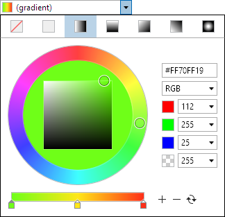

# BrushEditBox

The [BrushEditBox](xref:ActiproSoftware.Windows.Controls.Editors.BrushEditBox) control allows for the input of a `Brush` value.  It uses the [BrushPicker](../pickers/brushpicker.md) control in its popup.



## Common Capabilities

Each of the features listed in the table below describe functionality that is common to most edit boxes.  Please see the [Edit Box Basics](parteditboxbase.md) topic for details on each of these options and how to set them.

| Feature | Description |
|-----|-----|
| Has a spinner | No. |
| Has a popup | Yes, and can be hidden or its picker appearance customized. |
| Null value allowed | Yes, and can be prevented. |
| Read-only mode supported | Yes. |
| Non-editable mode supported | Yes. |
| Has multiple parts | No. |
| Placeholder text supported | Yes, and overlays the control. |
| Header content supported | Yes, and appears above the control. |
| Default spin behavior | No wrap. |

## Alpha Transparency

The [BrushEditBox](xref:ActiproSoftware.Windows.Controls.Editors.BrushEditBox).[IsAlphaEnabled](xref:ActiproSoftware.Windows.Controls.Editors.BrushEditBox.IsAlphaEnabled) property can be set to `false` to prevent alpha transparency from being supported.

When `false`, the edit box will only allow selection of RGB colors instead of ARGB colors.

## Gradient Support

The [BrushEditBox](xref:ActiproSoftware.Windows.Controls.Editors.BrushEditBox).[IsGradientAllowed](xref:ActiproSoftware.Windows.Controls.Editors.BrushEditBox.IsGradientAllowed) property can be set to `false` to prevent gradient brushes from being supported.

When `false`, the edit box will only allow selection of solid color brushes.

## Swatch Display

The [BrushEditBox](xref:ActiproSoftware.Windows.Controls.Editors.BrushEditBox).[HasSwatch](xref:ActiproSoftware.Windows.Controls.Editors.BrushEditBox.HasSwatch) property defaults to `true`, meaning that a small swatch will display the `Brush` value.  Set the property to `false` to hide the swatch.

The [SwatchMargin](xref:ActiproSoftware.Windows.Controls.Editors.BrushEditBox.SwatchMargin) property sets the margin thickness around the swatch.

## Text Display

The [BrushEditBox](xref:ActiproSoftware.Windows.Controls.Editors.BrushEditBox).[HasText](xref:ActiproSoftware.Windows.Controls.Editors.BrushEditBox.HasText) property defaults to `true`, meaning that the text representation of the `Brush` value will be displayed.  Set the property to `false` to hide the text, which is useful if you only wish to show the swatch.

When hiding the text, be sure to also set the [IsEditable](xref:ActiproSoftware.Windows.Controls.Editors.Primitives.PartEditBoxBase`1.IsEditable) property to `false` so that the control is treated more like a button instead of an edit control.

## Reusing Brushes

By default, the brush instance will generally be reused when a component like gradient stop is updated.  But this prevents the [ValueChanged](xref:ActiproSoftware.Windows.Controls.Editors.BrushEditBox.ValueChanged) event from firing on certain component changes, and also bindings to the `Value` property from updating when using value converters.  The [CanReuseBrush](xref:ActiproSoftware.Windows.Controls.Editors.BrushEditBox.CanReuseBrush) property can be set to `false` to force a new brush to be created any time a component is updated, which works around those issues.

## Sample XAML

This control can be placed within any other XAML container control, such as a `Page` or `Panel` with this sort of XAML:

```xaml
<editors:BrushEditBox Value="{Binding Path=YourVMProperty, Mode=TwoWay}" />
```
