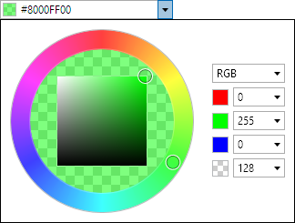
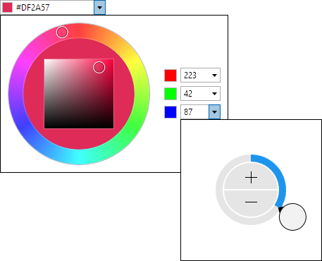

# ColorEditBox

The [ColorEditBox](xref:@ActiproUIRoot.Controls.Editors.ColorEditBox) control allows for the input of a `Color` value.  It uses the [ColorPicker](../pickers/colorpicker.md) control in its popup.



## Common Capabilities

Each of the features listed in the table below describe functionality that is common to most edit boxes.  Please see the [Edit Box Basics](parteditboxbase.md) topic for details on each of these options and how to set them.

<table>
<thead>

<tr>
<th>Feature</th>
<th>Description</th>
</tr>

</thead>
<tbody>

@if (winrt) {
<tr>
<td>Has a clear button</td>
<td>Yes, and can be hidden.</td>
</tr>
}

@if (wpf) {
<tr>
<td>Has a spinner</td>
<td>Yes, and can be hidden or optionally displayed only when the control is active.</td>
</tr>
}

<tr>
<td>Has a popup</td>
<td>Yes, and can be hidden or its picker appearance customized.</td>
</tr>

<tr>
<td>Null value allowed</td>
<td>Yes, and can be prevented.</td>
</tr>

<tr>
<td>Read-only mode supported</td>
<td>Yes.</td>
</tr>

<tr>
<td>Non-editable mode supported</td>
<td>Yes.</td>
</tr>

<tr>
<td>Has multiple parts</td>
<td>Yes.</td>
</tr>

<tr>
<td>Placeholder text supported</td>
<td>Yes, and overlays the control.</td>
</tr>

<tr>
<td>Header content supported</td>
<td>Yes, and appears above the control.</td>
</tr>

<tr>
<td>Default spin behavior</td>
<td>No wrap.</td>
</tr>

</tbody>
</table>

## Alpha Transparency

The [ColorEditBox](xref:@ActiproUIRoot.Controls.Editors.ColorEditBox).[IsAlphaEnabled](xref:@ActiproUIRoot.Controls.Editors.ColorEditBox.IsAlphaEnabled) property can be set to `false` to prevent alpha transparency from being supported.



When `false`, the edit box will only allow selection of an RGB color instead of an ARGB color.

## Initial Value Comparison on Popup

When the [ColorEditBox](xref:@ActiproUIRoot.Controls.Editors.ColorEditBox).[IsInitialValueComparedOnPopup](xref:@ActiproUIRoot.Controls.Editors.ColorEditBox.IsInitialValueComparedOnPopup) property is set to `true` (the default), the initial color will display on the left side of the picker hue ring's fill area.  The initial color is the edit box's value as the picker popup opens.  The right side of the picker hue ring's fill area will contain the current color value being selected.  This allows the old and new values to be compared side-by-side.

If the property is set to `false`, the picker hue ring's fill area will be completely filled by the current color value being selected.

## Swatch Display

The [ColorEditBox](xref:@ActiproUIRoot.Controls.Editors.ColorEditBox).[HasSwatch](xref:@ActiproUIRoot.Controls.Editors.ColorEditBox.HasSwatch) property defaults to `true`, meaning that a small swatch will display the `Color` value.  Set the property to `false` to hide the swatch.

The [SwatchMargin](xref:@ActiproUIRoot.Controls.Editors.ColorEditBox.SwatchMargin) property sets the margin thickness around the swatch.

## Text Display

The [ColorEditBox](xref:@ActiproUIRoot.Controls.Editors.ColorEditBox).[HasText](xref:@ActiproUIRoot.Controls.Editors.ColorEditBox.HasText) property defaults to `true`, meaning that the text representation of the `Color` value will be displayed.  Set the property to `false` to hide the text, which is useful if you only wish to show the swatch.

When hiding the text, be sure to also set the [IsEditable](xref:@ActiproUIRoot.Controls.Editors.Primitives.PartEditBoxBase`1.IsEditable) property to `false` so that the control is treated more like a button instead of an edit control.

## Parts and Incrementing/Decrementing

This edit box has multiple parts:

- A (optional)
- R
- G
- B

When the caret is over a part, the part value may be incremented or decremented.  Please see the [Edit Box Basics](parteditboxbase.md) topic for information on how to do this.

Small value changes alter the current color component by a single unit.  Large value changes alter the current color component by `16` units.

The [DefaultValue](xref:@ActiproUIRoot.Controls.Editors.ColorEditBox.DefaultValue) property sets the value that will be set when incrementing or decrementing from a null value.

## Sample XAML

This control can be placed within any other XAML container control, such as a `Page` or `Panel` with this sort of XAML:

```xaml
<editors:ColorEditBox Value="{Binding Path=YourVMProperty, Mode=TwoWay}" />
```
