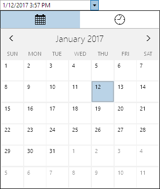

# DateTimeEditBox

The [DateTimeEditBox](xref:@ActiproUIRoot.Controls.Editors.DateTimeEditBox) control allows for the input of a `DateTime` value.  It uses the [DateTimePicker](../pickers/datetimepicker.md) control in its popup.



## Common Capabilities

Each of the features listed in the table below describe functionality that is common to most edit boxes.  Please see the [Edit Box Basics](parteditboxbase.md) topic for details on each of these options and how to set them.

<table>
<thead>

<tr>
<th>Feature</th>
<th>Description</th>
</tr>

</thead>
<tbody>

@if (winrt) {
<tr>
<td>Has a clear button</td>
<td>Yes, and can be hidden.</td>
</tr>
}

@if (wpf) {
<tr>
<td>Has a spinner</td>
<td>Yes, and can be hidden or optionally displayed only when the control is active.</td>
</tr>
}

<tr>
<td>Has a popup</td>
<td>Yes, and can be hidden or its picker appearance customized.</td>
</tr>

<tr>
<td>Null value allowed</td>
<td>Yes, and can be prevented.</td>
</tr>

<tr>
<td>Read-only mode supported</td>
<td>Yes.</td>
</tr>

<tr>
<td>Non-editable mode supported</td>
<td>Yes.</td>
</tr>

<tr>
<td>Has multiple parts</td>
<td>Yes, and supports optional arrow key navigation.</td>
</tr>

<tr>
<td>Placeholder text supported</td>
<td>Yes, and overlays the control.</td>
</tr>

<tr>
<td>Header content supported</td>
<td>Yes, and appears above the control.</td>
</tr>

<tr>
<td>Default spin behavior</td>
<td>Wrap.</td>
</tr>

</tbody>
</table>

## Formats

Standard date/time formats are supported via the [Format](xref:@ActiproUIRoot.Controls.Editors.DateTimeEditBox.Format) property and affect the textual value display.  These formats are recommended:

- `"g"`
- `"G"`
- `"f"`
- `"F"`
- `"MM/dd/yyyy hh:mm tt"`
- `"MM/dd/yy h:mm:ss tt"`
- `"yyyy-MM-dd HH:mm:ss"`
- `"d MMMM yyyy HH:mm"`
- `"d MMM yyyy HH:mm"`
- `"dd.MM.yyyy HH:mm"`
- `"d.M.yyyy HH:mm"`

## Minimum and Maximum Values

Minimum and maximum values may be assigned via the [Maximum](xref:@ActiproUIRoot.Controls.Editors.DateTimeEditBox.Maximum) and [Minimum](xref:@ActiproUIRoot.Controls.Editors.DateTimeEditBox.Minimum) properties.

No values can be committed that lay outside of the inclusive range created by those properties.

## Parts and Incrementing/Decrementing

This edit box has multiple parts:

- Year
- Month
- Day

When the caret is over a part, the part value may be incremented or decremented.  Please see the [Edit Box Basics](parteditboxbase.md) topic for information on how to do this.

## Sample XAML

This control can be placed within any other XAML container control, such as a `Page` or `Panel` with this sort of XAML:

```xaml
<editors:DateTimeEditBox Value="{Binding Path=YourVMProperty, Mode=TwoWay}" />
```
